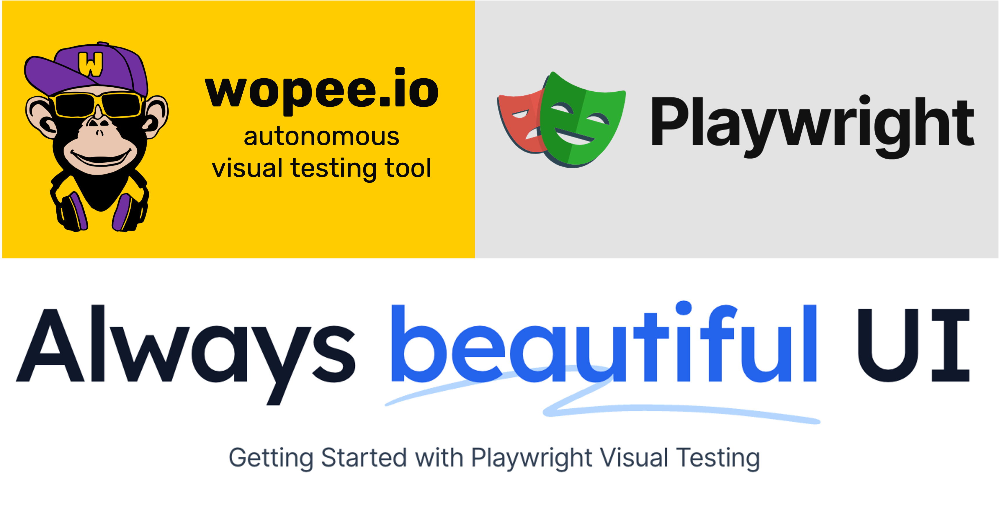
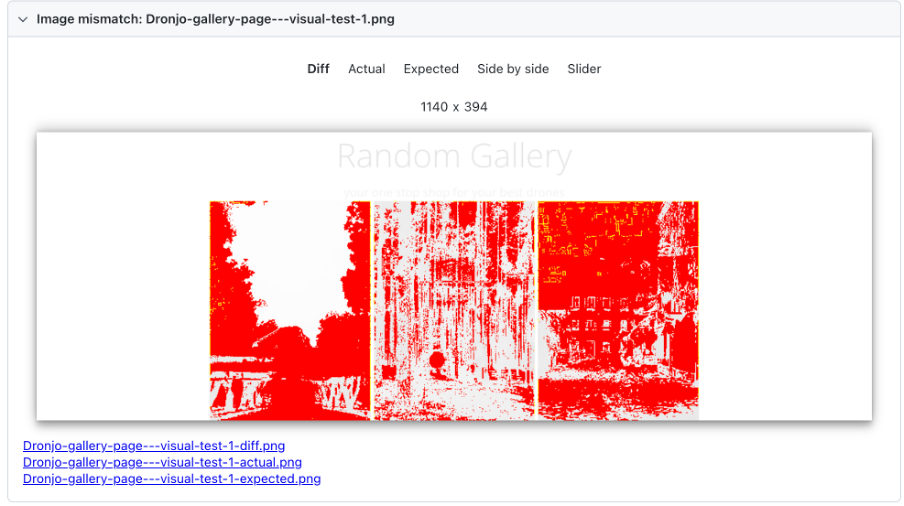

Visual testing has become an essential component of modern web development. By ensuring the visual fidelity of your application across different browsers and devices, you can guarantee a seamless user experience and minimize the risk of regressions. However, visual testing can be cumbersome, time-consuming, and require significant maintenance when it is not done properly. This is where Playwright could offer an efficient, fast, and simple approach to visual testing.

<!--truncate-->



## 1. What is Playwright?

Playwright is a powerful end-to-end testing framework developed by Microsoft. It boasts a unique combination of features that streamline the entire testing process, including visual testing. Playwright leverages browser automation capabilities to capture screenshots and compare them against baselines, allowing you to identify any visual inconsistencies introduced by code changes. This approach offers several advantages over traditional methods:

- **Unified Framework:** Playwright combines functional, integration, and visual testing into a single toolset. This eliminates the need for separate tools and streamlines test maintenance.
- **Cross-Browser Compatibility:** Playwright seamlessly executes tests across various browsers, such as Chromium, Firefox, and WebKit, ensuring comprehensive visual coverage.
- **Flexible Visual Testing Strategies:** Playwright supports different visual testing approaches, including pixel-perfect matching, full-page visual testing, and visual testing on the component level. This allows you to tailor your testing strategy to specific application requirements.

## 2. Benefits of Using Playwright for Visual Testing

Beyond its core functionality, Playwright offers several key benefits that make it an ideal choice for visual testing:

- **Improved Testing Efficiency:** Playwright automates the entire visual testing process, eliminating the need for manual screenshot comparisons. This saves significant time and resources for your testing team.
- **Enhanced Speed:** Playwright leverages browser automation, resulting in faster test execution. This is particularly advantageous when dealing with large test suites.
- **Simplified Maintenance:** Playwright's unified framework simplifies test maintenance. Visual tests are written in the same language as functional and integration tests, reducing the learning curve and minimizing maintenance overhead.
- **Scalability:** Playwright is designed for scalability. You can easily integrate it into your existing CI/CD pipeline and run visual tests alongside other types of tests. This ensures comprehensive visual coverage throughout your development lifecycle.

## 3. Getting Started with Playwright Visual Testing

Playwright offers a straightforward approach to implementing visual testing in your web application development process. Here's a basic guide to get you started:

### 1. Setting Up Playwright

Begin by installing Playwright using npm or yarn.

```bash
npm install playwright
```

:::tip

Are you new to Playwright Visual Testing? Use our [ready-made repository](https://github.com/autonomous-testing/ws-getting-started-w-playwright-visual-testing) for a quick start and speed up your hands-on learning.

:::

### 2. Writing Your First Visual Test

To write your first visual test using Playwright, you can use JavaScript. By utilizing Playwright's browser automation features, you can navigate your application, perform actions, and capture screenshots for comparison purposes. Adding a single line of code allows you to conduct a visual test with ease:

```javascript
await expect(page).toHaveScreenshot();
The entire simple test could look like this:
import { test, expect } from "@playwright/test";

const baseUrl = "https://dronjo.wopee.io";

test("Home page - visual test", async ({ page }) => {
  await page.goto(baseUrl);
  await expect(page).toHaveScreenshot();
});
```

### 3. Visual Testing on Component Level

You can use visual testing for individual components of your web app. This approach is recommended for its scalability, speed, and reliability.
Here is an example of how it works with Playwright:

```javascript
const galleryImages = page.locator(".row").first();
await expect(galleryImages).toHaveScreenshot();
```

The entire simple test could look like this:

```javascript
import { test, expect } from "@playwright/test";

const baseUrl = "https://dronjo.wopee.io/gallery.html";

test("Gallery page - visual test", async ({ page }) => {
  await page.goto(baseUrl);

  const galleryImages = page.locator(".row").first();
  await expect(galleryImages).toHaveScreenshot();
});
```

### 5. Running Tests and Baseline Management

Baseline screenshots, also known as snapshots in the Playwright world, represent the desired visual state of your application components. When you run your tests for the first time, they will fail as there are no baselines available. However, when you rerun your tests, they will either fail (if the baseline is different than the actual screenshot) or pass (if the baseline is the same as the actual screenshot).

If you're familiar with Playwright, you know that the following command is used to run tests:

```bash
npx playwright test
```

Or to run specific test file(s):

```bash
npx playwright test tests/2-element.spec.ts
```

To update baselines simply use:

```bash
npx playwright test -u
```

To see results after the test is executed use:

```bash
npx playwright show-report
```

When a visual bug is detected, the Playwright standard report is automatically opened and provides various views to analyze identified difference:



### 6. Using More Advanced (still simple) Options

Playwright offers a few more handy features that empower your visual testing. For a complete list see the [documentation](https://playwright.dev/docs/api/class-pageassertions#page-assertions-to-have-screenshot-1).

These are a few options that I believe are helpful when you are starting with visual testing with Playwright:

- `fullPage`: Takes a screenshot of the entire scrollable page instead of just the visible viewport. Default is false.
- `mask`: Specifies the locators that should be masked when the screenshot is taken, such as "#ytplayer" or ".gallery".
- `maxDiffPixelRatio`: Specifies an acceptable ratio of pixels that are different from the total amount of pixels, between 0 and 1. The default value can be configured with TestConfig.expect.
- `maxDiffPixels`: Specifies an acceptable amount of pixels that could be different. The default value can be configured with TestConfig.expect.
- `timeout`: Specifies the time to retry the assertion in milliseconds. Defaults to the timeout value in TestConfig.expect.

Example how to compare full-page screenshots while ignoring specific elements (#ytplayer and .gallery), with customized tolerance and timeout:

```javascript
import { test, expect } from "@playwright/test";

const baseUrl = "https://dronjo.wopee.io/gallery.html";

test("Gallery page - visual test", async ({ page }) => {
  await page.goto(baseUrl);

  await expect(page).toHaveScreenshot(
    "advanced.png", // set `Snapshot` name
    {
      fullPage: true,
      mask: [page.locator("#ytplayer"), page.locator(".gallery")],
      maxDiffPixelRatio: 0.01,
      maxDiffPixels: 1,
      timeout: 1000,
    }
  );
});
```

## 4. Advanced Playwright Visual Testing Opportunities

The Playwright offers goes beyond basic visual testing, offering advanced opportunities for comprehensive visual coverage:

- **Visual Testing with Different Viewports:** Test your application's visual fidelity across various screen sizes and devices by simulating different viewports during test execution.
- **Testing on Emulated Devices:** By leveraging Playwright's device emulation capabilities, you can simulate how your application renders and behaves on popular devices like iPhones, iPads, Android smartphones, and tablets. This allows you to identify any device-specific issues and ensure a consistent user experience across different platforms.
- **Visual Regression Detection:** Playwright integrates with visual testing libraries that offer advanced visual regression detection algorithms. These algorithms can identify subtle visual inconsistencies that might go unnoticed with pixel-perfect matching.
- **Continuous Improvement:** With Playwright you can establish a continuous visual testing strategy, ensuring the visual quality of your application throughout the development lifecycle. Here are some tips for ongoing improvement:
  - **Regularly Update Baselines:** As your application evolves, update your baseline screenshots to reflect the latest visual state.
  - **Prioritize Critical Components:** Focus your visual testing efforts on critical application components that directly impact user experience.
  - **Leverage Visual Testing Reports:** Utilize visual testing reports generated by Playwright and visual testing libraries to identify regressions and prioritize fixes.

## 5. Challenges While Scaling Up Visual Testing with Playwright

As your success grows with your visual testing strategy, it becomes increasingly crucial to adhere to best practices and effectively address challenges. In the following section, I am briefly covering the most common one.

### 1. Baseline Management Overhead

Maintaining a large set of baseline screenshots can become cumbersome. As your application grows, the number of screenshots needed for comprehensive visual coverage increases. This can lead to difficulties in managing baselines, especially when dealing with frequent UI updates.

**Strategies for Managing Baselines:**

- Automate Baseline Updates: Consider automating baseline updates for certain UI components that undergo frequent but predictable changes.
- Focus on Critical Components: Prioritize baseline management for elements that significantly impact user experience.
- Leverage Baseline Versioning: Utilize features offered by visual testing libraries to version control your baselines and roll back to previous versions if needed.

### 2. Flaky Tests Due to Visual Inconsistencies

Certain web application elements may exhibit slight visual inconsistencies due to factors like dynamic content loading, third-party library behavior, or browser rendering differences. These inconsistencies can trigger false positives in your visual tests, leading to flaky test results.

**Strategies for Handling Flaky Tests:**

- Employ Layout Inspections: Utilize Playwright's layout inspection capabilities to verify the overall structure of your application, rather than relying solely on pixel-perfect matching.
- Configure Visual Thresholds: Adjust the visual comparison thresholds offered by visual testing libraries to account for expected variations.
- Isolate Dynamic Content: Identify and isolate dynamic content that might cause inconsistencies to focus tests on static, visually critical elements.

### 3. Test Execution Time with Large Test Suites

While Playwright offers faster test execution compared to traditional visual testing tools, a large number of visual tests can still impact overall test suite execution time. This can become a bottleneck in fast-paced development environments.

Strategies for Optimizing Test Execution:

- Prioritize Critical Visual Tests: Focus on testing visually critical components that contribute most to user experience.
- Parallelize Test Execution: Leverage Playwright's capabilities for parallel test execution across multiple browsers or machines.
- Implement Lazy Loading: Consider loading visual tests only when necessary based on specific test scenarios.

### 4. Visual Testing Library Integration Complexity

Integrating Playwright with different visual testing libraries can introduce additional complexity, especially when managing configurations and reporting across various tools.

**Strategies for Simplifying Library Integration:**

- Standardize on a Single Library: Choose a single visual testing library for consistency and streamline configuration management across your test suite.
- Leverage Community Resources: Utilize community-built integrations and best practices to simplify setup and configuration.

### 5. Maintaining Team Workflow Efficiency for Visual Testing

Scaling visual testing effectively requires a well-defined workflow that facilitates collaboration within your testing team. Here are some challenges to consider:

- **Centralized Baseline Storage and Management:** With a large team, storing and managing baselines centrally becomes crucial. Finding a secure and easily accessible location for storing baseline screenshots and associated metadata (version information, approval history) is essential.
- **Tracking Baseline Approvals:** Establishing a clear process for approving baseline updates is important. Tracking who approved specific baseline changes helps maintain accountability and identify potential issues introduced during development.
- **Communication and Collaboration:** Effective communication between developers and testers regarding visual changes is critical. Visual testing tools should integrate seamlessly with existing communication channels to facilitate discussions and approvals.

Strategies for Enhancing Team Workflow Efficiency:

- **Utilize Version Control Systems:** Store baseline screenshots and metadata within your existing version control system (e.g., Git) to ensure centralized storage, access control, and version history tracking.
- **Integrate with Visual Testing Platform Features:** Many visual testing libraries offer features for managing baseline approvals and tracking changes. Leverage these features to streamline the approval process within your team.
- **Establish Clear Communication Channels:** Define clear communication protocols for developers and testers regarding visual changes. Utilize tools like issue trackers or dedicated channels for discussions and approvals.

By understanding these challenges and implementing appropriate strategies, you can effectively scale up your visual testing with Playwright while maintaining efficiency, reliability, and a smooth workflow within your testing team.

Integrate your Playwright tests into your CI/CD pipeline to automate visual testing alongside other test types. Playwright also integrates seamlessly with various visual testing libraries like Applitools, Percy or Wopee.io.

## 6. Where Wopee.io want to help

To tackle the difficulties mentioned in the previous chapter, numerous teams chose to create their solution. However, developing and maintaining such solutions is a time-consuming task and they often become obsolete when their creator leaves the team.
Our autonomous testing platform provides similar features to these homegrown solutions. To help you better understand the benefits of integrating your tests with Wopee.io, we have provided a simple comparison below.

:::tip

Use our [ready-made repository](https://github.com/autonomous-testing/ws-getting-started-w-playwright-visual-testing) for an effortless start and to gain initial experience with Wopee.io.

:::

### 1. Installing Playwright and Wopee.io

Install Playwright and Wopee.io by using npm. Here are steps to do so:

- Create GitHub token: Our package to integrate Wopee.io with Playwright is published on GitHub. You’ll need to set up your GitHub user token first to be able to download it. To do so, navigate to GihHub > user avatar icon > Settings > Developer settings > Personal access token > Tokens (classic) > Generate new token, or just navigate to the following link: https://github.com/settings/tokens/new and create a new token with `read:packages` right allowed.
- Set up environment variable: `export GITHUB_TOKEN=your_github_token`
- Create `.npmrc` file with following content:

```text
//npm.pkg.github.com/:_authToken=${GITHUB_TOKEN}
@wopee-io:registry=https://npm.pkg.github.com
```

- Get your `WOPEE_API_KEY` from [Wopee.io commander](https://cmd.wopee.io/projects) (Navigate to your project > Project Settings > API KEYS tab > Create new key).
- Install node packages:

Playwright:

```bash
npm i @playwright/test
```

Wopee.io:

```bash
npm i @wopee-io/wopee.pw
```

### 2. Your first test

To run your first test it is good to understand some basic concepts of how Wopee.io works. Use startSuite to create a suite where your test results from test execution will be stored. In case the test suite name already exists it will be used instead of creating a new. Use startScenario to create a new test where all your baselines will be created. To test against specific baseline use trackFullPageScreenshot.

The entire simple test could look like this:

```javascript
import { Wopee } from "@wopee-io/wopee.pw";
import { test } from "@playwright/test";

let wopee: Wopee;
const baseUrl = "https://dronjo.wopee.io";

test.describe("Example w. Wopee.io", () => {
  test.beforeAll(async () => {
    wopee = new Wopee();
    await wopee.startSuite(`First demo test suite`);
  });

  test("Home", async ({ page }, testInfo) => {
    await wopee.startScenario(testInfo.title);

    await page.goto(baseUrl);
    await wopee.trackFullPageScreenshot(page, "Home page");

    await wopee.stopScenario();
  });
});
```

### 3. Running Tests and Baseline Management

When you run your tests for the first time, they will NOT fail as in the case of running it with a basic Playwright setup however you will see warnings in the terminal with a link guiding you to the new baselines which should be reviewed and approved if there are visually correct.
The same command as for basic Playwright visual testing can be used to run tests:

```bash
npx playwright test
```

All baselines are now stored and maintained (approved or rejected) in commander (cmd.wopee.io). This increases the efficiency of your visual testing by providing one single source of truth for the entire team. Tracking history and versions is now simpler and more efficient, with the added capability to monitor across various configurations, browsers, operating systems, branches, and testing environments.

### 4. Using More Advanced (still simple) Options

We offer a few more handy features that empower your Playwright visual testing.

:::tip

For a few more ideas explore [more examples](https://github.com/autonomous-testing/ws-getting-started-w-playwright-visual-testing) in prepared repository. Specifically: `tests/w1-basics.spec.ts`, `tests/w2-element.spec.ts` and `tests/w3-more.spec.ts`

:::

## 7. Conclusion

In the fast-paced world of web development, visual testing has emerged as a critical component for ensuring the quality and consistency of web applications. However, traditional approaches to visual testing often fall short in terms of efficiency, speed, and simplicity, leading to increased testing overhead and maintenance efforts. This is where Playwright comes in, offering a helpfull solution that addresses these challenges head-on.

With Playwright, testers can automate the entire visual testing process, from capturing screenshots to comparing them against baselines, saving significant time and resources. Its unified framework combines functional, integration, and visual testing into a single toolset, streamlining test maintenance and reducing complexity.

Moreover, Playwright's cross-browser compatibility and flexible visual testing strategies make it a versatile choice for testing teams of all sizes. Whether you're a CTO, SDET, Test Automation Engineer, or Test Manager, Playwright empowers you to achieve faster test execution, simplified maintenance, and comprehensive visual coverage.

As you embark on your journey with Playwright visual testing, remember to leverage advanced techniques like visual testing with different viewports, layout inspections, and visual regression detection to ensure the highest level of quality for your web applications.

What’s your experience?
We would love to hear about your experience with Playwright visual testing and how you have scaled it up in your projects. Please share your insights with us on our Wopee.io discussion page! Your feedback and experiences are invaluable to the testing community.
