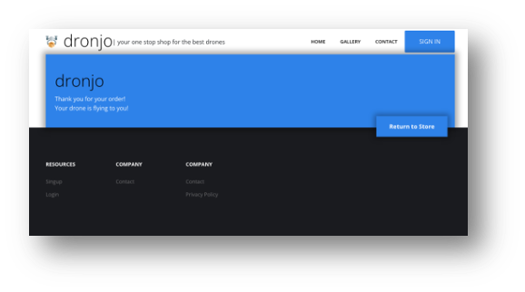
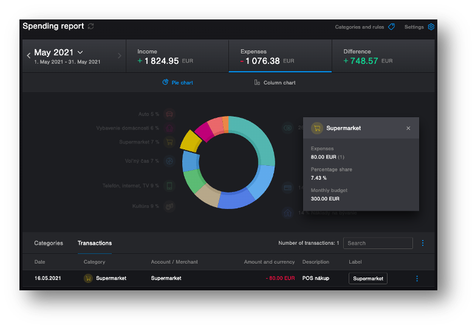

Two years ago, Gartner forecasted a **30% growth in adopting autonomous testing** approaches in the subsequent year. This prediction highlighted a significant shift in the software testing landscape, where organizations began to recognize the potential of leveraging automation to enhance testing efficiency and effectiveness. Last year, Forrester's report echoed this trend, estimating a remarkable **20-30% increase in testing productivity through testing bots**. These signals point towards a growing interest in autonomous testing solutions, driven by the need for faster, more reliable, and cost-effective testing processes.

<!--truncate-->

## 1. Journey into better testing

In 1979, Glenford J. Myers introduced the concept of separating debugging from testing. He focused on breakage testing, stating, "A successful test case detects an as-yet undiscovered error." This highlighted the software engineering community's desire to separate essential development activities, such as debugging, from verification. Over the past few decades, our industry has been searching for new ways to enhance the efficiency of all testing activities. We have progressed from manual testing to automated testing, and more recently, there has been discussion about autonomous testing.

import Cat from './testing-journey.png';


_Source: Wopee.io._

**Manual testing** involves repetitive tasks performed by human testers. While it's quick to get started and easy to adjust, it falls short in fast-paced software development environments following strategies like Agile or DevOps. The primary drawbacks include the time-consuming nature of repetitive tasks and the ineffectiveness of regression testing, which requires running the same tests multiple times to ensure that recent code changes haven't introduced new bugs.

**Automated testing** employs scripted robots to replicate the actions of manual testers, allowing for the rapid execution of tests. This approach significantly reduces the time required to run repetitive tasks, ensuring that tests are conducted quickly and consistently. However, setting up and maintaining automated tests requires substantial initial investment in time and resources. Creating and updating test scripts can be labor-intensive, especially in dynamic environments where applications frequently change. Moreover, while automated tests excel at performing predefined actions and checking specific outcomes, they often fall short in assessing the overall quality and user experience of the application. This limitation arises because automated scripts are typically designed to mimic manual testing steps rather than adaptively improving test coverage and effectiveness based on insights gained from previous test runs. Consequently, while automation enhances efficiency, it may not fully capture the nuanced quality metrics that human testers can identify.

**Autonomous testing** represents the next evolution, combining autonomous bots, learning algorithms, and AI/ML. This approach automates test generation, requiring no programming skills, and simplifies testing processes by automating result analysis and maintenance activities. It's as simple as manual testing and as quick as automated testing, offering a compelling blend of efficiency and effectiveness.

Simplified comparison of manual, automated, and autonomous testing:

| Manual Testing                 | Automated Testing       | Autonomous Testing             |
| ------------------------------ | ----------------------- | ------------------------------ |
| Quick to start                 | Rapid execution         | No programming skills required |
| Easy to adjust                 | Consistent results      | Automated result analysis      |
| Time-consuming                 | Labor-intensive         | Simplified maintenance         |
| Ineffective regression testing | Limited adaptability    | Enhanced test coverage         |
| Subjective quality assessment  | Limited quality metrics | Comprehensive quality insights |

## 2. Playwright, Robot Framework, and Cypress.io

This article is based on our previous webinars, where we covered alternative approaches to achieving high efficiency in creating and maintaining automated tests for web apps. During the webinar, we provided examples using three test automation tools: Playwright, Robot Framework, and Cypress.io. By combining our experiences with all three tools, we aim to offer additional value by comparing them in this concise article. We encourage readers to share their reactions by writing their own blog posts and comparing their experiences with other test automation tools.

Following section introduces the tools used in our demos for those who may not be familiar with them. You can skip it if you already know the tools.

### Cypress.io

Cypress.io is a comprehensive end-to-end (E2E) testing framework for web applications. Built on a JavaScript framework, it provides live debugging for quick issue resolution. As an open-source tool with an active community and extensive documentation, Cypress.io stands as a strong rival to Selenium, offering unique advantages for modern web application testing. Cypress.io supports real-time reloads, automatic waiting, and detailed error messages, making it a user-friendly option for developers and testers.

### Playwright

Playwright is a cutting-edge E2E testing framework developed by Microsoft. It supports multiple browsers (Chromium, Firefox, and WebKit) and is designed for modern web application testing. Playwright allows for seamless parallel testing, handles multiple contexts for efficient testing, and offers network interception and geolocation testing. Like Cypress, it provides an intuitive API and robust support for debugging and automation.

<iframe width="560" height="315" src="https://www.youtube.com/embed/GGNPv-6stCU?si=aJugu7B-Tcp7hHal" title="YouTube video player" frameborder="0" allow="accelerometer; autoplay; clipboard-write; encrypted-media; gyroscope; picture-in-picture; web-share" referrerpolicy="strict-origin-when-cross-origin" allowfullscreen></iframe>

### Robot Framework

Robot Framework is a generic open-source automation framework used for test automation and robotic process automation (RPA). It uses a keyword-driven testing approach, making it accessible to both technical and non-technical users. Robot Framework supports integration with various tools and libraries, such as Selenium for web testing, and can be extended using Python or Java. Its structured format and clear syntax make it ideal for larger projects requiring detailed documentation and collaboration.

This table offers a concise summary of the strengths and use cases for each tool, which can help you select the most suitable option for your specific testing needs. While I strived to remain objective, it's important to note that this is my viewpoint and may be heavily biased.

| Feature/Tool         | Cypress.io                              | Playwright                              | Robot Framework                                            |
| -------------------- | --------------------------------------- | --------------------------------------- | ---------------------------------------------------------- |
| Language             | JavaScript/TypeScript                   | JavaScript/TypeScript                   | Keyword-driven (extensible with Python/Java)               |
| Browser Support      | Chromium-based browsers                 | Chromium, Firefox, WebKit               | Any browser via Selenium                                   |
| Parallel Testing     | Limited                                 | Yes                                     | Yes (with Selenium Grid or Pabot)                          |
| Live Debugging       | Yes                                     | Yes                                     | Limited                                                    |
| Automatic Waiting    | Yes                                     | Yes                                     | Yes (w. PW)                                                |
| Network Interception | No                                      | Yes                                     | Yes (w. PW)                                                |
| Community Support    | Strong, active community                | Growing community                       | Mature community                                           |
| Documentation        | Extensive                               | Extensive                               | Extensive                                                  |
| Ease of Use          | High (developer-friendly)               | High (developer-friendly)               | Medium (requires understanding of keyword-driven approach) |
| Extensibility        | Medium                                  | High                                    | High                                                       |
| Primary Use Case     | E2E testing for modern web applications | E2E testing for modern web applications | General test automation and RPA                            |
| CI/CD Integration    | Yes                                     | Yes                                     | Yes                                                        |
| License              | Open-source                             | Open-source                             | Open-source                                                |

Examples of test scripts for each tool are provided below to help you compare their syntax and structure. These examples are based on simple test scenarios to demonstrate the basic capabilities of each tool. For more advanced use cases, refer to the official documentation and community resources for each tool.

import Tabs from '@theme/Tabs';
import TabItem from '@theme/TabItem';

<Tabs>
  <TabItem value="playwright" label="Playwright" default>

```javascript
const { chromium } = require("playwright");

(async () => {
  const browser = await chromium.launch();
  const page = await browser.newPage();
  await page.goto("https://example.com");
  await page.screenshot({ path: "example.png" });
  await browser.close();
})();
```

  </TabItem>

  <TabItem value="cypress.io" label="Cypress.io">

```javascript
describe("My First Test", () => {
  it("Does not do much!", () => {
    cy.visit("https://example.cypress.io");
    cy.contains("type").click();
    cy.url().should("include", "/commands/actions");
  });
});
```

  </TabItem>
  <TabItem value="robot framework" label="Robot Framework">

```robotframework
*** Settings ***
Library           SeleniumLibrary

*** Variables ***
${BROWSER}        Chrome
${URL}            https://example.com

*** Test Cases ***
Example Test
    Open Browser    ${URL}    ${BROWSER}
    Capture Page Screenshot
    Close Browser
```

  </TabItem>
</Tabs>

:::tip

All the examples with Cypress.io are available in the repository [Autopilot your Cypress.io testing](https://github.com/marcel-veselka/Autopilot-your-Cypress.io-testing). If you want to see the examples for Playwright and Robot Framework, please let me know, and I will clean it up and provide them as well.

:::

## 3. Optimize Your Productivity: 7 Ideas

There might be several opportunities to increase the efficiency of authoring and maintaining your testing. These are a few I believe could help you to boost your efficiency:

### A: Technical Assertions

**1. Status code check:** Ensuring that your application returns the correct HTTP status codes is crucial. All tools allow you to check the status code of HTTP requests.

**2. Console check (JS errors & warnings):** Monitoring the browser console for JavaScript errors and warnings can help catch issues that might not be immediately visible through UI tests. Implementing console checks in your Cypress.io tests ensures that any errors thrown during the execution are captured and addressed promptly.

**3. Loading time check:** Performance is a critical aspect of user experience. Cypress.io can be configured to measure and assert loading times for various resources, helping you ensure that your application meets performance standards.

:::note
Status code and console checks are built into Cypress.io, making it easy to verify endpoint responses, but not very flexible to customize. For the Playwright and Robot Framework it is more flexible however it needs to be implemented.
:::

### B: Visual Assertions

**4. Increase coverage:** Visual assertions can significantly increase test coverage by verifying that the UI appears correctly to the user. All tools could be easily combined with tools like Percy or Applitools. It can perform visual validations to ensure your application renders correctly across different browsers and devices. 5. Boost coding efficiency: Visual assertions can streamline your test automation efforts by reducing the code needed to validate UI changes. This efficiency gain allows your team to focus on more complex scenarios and edge cases, improving overall test quality.

### C: Autonomous Interactions

**6. Form filling on the fly:** Automating form interactions can save significant time. Cypress.io can dynamically fill out and submit forms using custom commands. This approach reduces manual intervention and ensures consistency across tests.

**7. BDD Copilot:** Behavior-driven development (BDD) frameworks such as Cucumber can be integrated with Cypress.io to create test scenarios that are more readable and maintainable. BDD copilot tools can help generate step definitions and test data, simplifying the process of writing and managing BDD tests. BDD-like functionality is implemented as a custom command in Cypress.io, a class in Playwright, and by following the standard approach for Robot Framework, using keywords to implement steps.

## 4. Technical Assertions

### The challenge of stable assertions

Assertions are the backbone of automated tests, but achieving stable and reliable assertions can be challenging. For instance, a test might pass if it detects a "Thank you for your order!" message but fails to verify the presence of critical UI elements like headers, footers, or buttons. This inconsistency can lead to unreliable test results and increased maintenance efforts.

See the following example (both will pass with an assertion to validate the text “Thank you for your order!” displayed):

a. Correct behavior – test passed



_Source: Wopee.io._

b. Incorrect behavior – test passed


_Source: Wopee.io._

### How to introduce it?

To introduce technical assertions, we have two options:

**1. Modify existing tests:** Introducing technical assertions into existing tests can enhance their flexibility and reliability. Cypress.io's built-in capabilities for checking status codes and other technical metrics make this process straightforward, although it may require additional effort to implement and maintain.

**2. Introduce a crawler:** Web crawlers can complement your testing strategy by automatically navigating through your application and performing technical assertions. This approach is easy to implement and can effectively increase test coverage, although it may lack the flexibility of manually written tests.

### Demo: Web Crawling with Technical Assertions

<Tabs>
  <TabItem value="playwright" label="Playwright" default>

```javascript
import { test } from "@playwright/test";
import { Crawling } from "./utils/crawler";

test("Crawl page", async ({ page }) => {
  const crawler = new Crawling(page); // custom class to crawl the site
  const urls = await crawler.crawlSite("https://dronjo.wopee.io/");
});
```

  </TabItem>

  <TabItem value="cypress.io" label="Cypress.io">

```javascript
it("Crawls web page and validates status code 200", () => {
  const visited = new Set();
  const toVisit = [`${Cypress.config("baseUrl")}/`];
  const maxVisitedPages = 15;
  const urlsWithNon200Status = [];

  function crawlUrl() {
    if (toVisit.length === 0 || visited.size >= maxVisitedPages) {
      return;
    }

    const url = toVisit.shift();
    if (visited.has(url)) {
      return crawlUrl();
    }

    visited.add(url);

    // Check the page status before visiting
    cy.request({ url, failOnStatusCode: false }).then((response) => {
      if (response.status !== 200) {
        urlsWithNon200Status.push({ url, status: response.status });
      }

      cy.visit(url, { failOnStatusCode: false });
      findAndQueueLinks(url, visited, toVisit).then(crawlUrl);
    });
  }

  crawlUrl();
  returnTestResults(urlsWithNon200Status, visited);
});
```

  </TabItem>
  <TabItem value="robot framework" label="Robot Framework">

```robotframework
*** Settings ***
Library     Collections
Library     Browser
Resource    ../resources/common.robot
Resource    ../resources/asserts.robot


*** Variables ***
${URL}    %{URL=https://dronjo.wopee.io}

${ERR_COUNT}                        0
${WARN_COUNT}                       0

${MAX_DEPTH_TO_CRAWL}               10
${MAX_NUMBER_OF_PAGE_TO_CRAWL}      100


*** Test Cases ***
Crawl a website
    Log To Console    \nTest for ${URL} just started
    ${crawling_result}=
    ...    Crawl Site    ${URL}    page_crawl_keyword=Wopee Checks
    ...    max_depth_to_crawl=${MAX_DEPTH_TO_CRAWL}
    ...    max_number_of_page_to_crawl=${MAX_NUMBER_OF_PAGE_TO_CRAWL}
    Get Summary Results    ${ERR_COUNT}    ${WARN_COUNT}    ${MAX_NUMBER_OF_PAGE_TO_CRAWL}


*** Keywords ***
Wopee Checks
    Console should not contain errors
    Console should not contain warnings
```

  </TabItem>
</Tabs>
### Implementing Console Check (JS Errors & Warnings)

A simple web crawler can traverse your application and perform technical checks, such as identifying JavaScript errors and monitoring resource loading times. Implementing this setup is straightforward and can be achieved with minimal code or configuration changes, providing an effective solution for detecting technical issues early.

These are just a few examples of technical assertions you can implement in your tests. More could be found in the repositories for each tool, or you can create your own based on your specific requirements.

<Tabs>
  <TabItem value="playwright" label="Playwright" default>

```javascript
  private async _LoadingAutoAssert(
    page: Page,
    treshold: {
      navigationTime: number;
      domContentLoadedTime: number;
      loadTime: number;
    } = {
      navigationTime: 500,
      domContentLoadedTime: 500,
      loadTime: 500,
    }
  ) {
    // Get the performance metrics
    const metrics = await page.evaluate(() => {
      const timing = performance.timing;
      const response = performance.getEntriesByType("navigation")[0];
      console.log("Performance timing:", response);

      return {
        navigationStart: timing.navigationStart,
        responseEnd: timing.responseEnd,
        domContentLoadedEventEnd: timing.domContentLoadedEventEnd,
        loadEventEnd: timing.loadEventEnd,
      };
    });

    // Calculate loading times
    const navigationTime = metrics.responseEnd - metrics.navigationStart;
    const domContentLoadedTime =
      metrics.domContentLoadedEventEnd - metrics.navigationStart;
    const loadTime = metrics.loadEventEnd - metrics.navigationStart;

    if (
      treshold.navigationTime < navigationTime ||
      treshold.domContentLoadedTime < domContentLoadedTime ||
      treshold.loadTime < loadTime
    ) {
      console.log("Navigation time:", navigationTime, "ms");
      console.log("DOMContentLoaded time:", domContentLoadedTime, "ms");
      console.log("Load time:", loadTime, "ms");
    }
  }

  // Check response.ok() returns true if the response status is 2xx
  private async _StatusAutoAssert(response: Response | null) {
    if (response && !response.ok()) {
      console.log("Response status is not 2xx");
    }
  }

```

  </TabItem>

  <TabItem value="cypress.io" label="Cypress.io">

```javascript
// Check the page status before visiting
cy.request({ url, failOnStatusCode: false }).then((response) => {
  if (response.status !== 200) {
    urlsWithNon200Status.push({ url, status: response.status });
  }

  cy.visit(url, { failOnStatusCode: false });
  findAndQueueLinks(url, visited, toVisit).then(crawlUrl);
});
```

  </TabItem>
  <TabItem value="robot framework" label="Robot Framework">

```robotframework

*** Settings ***
Library     Collections
Library     Browser


*** Keywords ***
Console should not contain errors
    ${console_log}=    Get Console Log

    FOR    ${log_item}    IN    @{console_log}
        ${log_type}=    Get From Dictionary    ${log_item}    type
        IF    '${log_type}' == 'error'
            Log    ERROR FOUND: ${log_item}    level=ERROR
            ${new_err_val}=    Evaluate    ${ERR_COUNT}+1
            Set Global Variable    ${ERR_COUNT}    ${new_err_val}
            Take Screenshot    fullPage=True
        END
    END

Console should not contain warnings
    ${console_log}=    Get Console Log

    FOR    ${log_item}    IN    @{console_log}
        ${log_type}=    Get From Dictionary    ${log_item}    type
        IF    '${log_type}' == 'warning'
            Log    WARNING FOUND: ${log_item}    level=WARN
            ${new_warn_val}=    Evaluate    ${WARN_COUNT}+1
            Set Global Variable    ${WARN_COUNT}    ${new_warn_val}
        END
    END
```

  </TabItem>
</Tabs>

## 5. Visual Assertions

### Why Visual Validation?

**1. Increase Test Automation Coverage:** Visual validation extends your test coverage by ensuring that the UI renders correctly for users. This approach can catch visual defects that might be missed by functional tests alone. On the following picture, you can see a comparison of two check-out pages. The first one is the correct one, and the second one is incorrect. With traditional functional tests, both pages would pass the test, but with visual validation, the second page would fail.

import CheckOutComparison from './check-out-comparison.png';


_Source: Wopee.io._

**2. Reduce Coding:** Automating visual checks reduces the amount of code needed for UI validations, streamlining your test suite and making it easier to maintain. Visual assertions can simplify complex validation scenarios, such as ensuring that a UI element appears correctly after a series of interactions. On the following picture, you can see an example of how visual validation can reduce coding.

import LessCode from './less-code.png';


_Source: Wopee.io._

**3. Simplify Complex Assertions:** Visual assertions can simplify complex validation scenarios, such as ensuring that a UI element appears correctly after a series of interactions. This simplification can improve test reliability and reduce maintenance overhead. On the following picture, there is an example of nice reach UI which can be easily validated with visual validation. Traditional functional tests would require a lot of code to validate this UI.



_Source: Wopee.io._

### When Visual Testing might NOT be ideal

**1. Potential for slower test execution:** Each visual assertion requires capturing and comparing screenshots, which can slow down test execution. It's essential to balance the need for thorough visual checks with the performance impact on your test suite.

**2. Risk of flaky tests:** Incorrectly implemented visual assertions can lead to flaky tests that fail intermittently. Ensuring that your visual validation setup is robust and reliable is crucial to avoid these issues. Flaky tests can be caused by various factors, such as network latency, rendering differences between browsers, or dynamic content that changes frequently. It's essential to address these issues to maintain the stability of your test suite.

**3. Unnecessary automation:** In some cases, visual testing might be overkill, especially if most of your tests are manual. It's important to evaluate whether the benefits of visual validation justify the additional complexity.

:::tip
If you are interested in more information about visual testing, you can read our article [Getting Started with Playwright Visual Testing](/blog/getting-started-with-playwright-visual-testing).
:::

### Demo: Visual Assertions with Wopee Library

Setting Up Visual Validation with Wopee Library

#### Install Wopee

<Tabs>
  <TabItem value="playwright" label="Playwright" default>

```javascript
npm i @wopee-io/wopee.pw
```

</TabItem>

  <TabItem value="cypress.io" label="Cypress.io">

```javascript
npm @wopee-io/wopee.cy
```

  </TabItem>

  <TabItem value="robot framework" label="Robot Framework">

```robotframework
pip install wopee
```

  </TabItem>
</Tabs>

#### Set up configuration file

Configuration file require API URL, API key, and project ID. It could be stored as JSON, .env, yaml or directly in config file and looks like this (depending on the tool you use):

<Tabs>
  <TabItem value=".env" label=".env" default>
Example of .env file:
```dotenv
WOPEE_API_URL=https://api.wopee.io/
WOPEE_API_KEY=su3r53cr3t4p1k3y
WOPEE_PROJECT_UUID=da05efe3-dadf-abcd-af49-82b10387cc99
```

</TabItem>

  <TabItem value="json" label="JSON">
Example of JSON file:
```json
{
  "url": "https://api.wopee.io/",
  "key": "su3r53cr3t4p1k3y",
  "projectId": "da05efe3-dadf-abcd-af49-82b10387cc99"
}
```

  </TabItem>

  <TabItem value="cypress.io config" label="Cypress.io config">

```javascript
module.exports = defineConfig({
  e2e: {
    ...

    env: {
      wopee: {
        apiUrl: process.env.WOPEE_API_URL,
        apiKey: process.env.WOPEE_API_KEY,
        projectUuid: process.env.WOPEE_PROJECT_UUID,
      },
    },

    ...
  },
});
```

  </TabItem>
  <TabItem value="yaml" label="Yaml">

```yaml
WOPEE_API_URL=https://api.wopee.io/
WOPEE_API_KEY=su3r53cr3t4p1k3y
WOPEE_PROJECT_UUID=da05efe3-dadf-abcd-af49-82b10387cc99
```

  </TabItem>
</Tabs>

#### Run Your Tests

Execute your tests with the Wopee library to perform visual validations. The library will capture screenshots of your application and compare them against baseline images to detect any visual differences. If discrepancies are found, the library will flag them as visual bugs, allowing you to investigate and resolve them promptly. Here's an example of running tests with the Wopee library using Playwright, Cypress.io, or Robot Framework.

<Tabs>
  <TabItem value="playwright" label="Playwright" default>

```javascript
npx playwright
```

  </TabItem>

  <TabItem value="cypress.io" label="Cypress.io">

```javascript
npx cypress run
```

  </TabItem>
  <TabItem value="robot framework" label="Robot Framework">

```robotframework
robot --variable WOPEE_CONFIG:wopee.yaml --listener wopee_rf.listener tests/example.robot
```

  </TabItem>
</Tabs>

:::note

Above examples are simplified and may not cover all the necessary steps to run your tests.
To run it properly often requires more advanced setup, like setting up a CI/CD pipeline. For more information, refer to the official documentation of the tool you are using.

:::

### Benefits of Wopee visual testing

- **Broaden Testing Coverage:** Expand your testing horizons and ensure comprehensive coverage of your applications, catching issues that traditional testing might miss.
- **Simplify Automation for Complexity:** Tackle intricate features with ease. Our Copilot simplifies the automation of even the most complex functionalities, streamlining your testing process.
- **Guard Against Visual Bugs:** Safeguard your production environment by minimizing the risk of visual bugs slipping through undetected. Wopee assistant ensures the visual integrity of your applications.
- **Boost Testing Team Efficiency:** Foster seamless collaboration among your team members. Our Visual Testing Copilot enhances teamwork, making it easier for your testing team to work together efficiently.

:::info

Try **Wopee visual testing** today and experience the benefits of comprehensive visual validation for your applications. Elevate your testing strategy and ensure the visual integrity of your software with Wopee.

Sign up for a free trial at [cmd.wopee.io](https://cmd.wopee.io).

:::

## 6. Autonomous Interactions

During our test automation projects, we often encounter challenges related to authoring and maintaining test scripts. These challenges can hinder productivity, increase maintenance overhead, and limit the scalability of test automation efforts. By introducing autonomous interactions into your testing strategy, you can streamline test creation, enhance test coverage, and improve the efficiency of your testing process.

Following section explores the benefits of autonomous interactions and provides examples of how you can leverage them in your test automation projects. All examples are based on our prototypes and are intended to showcase the potential of autonomous testing in enhancing test automation efficiency by leveraging AI and machine learning (LLM) models.

### Challenges in Authoring and Maintenance

1. **Locator Issues**: Identifying and maintaining locators can be particularly challenging, especially as applications undergo frequent changes and updates. This can lead to unstable tests that require constant attention.

2. **Frequent Application Changes**: The dynamic nature of modern applications often necessitates frequent updates and modifications. Keeping test scripts aligned with these changes can be daunting, resulting in increased maintenance efforts and potential disruptions to the testing process.

3. **Maintenance Overhead**: Maintaining existing tests can consume significant time and resources. This often leaves less time for developing new tests, hindering the ability to expand test coverage and keep pace with application development.

### Inspiration

1. **Vercel AI Playground:** The tool offers the ability to test various LLM models through a simple chat UI, allowing you to compare the speed and quality of the selected models side by side. Additionally, it provides cost estimations.

2. **GitHub Copilot:** An AI-powered code completion tool developed by GitHub in collaboration with OpenAI, designed to assist developers by suggesting code snippets and entire functions as they type. It leverages machine learning to provide contextually relevant suggestions, enhancing productivity and streamlining the coding process.

### Promting & prompt templates

1. **Prompting**: The process of generating prompts to guide the AI model in producing relevant and accurate responses. By providing clear and concise prompts, you can direct the AI model to focus on specific tasks or topics, improving the quality of its output.

2. **Prompt Templates**: Predefined templates that contain placeholders for variables or keywords that can be filled in with specific values or instructions. These templates serve as a starting point for generating prompts and can be customized to suit different use cases or scenarios.

Example of a prompt template for generating test steps:

````plaintext
I'm a test engineer writing tests in Cypress.io using Javascript.

I've opened a web page and want to fill in and submit (click on a button as a last step) the form on this page.

Use realistic test data (consider defined and typical validations) and locators from this HTML:

```html
{{ html }}
```

Provide me with steps to accomplish it in JSON format. Example:

```json
[
  { "step": 1, "locator": "#name", "value": "Marcel", "action": "fill" },
  { "step": 2, "locator": "#pswd", "value": "abc123", "action": "fill" }
  { "step": 3, "locator": "#submit", "action": "click" }
]
```
````

When creating prompts for AI models, it's essential to be clear and specific about the desired outcome. Providing detailed instructions and context can help the model generate accurate and relevant responses. Often I am using the same prompt for all tools, but sometimes I need to adjust it slightly to fit the specific tool.

:::tip

I often use LLM model to help me to improve my prompt templates. It can suggest me how to improve the prompt to get better results. Simply use prompt template like this:

```plaintext
Improve, simplify, and make more specific following prompt template:
{{ prompt }}
```

:::

### How the "magic" works

We use the following approach to test with any Large Language Model (LLM) models. Here's how it works:

1. **Provide a Prompt:** We give the LLM model a specific instruction or question, called a prompt (combining data + prompt template).
2. **Generate a JSON Response:** The LLM model generates a response in JSON format, a structured way to represent data.
3. **Parse and Take Action:** Our test script extracts the information from the JSON response (parses it) and performs the appropriate action based on the response.

We are using OpenAI model in our examples however this approach works with any LLM model, not just OpenAI's. We simply use a REST API (a standard communication method) to connect to the LLM model we're testing. By automating test step generation with LLMs, we save time and effort compared to manual creation, especially to create and maintain locators and test data.

import HowTheMagicWorks from './how-the-magic-works.png';


### Demo: Autonomous form filling

Creating custom methods/keywords/commands to dynamically interact with forms can significantly enhance productivity. Here's an example of steps provided by the LLM model in JSON format:

```json
{
  "actions": [
    {
      "step": 1,
      "locator": "input[name='user']",
      "value": "example@tesena.com",
      "action": "fill"
    },
    {
      "step": 2,
      "locator": "input[name='password']",
      "value": "SecurePass123!",
      "action": "fill"
    },
    { "step": 3, "locator": "button.btn.btn-main-sm", "action": "click" }
  ]
}
```

Here are a few examples how to implement it in different tools:

<Tabs>
  <TabItem value="playwright" label="Playwright" default>

```javascript
import { test } from "@playwright/test";
import { WopeeCopilot } from "./utils/ai";

// const baseURL = "https://www.saucedemo.com/";
const baseURL = "https://dronjo.wopee.io/";
let wopeeCopilot: WopeeCopilot;

test.beforeEach(async ({ page }) => {
  wopeeCopilot = new WopeeCopilot(page);
});

test.only("Login with valid credentials", async ({ page }) => {
  await page.goto(baseURL);
  await page.click("#sign_in >> text=Sign in");
  // await wopeeCopilot.action("Navigate to login page");

  await wopeeCopilot.fillForm();
});

test("Login with valid credentials 2", async ({ page }) => {
  await page.goto(baseURL);
  // await page.click("#sign_in >> text=Sign in");
  await wopeeCopilot.action("Navigate to login page");
  await wopeeCopilot.action("Fill in a@a.sk into the username field");
  await wopeeCopilot.action("Fill in pswd!123 into the password field");
  await wopeeCopilot.action("Submit the login form");
});
```

  </TabItem>

  <TabItem value="cypress.io" label="Cypress.io">

```javascript
// const baseUrl = "https://dronjo.wopee.io/";
const baseUrl = "https://www.saucedemo.com/";

describe("AI Interaction demo", () => {
  it("Natural language instead of locators", () => {
    cy.visit(baseUrl, { failOnStatusCode: false });
    cy.wopeeAction("Navigate to login page");
  });

  it("More complex example", () => {
    cy.visit(baseUrl);
    cy.wopeeAction("Navigate to login page");
    cy.wopeeFillForm();
  });
});
```

  </TabItem>
  <TabItem value="robot framework" label="Robot Framework">

```robotframework
*** Test Cases ***
Filling form bot
    [Setup]    Start App
    Autonomous Form Filling
    [Teardown]    Close App

```

  </TabItem>
</Tabs>

### Demo: Autonomous BDD copilot

Our example integrate test tools with LLM to enhance the readability and maintainability of tests. Here's an example of a BDD scenario with autogenerated low-level code:

<Tabs>
  <TabItem value="playwright" label="Playwright" default>

```javascript
import { test } from "@playwright/test";
import { WopeeCopilot } from "./utils/ai";

// const baseURL = "https://www.saucedemo.com/";
const baseURL = "https://dronjo.wopee.io/";
let wopeeCopilot: WopeeCopilot;

test.beforeEach(async ({ page }) => {
  wopeeCopilot = new WopeeCopilot(page);
});

test.only("Login with valid credentials", async ({ page }) => {
  await page.goto(baseURL);
  await page.click("#sign_in >> text=Sign in");
  // await wopeeCopilot.action("Navigate to login page");

  await wopeeCopilot.fillForm();
});

test("Login with valid credentials 2", async ({ page }) => {
  await page.goto(baseURL);
  // await page.click("#sign_in >> text=Sign in");
  await wopeeCopilot.action("Navigate to login page");
  await wopeeCopilot.action("Fill in a@a.sk into the username field");
  await wopeeCopilot.action("Fill in pswd!123 into the password field");
  await wopeeCopilot.action("Submit the login form");
});
```

  </TabItem>

  <TabItem value="cypress.io" label="Cypress.io">

```javascript
// const baseUrl = "https://dronjo.wopee.io/";
const baseUrl = "https://www.saucedemo.com/";

describe("AI Interaction demo", () => {
  it("BDD Copilot Demo", () => {
    cy.wopeeGiven(`I am on the homepage, at ${baseUrl}`);
    cy.wopeeWhen("Navigate to login screen");
    cy.wopeeThen("I should see the signup form");
  });
});
```

  </TabItem>
  <TabItem value="robot framework" label="Robot Framework">

This example use standard BDD approach with Robot Framework. It is not using LLM to generate the test steps, but it is using standard keywords to implement the steps.

```robotframework
*** Variables ***
${URL}      %{URL=https://dronjo.wopee.io/}
# ${URL}    %{URL=https://www.saucedemo.com/}


*** Test Cases ***
Test Login
    Given   I am on the login page
    When    I fill in the login form
    Then    I should be logged in
```

  </TabItem>
</Tabs>

## 7. Conclusion: Reducing Test Automation Complexity

As the software testing landscape continues to evolve, autonomous testing emerges as a game-changer, promising unprecedented efficiency and effectiveness. By leveraging AI, machine learning, and advanced automation tools like Cypress.io, Playwright, and Robot Framework, organizations can streamline their testing processes, reduce maintenance overhead, and ensure higher quality software releases. Embracing autonomous testing not only addresses the limitations of manual and traditional automated testing but also paves the way for innovative testing strategies that adapt to the dynamic nature of modern software development.

The journey from manual to automated to autonomous testing signifies a paradigm shift in how we approach quality assurance. Autonomous testing offers a harmonious blend of simplicity, speed, and intelligence, making it an indispensable tool for today’s fast-paced development environments. As we look to the future, the potential for predictive test selection, self-healing locators, and smarter reporting will further solidify autonomous testing as a cornerstone of effective software development.

:::info

### Testing bots

Alternatively to enhancing your traditional test automation, you can use a testing bot to **simplify the process of creating and maintaining test scripts**.

The bot can generate test steps, reducing the need for manual script writing and maintenance. By leveraging AI and machine learning, the bot can understand and interpret your testing requirements, generating accurate and relevant test steps to streamline your testing process.
:::

### Work with Us

At Wopee.io, we are committed to pioneering these advancements and providing cutting-edge solutions that empower your testing teams. Join us in embracing the future of testing and set your testing processes on autopilot today. With autonomous testing, you can achieve superior quality, faster release cycles, and a competitive edge in the ever-evolving tech landscape.

For more information and to start your journey with autonomous testing, sign up for a free trial at [cmd.Wopee.io](https://cmd.wopee.io) and experience the transformative power of our comprehensive testing solutions.
