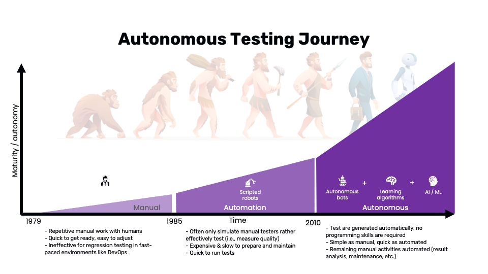
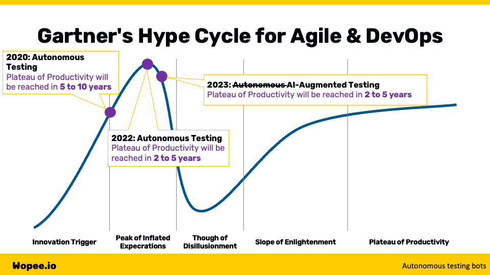
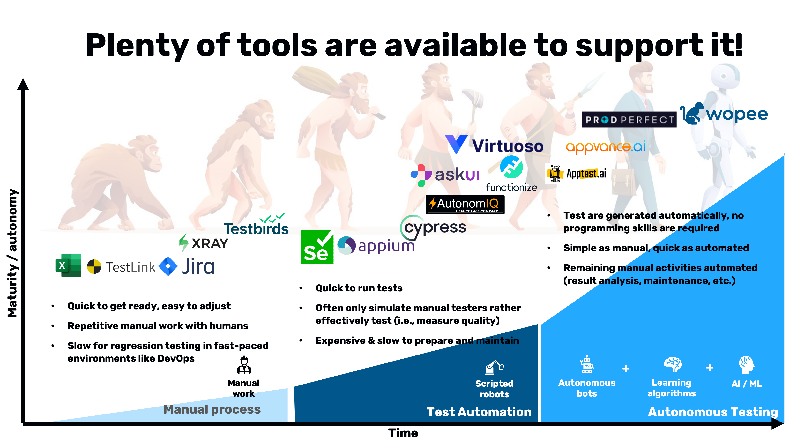

In the rapidly evolving landscape of software testing, traditional methods are becoming outdated. Since the inception of software testing in 1979 and test automation in 1985, core ideas have largely remained unchanged despite significant advancements. This article explores the future of software testing, examining the journey from manual to automated and autonomous testing, the benefits and challenges of these advancements, and the opportunities they present for the industry.

<!--truncate-->

## Introduction

Since the dawn of software testing in 1979 and the advent of test automation in 1985, the landscape of software testing has continually evolved. Despite these advancements, the core ideas and practices surrounding software testing remain rooted in principles established decades ago. In today's fast-paced, ever-changing technological environment, the demand for more efficient, effective, and innovative testing methodologies is greater than ever. Industry reports and forecasts highlight the significant potential of new testing paradigms. For example, Forrester’s report last year projected a 20-30% increase in testing productivity through testing bots, while Gartner forecasted a 30% growth in the adoption of autonomous testing approaches, now rebranded as AI-augmented testing. These insights point to a transformative shift in how testing will be approached in the future.

_Source: Wopee.io._

## Journey to the Testing Future

### From Manual to Automated Testing

The journey of software testing has been a progression from manual to automated testing. Initially, software testing was heavily manual, with human testers performing repetitive tasks. This method, while easy to set up and adjust, was inadequate for regression testing in dynamic environments like DevOps.

The introduction of automated testing brought about a significant change. By employing scripted robots to perform tests, it aimed to alleviate the manual workload. However, this approach had its limitations. Automated testing often struggled to measure quality effectively, was expensive and slow to prepare and maintain, and while quick to run tests, it didn't fully replicate the actions of manual testers.

### Enter Autonomous Testing

Autonomous testing represents the next significant leap in testing methodologies. This approach leverages the power of autonomous bots, learning algorithms, and AI/ML technologies. Autonomous testing eliminates the need for programming skills by generating tests automatically. This combines the simplicity of manual testing with the speed of automated testing, automating remaining manual activities such as result analysis and maintenance.

However, a critical question arises: Is autonomous testing truly the next era, or is it just an improved form of test automation?

## Understanding Autonomous Testing

Various sources classify autonomous testing into six levels:

- **Level 0 - Manual**: Entirely manual testing with no automation.
- **Level 1 - Assisted Automated Testing**: Some automation assists human testers.
- **Level 2 - Partial Automated Testing**: Automation handles specific tasks, but humans oversee the process.
- **Level 3 - Integrated Automated Testing**: Automation is integrated into the testing process, with significant but not total control.
- **Level 4 - Intelligent Automated Testing**: Automation is highly intelligent and capable, but still requires some human oversight.
- **Level 5 - Autonomous Testing**: The computer has full control of the testing process, making decisions and carrying out all testing actions without human intervention.

This classification mirrors the levels of autonomy seen in the automotive industry and reflects the gradual transition towards complete autonomy.

## The Hype and Reality of Autonomous Testing

In 2020, Gartner placed autonomous testing on their Hype Cycle for Agile and DevOps, predicting it would reach the Plateau of Productivity in 5 to 10 years. By 2022, this prediction was shortened to 2 to 5 years. Surprisingly, in 2023, autonomous testing disappeared from the cycle, replaced by AI-augmented testing. This shift underscores the dynamic nature of technological advancements in testing.

Regardless of the exact predictions or the final terminology adopted, the trajectory is clear: we are heading towards an era where human involvement in testing will be significantly reduced. The path to this future can be approached in two main ways: improving existing automation and introducing testing bots.

_Source: Wopee.io._

### Improving Existing Automation

Enhancing existing automation involves augmenting software test automation practices with or without AI. This approach not only boosts efficiency but also reduces the margin of error and increases the overall effectiveness of the testing process. Here are some opportunities to enhance existing automation:

#### Predictive Test Selection

[Predictive test selection](/blog/predictive-test-selection/) uses AI and machine learning to analyze past test results, code changes, and other factors to predict which tests are likely to fail. This approach helps prioritize testing efforts, ensuring that the most critical and likely-to-fail areas of the code are tested first. By focusing on high-risk areas, teams can catch defects earlier, reduce testing time, and improve overall software quality.

#### Test Script Generation

Automating the creation of test scripts can significantly speed up the authoring and maintenance process while reducing human errors. AI-powered tools can analyze the application under test (AUT) and generate test scripts automatically, adapting to changes in the codebase. This not only reduces the time required to create and update test scripts but also ensures that the scripts are always in sync with the latest version of the application.

#### Self-Healed Locators

Self-healing locators automatically update in test cases when the structure or attributes of the page change. Traditional test automation scripts often fail when the UI changes, as locators become outdated. [Self-healing locators](/blog/self-healing-in-sw-test-automation/) use machine learning algorithms to identify and adapt to changes in the UI, ensuring that tests remain functional and reducing the need for manual intervention.

#### Autonomous Navigation/Interaction

Autonomous navigation and interaction eliminate the need for hardcoded scripts by generating AUT navigation and interaction on the fly. This makes tests more adaptive to changes in the application, as the AI can dynamically interact with the UI based on the current state of the application. This approach improves test coverage and reduces maintenance efforts, as the AI can handle changes in the application without requiring updates to the test scripts.

#### Image-Based (UI) Object Recognition

Image-based object recognition uses advanced image recognition techniques to identify objects in the UI. This is particularly useful when traditional locators, such as IDs or class names, are not available or reliable. By analyzing the visual representation of the UI, AI-powered tools can identify and interact with UI elements based on their appearance, making the tests more robust and adaptable to changes.

#### Visual Validations/Assertions

Visual validations and assertions ensure that UI elements are displayed correctly and look as expected. This technique can be used for testing graphical user interfaces (GUIs), ensuring that visual aspects such as layout, color, and fonts are correct. It can also be applied to report (PDF) testing, verifying that the content and formatting of generated reports meet the specified requirements. Visual validations provide an additional layer of testing that complements traditional functional tests.

#### Dynamic/Magic POM

Dynamic or magic Page Object Model (POM) techniques increase the maintenance efficiency of scripts by generating page objects dynamically. Traditional POM requires manual updates whenever the UI changes, which can be time-consuming and error-prone. Dynamic POM techniques use AI to automatically generate and update page objects based on the current state of the UI, reducing maintenance efforts and ensuring that the tests remain up-to-date.

#### Smarter Reporting

Smarter reporting involves classifying test failures into different categories, such as environment issues, flaky tests, or actual bugs. By categorizing failures, teams can prioritize and focus on the most critical issues, improving the efficiency of the debugging process. Smarter reporting also provides better insights into the overall health of the application, helping teams identify recurring issues and trends that need to be addressed.

_Source: Wopee.io._

Enhancing existing automation through these advanced techniques can lead to significant improvements in the efficiency, accuracy, and effectiveness of software testing. By leveraging AI and machine learning, teams can automate repetitive tasks, adapt to changes more quickly, and focus their efforts on the most critical areas. These advancements not only reduce the manual workload but also improve the overall quality of the software, ensuring that it meets the highest standards and delivers a superior user experience.

## Introducing Testing Bots

Testing bots, such as Turing Bots, are AI-powered software designed to assist developers and development teams in planning, designing, building, testing, and deploying application code. These bots represent a significant leap forward in the automation of software testing, leveraging artificial intelligence to perform complex tasks more efficiently than traditional automated testing tools. Forrester recently highlighted the potential of testing bots, estimating that they could boost productivity by 20-30%. GitLab's 2023 Global DevSecOps Report supports this optimistic outlook, noting that 53% of respondents use or plan to use bots for testing, a substantial increase from 39% the previous year.

### Building Effective Testing Bots

To build effective testing bots, it is crucial to focus on two key features: interactions and validations. These elements ensure that bots can comprehensively test applications across various dimensions, from user interactions to data integrity.

### Interactions

Interactions involve the various ways a bot can interact with the system under test. These interactions are essential for simulating real-world usage scenarios and ensuring that all aspects of the application function correctly. The main types of interactions include:

- **UI (Web, Mobile, Desktop)**: Interacting with the user interface of applications across different platforms is critical for ensuring that the application behaves correctly from the end-user's perspective. Testing bots can simulate user actions such as clicking buttons, entering text, and navigating through the application, providing a thorough assessment of the UI's functionality and usability.

- **API**: Application Programming Interface (API) testing is vital for verifying that different parts of the application communicate correctly. Testing bots can send requests to APIs, validate the responses, and ensure that they adhere to the expected formats and protocols. This type of interaction is crucial for backend testing and ensuring that services integrate seamlessly.

- **Files**: Bots can interact with files by reading, writing, and verifying file contents. This interaction is particularly useful for applications that involve file processing, such as document management systems or data analysis tools. Testing bots can ensure that files are handled correctly, that data is accurately read and written, and that file integrity is maintained.

- **Databases**: Interacting with databases involves performing CRUD (Create, Read, Update, Delete) operations to ensure data integrity. Testing bots can verify that data is stored correctly, that queries return the expected results, and that database transactions are processed accurately. This interaction is essential for applications that rely heavily on data storage and retrieval.

- **Networks**: Network interactions involve testing the communication between different system components. Bots can simulate network traffic, test network latency and throughput, and ensure that data is transmitted securely. This type of interaction is crucial for distributed applications and systems that require reliable network connectivity.

### Validations

Validations are the various ways a bot can verify the correctness of the system under test. These validations ensure that the application meets its functional and non-functional requirements, providing a comprehensive assessment of its quality. The main types of validations include:

- **Functional**: Functional validation ensures that the application functions as expected. Bots can perform functional tests by executing specific workflows, verifying the outputs, and checking that the application behaves correctly under various conditions. This type of validation is fundamental for ensuring that the application's features work as intended.

- **Data**: Data validation involves verifying that data is processed and stored correctly. Bots can check data consistency, accuracy, and integrity by validating data inputs and outputs, ensuring that data transformations are performed correctly, and verifying that data is stored accurately in databases. This type of validation is crucial for applications that handle large volumes of data or require precise data processing.

- **Performance**: Performance validation ensures that the application meets performance criteria, such as response times, throughput, and resource usage. Bots can perform load testing, stress testing, and performance benchmarking to assess the application's performance under different conditions. This type of validation helps identify performance bottlenecks and ensures that the application can handle expected workloads.

- **Security**: Security validation involves testing the application for vulnerabilities and ensuring it meets security standards. Bots can perform security testing by scanning for common vulnerabilities, testing access controls, and verifying that data is encrypted and transmitted securely. This type of validation is essential for protecting sensitive data and ensuring that the application complies with security best practices.

- **Compliance and Accessibility**: Compliance and accessibility validation ensure that the application adheres to relevant regulations and standards, including those for accessibility. Bots can check that the application complies with industry-specific requirements, such as GDPR for data protection or WCAG (Web Content Accessibility Guidelines) for accessibility. This type of validation is crucial for avoiding legal and regulatory issues, ensuring that the application is usable by people with disabilities, and meeting all necessary compliance requirements.

Introducing testing bots into the software development lifecycle offers numerous benefits, from increased productivity to enhanced accuracy and efficiency. By focusing on key features like interactions and validations, testing bots can provide a comprehensive and reliable assessment of the application, ensuring it meets the highest standards of quality and performance. As more organizations adopt these advanced testing tools, the future of software testing looks increasingly promising, with AI-powered bots leading the way towards more efficient and effective testing practices.

## Benefits of Advanced Testing Approaches

The adoption of advanced testing approaches, such as autonomous testing and testing bots, brings several benefits:

- **Increased Efficiency**: Automated and autonomous testing significantly reduce the time and effort required for testing, allowing for faster release cycles.
- **Enhanced Accuracy**: Automated tests are less prone to human error, ensuring more reliable and consistent test results.
- **Scalability**: These approaches can easily scale to handle large and complex applications, ensuring comprehensive testing coverage.
- **Cost Savings**: By reducing manual testing efforts and improving test efficiency, organizations can achieve significant cost savings.
- **Improved Quality**: With more thorough and consistent testing, the overall quality of the software is enhanced, leading to better user satisfaction and fewer post-release issues.

## Challenges and Considerations

While the future of software testing is promising, there are several challenges and considerations to keep in mind:

- **Initial Investment**: Implementing advanced testing approaches requires a significant initial investment in terms of time, resources, and technology.
- **Skill Set**: The adoption of new testing methodologies may require upskilling existing team members or hiring new talent with the necessary expertise.
- **Maintenance**: While autonomous testing reduces maintenance efforts, some level of oversight and maintenance is still required to ensure the tests remain relevant and effective.
- **Integration**: Integrating new testing tools and approaches with existing systems and processes can be challenging and may require significant effort.

## The Future: AI-Augmented Testing

As we move forward, the distinction between automated, autonomous, and AI-augmented testing will become increasingly blurred. AI-augmented testing represents the next evolutionary step, combining the best aspects of both autonomous and traditional automated testing. This approach leverages AI and machine learning to not only execute tests but also to learn and adapt from the testing process, providing insights and making intelligent decisions to optimize the testing strategy.

## Conclusion

The future of software testing is bright, with emerging technologies and methodologies promising to revolutionize the field. From the early days of manual testing to the current advancements in automated and autonomous testing, the journey has been marked by continuous innovation and improvement. As we look ahead, AI-augmented testing stands out as a key trend, offering the potential to further enhance testing efficiency, accuracy, and effectiveness. By embracing these advancements, organizations can stay ahead of the curve, ensuring their software meets the highest standards of quality and reliability in an increasingly competitive and fast-paced market.
