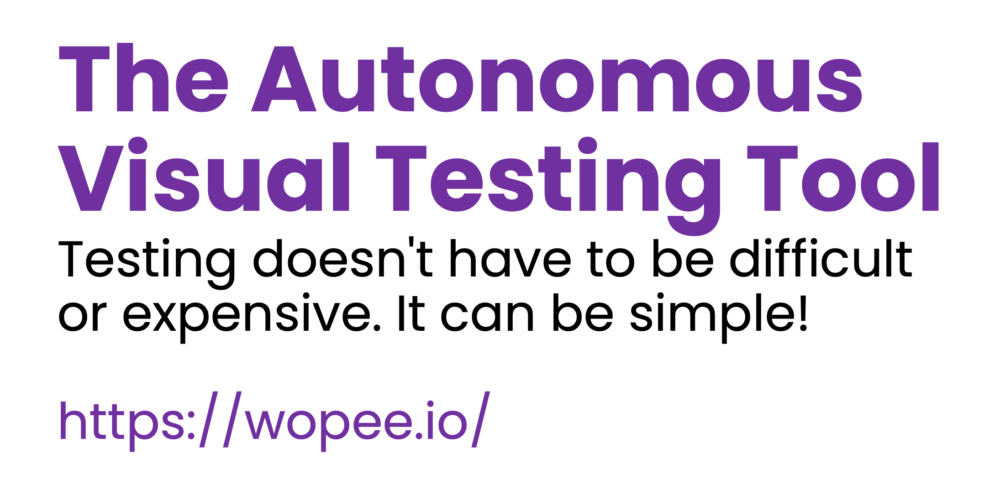

> ## Stop overpaying for visual testing. It doesn’t have to suck.

You’re probably paying too much for visual testing tools that overcomplicate everything. The truth is, visual testing doesn’t have to be this hard. It can be simple, affordable, and — dare we say — even enjoyable. It’s time for a change.

**Visual regression testing** is essential for ensuring that your web and mobile apps look perfect across browsers and devices. But with so many tools available, how do you choose the best one for your team? Two of the most popular options are **Applitools** and **Wopee.io**. Here’s a detailed comparison to help you decide.

<!-- truncate -->

### Stop struggling with bloated, expensive solutions and start testing with a tool that just works: Wopee.io 😎

## Why Visual Regression Testing Matters

Visual regression testing ensures that visual elements of your app function correctly across different environments. It automates the detection of visual differences between baseline and actual images, saving teams countless hours of manual testing and preventing errors from reaching production.

## Applitools: Industry Giant but at a Price

Applitools is a well-known player in the **visual regression testing** space. Its **Visual AI** technology is praised for accuracy and it integrates with many testing frameworks like Selenium, Cypress, and WebDriverIO.

However, despite its popularity, Applitools customers report **mixed experiences** when it comes to its ease of use and pricing model:

- **Opaque Pricing**: One of the most common complaints is that Applitools does not disclose pricing on their website. Customers report needing to go through time-consuming negotiations to get pricing that’s tailored to their company, often resulting in higher-than-expected costs.
- **Expensive for Growing Teams**: Many users on G2 point out that Applitools' pricing escalates quickly as your team scales or your testing needs increase
  [[source]](https://www.g2.com/products/applitools/reviews).
- **Complex Setup**: While Applitools has powerful AI-powered features, some users mention that the tool can be difficult to implement, particularly when dealing with dynamic content or low-resolution images [[source]](https://www.g2.com/products/applitools/reviews).
- **High Maintenance**: Applitools may require **constant updates and fine-tuning**, which can increase the burden on teams that already have limited resources [[source]](https://www.g2.com/products/applitools/reviews).

## Wopee.io: Affordable, Easy-to-Use, and Built for Scale (Cloud or On-Premise)

**Wopee.io** is the **cost-effective alternative** for teams looking to simplify **visual regression testing** without the technical complexity or exorbitant costs that often come with tools like Applitools. Whether you're working in the cloud or need an **on-premise** solution for more control and security, Wopee.io is designed to meet your needs without compromise.

### Key Benefits of Wopee.io

#### 1. **Transparent and Affordable Pricing**

With **Wopee.io**, pricing is fully transparent — no hidden fees, no surprise price hikes, and no painful negotiations. Plans start at €79 per user/month, and we make it easy to understand what you’re paying for.

Plus, for customers looking for a long-term solution, we offer a **40% discount on annual commitments**, making Wopee.io even more affordable for businesses ready to scale their testing efforts.

#### 2. **Cloud or On-Premise Flexibility**

Wopee.io gives you the freedom to choose where you want to run your tests. Whether you prefer the convenience and scalability of the **cloud** or require the enhanced **security and control** of an **on-premise** deployment, we’ve got you covered. Our **on-premise option** ensures that your testing data stays behind your firewall, all while delivering the same effortless performance.

#### 3. **Long-Term Partnership**

At Wopee.io, we’re committed to building **long-term partnerships** with our customers. We don’t just listen to feedback; we actively adjust our product to meet evolving needs. In advanced partnerships, we even **customize or build features** specifically tailored to your workflow and requirements.

#### 4. **20+ Years of Expertise**

With over **20 years of experience** in web app software testing and development, our team brings a deep understanding of the challenges modern QA teams face. Whether it’s helping you set up faster or scale seamlessly, we have the expertise to ensure your success.

#### 5. **Easy Setup**

Wopee.io is designed for rapid deployment. **Minimal coding** is required, so your team can start testing in minutes — regardless of their technical skill level. No need for extensive DevOps resources to get started.

#### 6. **Instant Results**

Speed is critical in modern software development. Wopee.io delivers **instant accurate results**, allowing your team to quickly identify and resolve visual bugs before they reach production. This increases your team’s **efficiency** by tenfold.

#### 7. **Effortless Scalability**

Whether you’re testing a simple landing page or a complex, multi-functional app, Wopee.io scales effortlessly. Expand your visual testing coverage without the hassle of additional configuration or complexity, in both **cloud** and **on-prem** environments.

#### 8. **Minimal Maintenance**

Built with simplicity in mind, Wopee.io requires **30% less maintenance** compared to tools like Applitools. This frees up your team to focus on more important tasks, instead of constantly managing the testing setup.

#### 9. **Comprehensive Integration**

Wopee.io integrates seamlessly with frameworks like **Playwright, Cypress, WebDriverIO**, and **Robot Framework**, giving you the flexibility to work with the tools you already rely on. No need to change your current workflow.

:::tip Get Started Today 🔥

**Ready to simplify your visual testing?** [Start your free trial with Wopee.io](https://cmd.wopee.io) today and see the difference in minutes.

:::

## Feedback from Wopee.io Customers

### Multitude

_European provider of Digital Financial Services with 400k+ customers in 20 countries._

> Wopee autonomous testing is extremely valuable in testing our marketing & customer account pages.

— **Juraj Žabka**, Engineering Lead

### Livesport

_The fastest sports information and scores provider from 35+ sports to 100M people worldwide._

> Wopee showcased its potential to save us valuable time and effort in maintaining the visual integrity of our application.

— **Martin Šimon**, Test Automation Lead

For more details on how Livesport leverages Wopee.io for visual testing, check out the full case study [here](/blog/livesport-visual-testing-w-wopee-io).

## Pricing Comparison: Applitools vs. Wopee.io

### Wopee.io Pricing

- Basic Plan: €79/user/month (10,000 test steps/month)
- Premium Plan: €179/user/month (100,000 test steps/month)
- Ultimate Plan: Contact us for pricing (unlimited test steps and on-premise bots)

### Applitools Pricing

Unlike Applitools, where pricing is hidden behind sales negotiations, Wopee.io offers **transparent and affordable plans** right on their website.

> "Applitools pricing is unfair to users, who must negotiate to get their costs and are often surprised by how expensive it becomes for larger teams." -- source: demo calls with Applitools customers

In contrast, Wopee.io provides upfront pricing, saving teams time and avoiding budget overruns.

We've heard directly from customers switching from Applitools to Wopee.io that they were paying **€50k+ annually** for their visual testing needs. After making the switch, many report **savings of 40% to 70%**, significantly reducing their costs while maintaining the same high level of performance and scalability.

## Wopee.io vs. Applitools: Key Features Breakdown

| Feature                            | Wopee.io                                          | Applitools                                                                                    |
| ---------------------------------- | ------------------------------------------------- | --------------------------------------------------------------------------------------------- |
| **Pricing Transparency**           | Transparent                                       | Opaque                                                                                        |
| **Visual AI Technology**           | Available                                         | Available                                                                                     |
| **Ease of Use**                    | Very Easy                                         | Can be complex for dynamic content [[source]](https://www.g2.com/products/applitools/reviews) |
| **Instant Test Results**           | Yes                                               | Yes                                                                                           |
| **Integration with Testing Tools** | Playwright, Cypress, WebDriverIO, Robot Framework | Selenium, Cypress, WebDriverIO                                                                |
| **Pricing Flexibility**            | Affordable, clear plans                           | High, requires negotiation [[source]](https://www.g2.com/products/applitools/reviews)         |
| **Setup Time**                     | Minutes                                           | Can be difficult [[source]](https://www.g2.com/products/applitools/reviews)                   |
| **Maintenance**                    | Minimal                                           | Requires constant maintenance [[source]](https://www.g2.com/products/applitools/reviews)      |
| **Cost**                           | up to 70% cost saving                             | -                                                                                             |

## Why Teams Are Choosing Wopee.io Over Applitools

Teams frustrated with the **high costs** and **complex maintenance** of Applitools are making the switch to Wopee.io for its ease of use, affordable pricing, and lightning-fast setup.

### Customer Story: Scaling Visual Testing with Wopee.io

> "We were struggling with the complexity and cost of Applitools. Switching to Wopee.io was a game-changer. It’s so easy to set up, and the savings allowed us to redirect resources to other key areas." – Emily, Test Lead

## Conclusion: Wopee.io – The Smart Choice for Visual Regression Testing

If you’re looking for a fast, affordable, and **easy-to-use visual regression testing tool**, **Wopee.io** is the clear winner.

It offers transparent pricing, minimal setup, and effortless scalability—perfect for teams of all sizes. Plus, with Wopee.io’s **long-term commitment discounts** and our commitment to **customizing features for advanced cooperation**, you’ll be well-equipped to grow your testing efforts without breaking your budget.

:::tip Ready to make the switch? 🔥

**Try Wopee.io [free for 1 month](https://cmd.wopee.io)** and experience the simplicity and power of visual regression testing without the high costs.

:::
