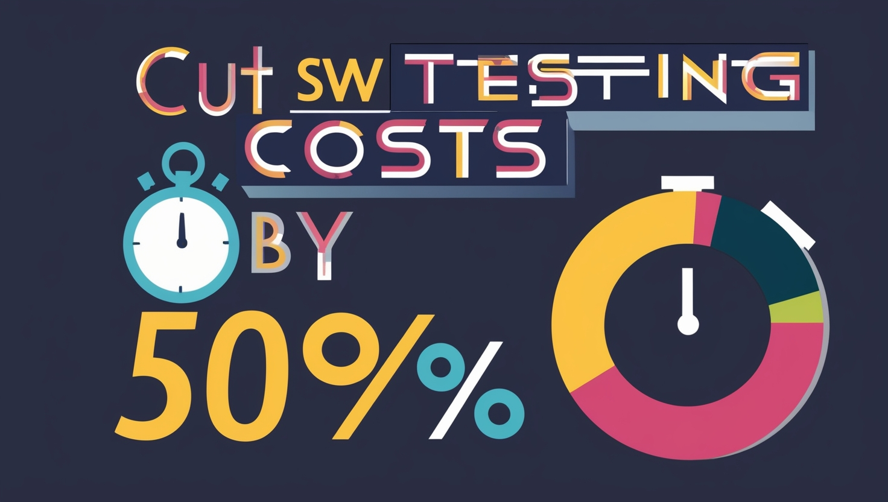

What a ridiculous idea! … or, wait a minute.
🧐
Maybe? 🤔
Maybe it could be possible. 🫣

When I first heard about the idea of saving 50% in software testing costs, I thought it was just another wild dream. But then, I started to think about it. Could it really be possible? What if there are ways to streamline the process, cut unnecessary steps, and still ensure quality? I decided to dig deeper and explore this concept, and here’s what I found. Let me share with you 7 tips that could(?) turn this dream into a reality.

<!--truncate-->

_Source: Wopee.io & leonardo.ai._

## 1. Do NOT Test

Yes, you read that right. At least, not everything.

The notion of not testing every single part of your software might sound controversial, especially when you bring it up with your manager. But here’s the thing: a risk-based analysis can help you determine what really needs to be tested. This method focuses on the areas of your product that are most critical and frequently used, especially those that haven’t been modified. By concentrating your efforts where they matter most, you can reduce the time and resources spent on regression testing without compromising quality.

**Checklist to Get Started:**

- **Conduct a Risk-Based Analysis:**

  - Identify the most critical parts of your application.
  - Assess which areas are most frequently used by users.
  - Determine which parts of the software have been modified recently.

- **Prioritize Test Cases:**

  - Create a priority list of test cases based on risk assessment.
  - Focus on high-impact areas first.
  - Continuously reassess and adjust priorities as the project evolves.

- **Communicate with Stakeholders:**
  - Discuss the risk-based approach with your team and management.
  - Ensure everyone understands the rationale behind the reduced testing scope.
  - Collect feedback and address any concerns.

## 2. Test in Production

What if you used your users as your testers? Testing in production is a strategy employed by many companies with widely adopted products. This method involves making frequent releases with feature flags, and continuously monitoring the production environment. With strong deployment and rollback capabilities, as well as user feedback mechanisms, this approach can effectively identify and address issues in real time. Additionally, integrating automated testing into this strategy can make it even more robust.

**Checklist to Get Started:**

- **Set Up Monitoring Tools:**

  - Implement infrastructure monitoring tools.
  - Use application performance monitoring (APM) solutions.
  - Establish user feedback channels such as surveys or support tickets.

- **Enable Feature Flags:**

  - Use feature flags to control the release of new features.
  - Gradually roll out new features to a subset of users.
  - Monitor the impact and gather feedback before a full release.

- **Develop Strong Rollback Capabilities:**
  - Ensure you have a reliable deployment process.
  - Implement automatic rollback mechanisms.
  - Regularly test rollback procedures to ensure they work smoothly.

## 3. Automate (But Not Just Testing)

Automation is a buzzword in the software industry, but it’s often misunderstood. It’s not just about automating your tests; it’s about integrating test automation into your CI/CD processes. This integration ensures that your automation efforts are consistent and aligned with your development workflow. Remember, automation isn’t a one-size-fits-all solution. It requires time, effort, and the right tools to be successful. Be prepared for a gradual process rather than an overnight transformation.

**Checklist to Get Started:**

- **Integrate with CI/CD Pipelines:**

  - Set up automated tests to run with every build.
  - Ensure that test results are immediately available to the team.
  - Continuously refine and improve the automation process.

- **Choose the Right Tools:**

  - Evaluate different test automation tools based on your needs.
  - Consider using open-source tools for flexibility and cost savings.
  - Invest in tools that integrate seamlessly with your existing infrastructure.

- **Plan for Long-Term Success:**
  - Develop a clear automation strategy and roadmap.
  - Train your team on best practices in test automation.
  - Allocate time and resources for maintaining and updating automated tests.

## 4. Do NOT Automate! (Yes, You Read That Right)

I love automation, but sometimes it’s just not worth it. If automating a test doesn’t make sense, don’t do it. Instead, look for opportunities to simplify or optimize the testing process. For instance, consider moving tests from the UI level to the API level, or focus on improving monitoring tools. By rethinking your approach, you might find that some tests become more feasible to automate, while others can be handled more efficiently through other means.

**Checklist to Get Started:**

- **Identify Non-Critical Tests:**

  - Review your test suite to identify tests that are less critical.
  - Determine if these tests can be simplified or performed manually.
  - Assess the potential impact of not automating these tests.

- **Focus on High-Impact Areas:**

  - Prioritize automation for tests that provide the highest ROI.
  - Move tests from the UI level to the API level where possible.
  - Improve monitoring tools to catch issues without extensive test automation.

- **Evaluate and Adapt:**
  - Regularly review your automation strategy.
  - Be flexible and willing to adapt your approach based on new information.
  - Involve your team in decision-making to gain diverse perspectives.

## 5. Improve Non-Testing Areas

Efficiency in testing isn’t just about the tests themselves. It’s also about the environment, data quality, feedback loops, and automation of builds and releases. These non-testing activities can significantly impact your overall testing efficiency. For example, a stable and fast testing environment can save a lot of time and headaches. Similarly, high-quality test data and prompt feedback from developers or business users can streamline your testing process.

**Checklist to Get Started:**

- **Enhance Testing Environments:**

  - Ensure that your testing environments are stable and fast.
  - Use virtualization or containerization to replicate production environments.
  - Regularly update and maintain your testing environments.

- **Improve Test Data Quality:**

  - Use realistic and high-quality test data.
  - Automate the creation and management of test data.
  - Regularly clean up and refresh test data to avoid inconsistencies.

- **Streamline Feedback Loops:**
  - Establish clear communication channels between testers and developers.
  - Implement tools that facilitate quick feedback and issue resolution.
  - Foster a collaborative culture to improve overall efficiency.

## 6. Re-focus Your Testing

Not all tests are created equal. It’s crucial to focus your testing efforts at the right levels. Following the testing pyramid blindly might not always be the best approach. I remember a project where we worked closely with developers to create initial happy path scenarios for smoke testing. This collaboration not only improved our productivity but also helped the developers understand the challenges we faced with locators, leading them to enhance the application to facilitate test automation. Moving complex tests from the UI to the API level can also significantly reduce maintenance efforts.

**Checklist to Get Started:**

- **Collaborate with Developers:**

  - Work with developers to create initial test scenarios.
  - Share insights on challenges faced during testing.
  - Foster a collaborative environment to improve testability.

- **Optimize Test Levels:**

  - Identify which tests are better suited for the API level.
  - Move complex UI tests to the API level where possible.
  - Regularly review and adjust your testing strategy.

- **Think Outside the Box:**
  - Challenge traditional testing pyramids and explore new approaches.
  - Experiment with different testing levels and strategies.
  - Be open to innovative solutions that improve efficiency.

## 7. Involve the Right People

Getting the right people involved doesn’t always mean hiring more full-time staff. Sometimes, a short-term expert can make a big difference. At Wopee.io, we often bring in short-term advisors to boost our competencies. This approach can dramatically improve efficiency without the long-term commitment of hiring new employees. If you’re looking for ways to speed up your testing process, consider bringing in an expert to help you identify and implement improvements.

**Checklist to Get Started:**

- **Identify Expertise Gaps:**

  - Assess your team’s current skills and identify gaps.
  - Determine which areas could benefit from expert input.
  - Plan for short-term or long-term support as needed.

- **Hire Short-Term Experts:**

  - Look for experienced professionals who can provide immediate value.
  - Use consultants or advisors to speed up specific projects.
  - Focus on knowledge transfer to ensure lasting benefits.

- **Foster Continuous Learning:**
  - Encourage your team to learn from external experts.
  - Provide opportunities for training and professional development.
  - Create a culture of continuous improvement.

## Turning the Dream into Reality

By adopting these strategies, you can significantly enhance the efficiency of your software testing process. While achieving a 50% reduction in costs is an ambitious target, even more modest improvements can have a substantial impact. Regularly reviewing your testing approach and being open to new ideas can lead to meaningful gains in efficiency, speed, and reliability.

At Wopee.io, our mission is to help you achieve these efficiency gains. Our tool simplifies and accelerates testing by eliminating the need for complex preparation and programming. With Wopee.io, testing becomes effortless – no setup required, and you get results instantly.

### Let’s Start a Conversation

Let’s start a conversation about how you can enhance your testing efficiency. Share this article on LinkedIn, tag us, and let’s brainstorm together. I'm eager to hear your thoughts and ideas on this topic. Reach out to me via my [LinkedIn profile](https://www.linkedin.com/in/marcelveselka/) or the [Wopee.io LinkedIn](https://www.linkedin.com/company/wopee/) page.

Embrace the future of testing with Wopee.io, where improving your testing process is not just a dream – it’s a practical goal.
