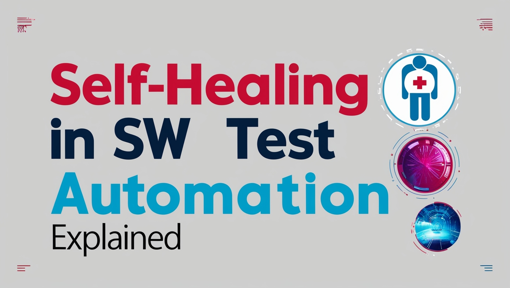

Self-Healing in Test Automation: The Future of Reliable Testing?

Maintaining robust test automation can be a daunting challenge. As applications evolve rapidly, test scripts often break due to changes in the user interface (UI) or application structure. This leads to increased maintenance overhead, false test failures, and reduced confidence in the test suite.

<!--truncate-->

Enter self-healing test automation - a game-changing approach that promises to revolutionize the way we handle test maintenance and reliability. In this comprehensive guide, we'll explore what self-healing automation is, how it works, and how you can implement it in your testing strategy to stay ahead in the competitive software development landscape.


_Source: Wopee.io & leonardo.ai._

## Understanding Self-Healing Test Automation

### What is Self-Healing Test Automation?

Self-healing test automation refers to the capability of test frameworks and tools to automatically detect and recover from issues that cause tests to fail, particularly due to changes in the application under test (AUT). This innovative approach aims to enhance the resilience of automated test suites by dynamically adjusting to UI changes, element locator modifications, and other structural alterations without requiring manual intervention.

In traditional test automation, even minor changes to the application's UI can lead to test failures, necessitating time-consuming updates to test scripts. Self-healing mechanisms address this challenge by incorporating intelligent techniques that can adapt to these changes on the fly, ensuring that tests remain stable and effective despite ongoing application development.

### Key Concepts of Self-Healing

To fully grasp the power of self-healing test automation, it's essential to understand its key concepts:

1. **Dynamic Locators**: These are flexible strategies used to identify UI elements even when their properties change. Instead of relying on fixed attributes, dynamic locators use multiple attributes or contextual information to locate elements.

2. **Fallback Strategies**: These are alternative methods employed to locate elements if the primary method fails. Fallback strategies ensure that the test can continue even if the preferred locator becomes invalid.

3. **Machine Learning and AI**: Advanced self-healing systems use machine learning algorithms to predict and adapt to UI changes based on historical data and patterns. This allows the system to make intelligent decisions about how to handle changes in the application.

4. **Adaptive Waits**: These are smart waiting mechanisms that adjust dynamically based on the application's state, reducing timing-related issues in tests.

5. **Visual Recognition**: Some self-healing tools use image recognition and visual AI to identify elements based on their appearance rather than their underlying code.

## How Self-Healing Mechanisms Work

Self-healing automation typically employs a combination of techniques to maintain test stability:

### 1. Dynamic Element Identification

The core of self-healing lies in its ability to adapt to changes in UI attributes. When an element's properties change, the system attempts to identify the element using alternative attributes or contextual information.

#### Example: Dynamic Locator Strategy

```python
def find_element(driver, locator_strategies):
    for strategy, value in locator_strategies:
        try:
            return driver.find_element(strategy, value)
        except NoSuchElementException:
            continue
    raise NoSuchElementException("Element not found with any strategy")

# Usage
locator_strategies = [
    (By.ID, "submit-button"),
    (By.NAME, "submit"),
    (By.XPATH, "//button[contains(text(), 'Submit')]"),
    (By.CSS_SELECTOR, ".submit-btn")
]

element = find_element(driver, locator_strategies)
```

This example demonstrates a simple dynamic locator strategy that attempts multiple locator methods before giving up. It tries to find the element using ID, name, XPath, and CSS selector, increasing the chances of locating the element even if some attributes have changed.

### 2. Fallback Mechanisms

When the primary locator fails, self-healing systems employ fallback strategies to locate elements using alternative methods or heuristics.

#### Example: Fallback Strategy with Fuzzy Matching

```python
from fuzzywuzzy import fuzz

def find_element_with_fuzzy_match(driver, text, threshold=80):
    elements = driver.find_elements(By.TAG_NAME, "*")
    for element in elements:
        if fuzz.ratio(element.text, text) >= threshold:
            return element
    raise NoSuchElementException(f"No element found with text similar to '{text}'")

# Usage
try:
    element = find_element_with_fuzzy_match(driver, "Submit Order")
    element.click()
except NoSuchElementException:
    print("Element not found, even with fuzzy matching")
```

This example demonstrates the use of fuzzy string matching to locate an element with text that closely resembles the target, even allowing for minor text variations in buttons or labels. Please note that this is just a simplified explanation, and in reality, the implementation would be more complex.

:::note

The `fuzzywuzzy` is a Python library used for string matching and comparison. It's particularly useful in scenarios where you need to find similarities between strings, which can be very helpful in self-healing test automation.

:::

### 3. Context-Aware Adjustments

Self-healing mechanisms are context-aware and adjust their strategies based on the current state of the UI. They can re-evaluate elements and adapt to changes in real-time.

### 4. Error Detection and Recovery

When a test fails due to an un-locatable element, self-healing systems attempt to recover by employing recovery procedures, such as retrying with different locators or reloading the page.

#### Example: Implementing Retry Logic

```python
from retry import retry

@retry(NoSuchElementException, tries=3, delay=1, backoff=2)
def click_element_with_retry(driver, locator):
    element = driver.find_element(*locator)
    element.click()

# Usage
try:
    click_element_with_retry(driver, (By.ID, "dynamic-button"))
except NoSuchElementException:
    print("Element not clickable after multiple attempts")
```

In this example, a retry decorator is utilized to make multiple attempts to click an element, with increasing delays between each attempt.

Some teams implement even more advanced recovery mechanisms, such as moving test execution to the end of the test suite. This also requires setting up a proper strategy for maintaining test data effectively.

## Tools and Frameworks for Self-Healing Automation

There are numerous tools and frameworks offering self-healing capabilities in test automation. Below are a few examples, though many more options are available:

### 1. Selenium with Self-Healing Extensions

Selenium, a popular open-source testing framework, can be enhanced with self-healing capabilities through various libraries and plugins like Selenium IDE (Google Chrome extension) or healenium.io. These extensions integrate with existing Selenium test suites, offering flexibility and customization.

### 2. Testim

Testim is an AI-driven test automation platform that incorporates self-healing to automatically adjust to changes in the application UI. It features an easy-to-use interface with low-code/no-code options and advanced machine learning algorithms for UI change prediction.

### 3. Ranorex

Ranorex is a comprehensive test automation tool that includes self-healing features to handle dynamic UI changes. It is robust and feature-rich, supporting extensive platforms and integrating well with CI/CD tools.

### 4. Katalon Studio

Katalon Studio is an integrated test automation tool with self-healing features. It is cost-effective, supports both web and mobile testing, and provides integrated test management and reporting.

## Implementing Self-Healing in Your Test Suite

Many tools have their own “Getting started” instructions to easily follow. If you decide to implement self-healing in your existing test suite, following these steps might inspire you to get started:

### 1. Assess Current Test Suite

Start by evaluating your current test cases to understand their structure and identify areas prone to failure due to UI changes. This assessment will help you prioritize which tests would benefit most from self-healing mechanisms.

### 2. Choose the Right Tool

Select a self-healing tool or framework that aligns with your needs, considering factors like integration capabilities, cost, ease of use, and support for your technology stack.

### 3. Implement Dynamic Locators

Replace static locators with dynamic ones to make your tests more resilient to UI changes. Here's an example of implementing a dynamic locator strategy:

```python
def get_dynamic_locator(driver, locator_strategies):
    for strategy in locator_strategies:
        try:
            return driver.find_element(*strategy)
        except NoSuchElementException:
            continue
    raise NoSuchElementException("Element not found with any strategy")

# Usage
login_button_strategies = [
    (By.ID, "login-btn"),
    (By.NAME, "login"),
    (By.XPATH, "//button[contains(text(), 'Log In')]"),
    (By.CSS_SELECTOR, ".login-button")
]

login_button = get_dynamic_locator(driver, login_button_strategies)
login_button.click()
```

### 4. Configure Adaptive Waits

Implement adaptive wait strategies to handle timing issues and asynchronous operations effectively. Here's an example of an adaptive wait:

```python
from selenium.webdriver.support.ui import WebDriverWait
from selenium.webdriver.support import expected_conditions as EC

def wait_for_element(driver, locator, timeout=10):
    return WebDriverWait(driver, timeout).until(
        EC.presence_of_element_located(locator)
    )

# Usage
try:
    element = wait_for_element(driver, (By.ID, "dynamic-content"))
    print(element.text)
except TimeoutException:
    print("Element did not appear within the specified timeout")
```

### 5. Implement Error Recovery Mechanisms

Set up recovery procedures to handle failures gracefully. This may include retrying actions, refreshing the page, or attempting alternative workflows.

```python
def perform_action_with_recovery(driver, action, max_retries=3):
    for attempt in range(max_retries):
        try:
            action(driver)
            return  # Action successful, exit the function
        except (NoSuchElementException, ElementClickInterceptedException) as e:
            if attempt == max_retries - 1:
                raise  # Re-raise the exception if all retries failed
            print(f"Attempt {attempt + 1} failed. Retrying...")
            driver.refresh()  # Refresh the page before retrying

# Usage
def click_submit_button(driver):
    submit_button = driver.find_element(By.ID, "submit-btn")
    submit_button.click()

perform_action_with_recovery(driver, click_submit_button)
```

### 6. Test and Validate

Run your test suite with the new self-healing mechanisms in place. Monitor the results to ensure that self-healing features are functioning as expected and adjust configurations as needed.

## Best Practices for Maximizing Self-Healing Benefits

To get the most out of your self-healing test automation strategy, consider the following best practices:

1. **Use relative locators**: Prefer relative locators (e.g., relative XPaths, CSS selectors) over absolute ones to reduce sensitivity to UI changes.

2. **Implement multiple locator strategies**: Define primary and secondary locators for each element to increase the chances of successful identification.

3. **Regularly review and update locator strategies**: Periodically audit your locator strategies to ensure they remain effective as the application evolves.

4. **Leverage machine learning models effectively**: If using AI-driven tools, ensure that machine learning models are trained with up-to-date and relevant data.

5. **Configure appropriate adaptive waits**: Set up adaptive wait strategies that handle timing issues effectively, using explicit waits for specific conditions and implicit waits for general timing needs.

6. **Design modular and reusable test cases**: Create test cases that are modular and reusable to simplify maintenance and adaptation to changes.

7. **Maintain clear documentation**: Keep detailed documentation of self-healing configurations, including locator strategies, machine learning models, and recovery procedures.

8. **Monitor and analyze test results**: Regularly review test results and failure patterns to identify areas for improvement in your self-healing strategy.

9. **Stay updated with technological advancements**: Keep abreast of new tools, features, and best practices in self-healing test automation to continuously improve your approach.

10. **Invest in team training**: Ensure that your team is well-trained in self-healing technologies and best practices to maximize the benefits of your strategy.

## Future Trends in Self-Healing Test Automation

As technology continues to evolve, several exciting trends are emerging in the field of self-healing test automation:

### 1. Enhanced AI and Machine Learning Capabilities

Future self-healing systems will likely incorporate more sophisticated AI and machine learning models, capable of:

- Predicting UI changes before they occur, allowing for proactive test adjustments
- Self-training and continuous learning from new test data without manual intervention
- More accurate element identification based on context and user behavior patterns

:::tip

Check out the [Healenium](https://healenium.io/) tool, which uses machine learning to predict UI changes and automatically update test scripts.

:::

### 2. Advanced Visual Recognition and Augmented Reality

Visual AI is becoming increasingly sophisticated, enabling:

- More accurate and reliable element identification through visual recognition
- Testing of augmented reality (AR) applications by understanding and interacting with 3D elements
- Self-healing mechanisms that can adapt to visual changes in addition to code-level changes

### 3. Unified Frameworks and Seamless CI/CD Integration

The future of self-healing test automation will likely see:

- Development of unified frameworks that combine self-healing, AI, and other advanced testing methodologies into cohesive solutions
- Deeper integration with CI/CD pipelines, allowing for real-time healing and feedback within development workflows
- Automated rollback and recovery mechanisms that can handle test failures and ensure stability in production environments

### 4. Intelligent Test Case Generation

Emerging trends include:

- AI-driven test case creation based on application behavior and user interactions
- Dynamic adjustment of test coverage based on real-time data and application performance
- Automated optimization of test suites to focus on high-risk areas and critical user paths

:::tip

Check out our experts with Playwright & LLMs: [BDD Copilot w. Playwright](https://github.com/Wopee-io/BDD-Copilot-with-Playwright?tab=readme-ov-file#experiments) where we generate locators using LLMs on the fly for Playwright tests using BDD.

:::

## Conclusion

Self-healing test automation represents a significant advancement in making automated testing more robust, adaptable, and less maintenance-intensive. By implementing self-healing mechanisms and following best practices, teams can significantly improve the reliability and efficiency of their test suites, ultimately leading to faster development cycles and higher-quality software.

As we look to the future, the continued evolution of AI, machine learning, and visual recognition technologies promises to make self-healing test automation even more powerful and indispensable. The integration of these advanced capabilities with IoT testing and unified testing frameworks will further expand the scope and effectiveness of automated testing.

To stay competitive in the rapidly changing landscape of software development, it's crucial for organizations to embrace self-healing test automation and continuously refine their testing strategies. By doing so, they can ensure that their testing processes remain efficient, reliable, and capable of keeping pace with the demands of modern software development.

As you embark on your journey with self-healing test automation, remember that it's not just about adopting new tools or technologies. It's about fostering a culture of continuous improvement, staying informed about emerging trends, and always striving to optimize your testing processes. With the right approach and a commitment to innovation, self-healing test automation can be a significant improvement of stability for your software quality assurance efforts.

### Take Your Testing to the Next Level with Us!

Are you ready to revolutionize your testing processes and dramatically improve your software quality? We're passionate about helping organizations like yours harness the power of self-healing test automation. Our team of expert consultants has deep experience in implementing cutting-edge testing solutions across various industries.

Don't let unstable tests and constant maintenance slow down your development cycles. Partner with us to:

- Assess your current testing infrastructure and identify opportunities for improvement
- Design and implement a customized self-healing test automation strategy tailored to your unique needs
- Train your team on best practices and emerging trends in test automation
- Provide ongoing support and optimization to ensure your testing processes stay ahead of the curve

We'd love to help you unlock its benefits for your organization. Whether you're just starting your automation journey or looking to enhance your existing processes, we have the expertise to guide you every step of the way.

Contact us for a consultation and discover how we can help you achieve unprecedented levels of testing efficiency and software quality. Let's work together to build a more robust, reliable, and agile testing ecosystem for your organization.

Don't let test maintenance hold you back—embrace the future of testing with us!
