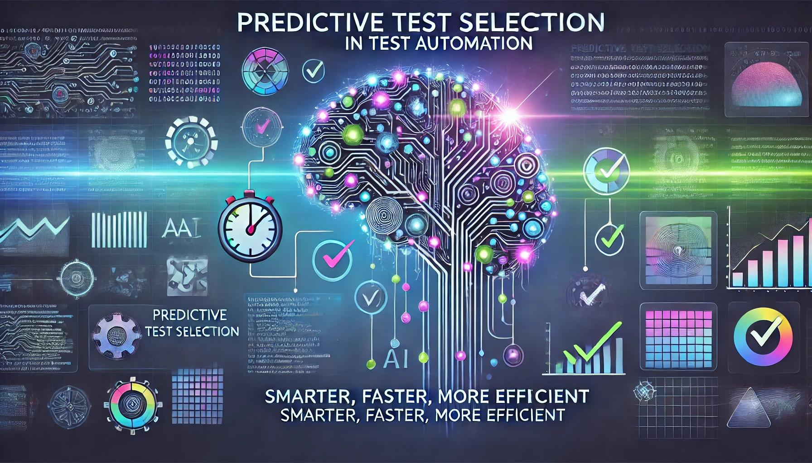
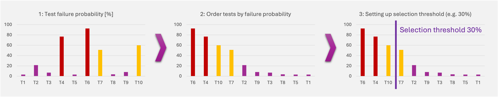

The need to release high-quality products quickly is more critical than ever. While test automation has greatly improved the efficiency of testing processes, the sheer volume of tests required can still overwhelm even the most streamlined teams. Enter **Predictive Test Selection (PTS)**—an AI-driven approach designed to optimize and accelerate the testing process by focusing on the areas of your code most likely to fail. In this article, we’ll explore how PTS enhances test automation, ensuring earlier defect detection, reduced testing time, and improved software quality.

<!--truncate-->

## 1. The Evolution: From Manual Prioritization to AI-Driven Predictions

Historically, test case prioritization was a manual, often subjective process. Test leads would rely on intuition, experience, or basic heuristics to determine which tests to run first. While this method worked, it was time-consuming and prone to human error. As software systems grew in complexity, this approach became less viable. The advent of AI and machine learning has shifted this paradigm, allowing predictive models to analyze vast amounts of historical test data, code changes, and other factors to forecast the tests most likely to uncover defects. This evolution from manual to AI-driven selection marks a significant improvement in testing efficiency and accuracy.

_Source: openai.com, DALL·E image generation_

The process of selecting which tests to run has evolved significantly over time. Understanding this evolution is crucial for appreciating the value that Predictive Test Selection (PTS) brings to modern testing environments. Let’s take a closer look at the progression from traditional methods to AI-driven approaches:

### Manual Prioritization: The Early Days

- **Experience-Based Decision Making**: In the early stages of software testing, test leads and QA teams relied heavily on their experience and intuition to prioritize tests. This often involved:

  - **Gut Instincts and Expertise**: Testers would choose which tests to run based on their knowledge of the codebase and past experiences with similar issues.
  - **Ad Hoc Processes**: There was little to no formal structure, with decisions made on the fly depending on the perceived risk or importance of certain features.

- **Challenges**:
  - **Inconsistency**: Different team members might prioritize tests differently, leading to inconsistent coverage.
  - **Scalability Issues**: As projects grew larger and more complex, this approach became increasingly difficult to manage.

### Tagging and Grouping Test Cases: Structuring the Process

- **Introduction of Tags**: To bring more structure to test selection, teams began using tags to group test cases. This approach involved:

  - **Categorizing Tests**: Test cases were labeled based on various attributes, such as functionality, risk level, or the module they covered.
  - **Easier Selection**: Tags allowed teams to quickly filter and select relevant tests, particularly for regression testing, where running the entire test suite might be impractical.

- **Challenges**:
  - **Manual Effort**: Assigning and managing tags required significant manual effort, especially in larger projects.
  - **Static Groupings**: Tags provided a static way to group tests, which didn’t account for the dynamic nature of software changes. As the code evolved, tags might become outdated, leading to less effective test coverage.

### Risk-Based and Coverage-Based Prioritization: A More Analytical Approach

The next step in the evolution was to enhance previous Tagging and Grouping Test Cases methods. Teams have started adopting more analytical approaches to test prioritization, such as Risk-Based Testing and Coverage-Based Testing.

- **Risk-Based Testing**: This method prioritized tests based on the potential impact of a failure. It involved:

  - **Identifying High-Risk Areas**: Tests were focused on the most critical parts of the application, where defects would have the most significant consequences.
  - **Optimizing Resource Allocation**: Resources were directed towards testing areas with the highest risk, ensuring that critical issues were caught early.

- **Coverage-Based Testing**: Another strategy was to prioritize tests based on code coverage metrics:

  - **Maximizing Coverage**: Tests were selected to cover the most lines of code or the most critical paths through the codebase.
  - **Balancing Quality and Efficiency**: This approach sought to balance thoroughness with the need to run tests efficiently, though it still required manual input and analysis.

- **Challenges**:
  - **Dependency on Historical Data**: These methods required detailed historical data (e.g. assessing impact based on user behavior in the production environment) and thorough risk assessments, which were time-consuming and often incomplete.
  - **Manual Adjustments**: Despite being more structured, these approaches still involved manual adjustments and judgment calls, which could introduce human error.

### AI-Driven Predictions: The Modern Approach

- **Harnessing Machine Learning**: With the advent of AI and machine learning, Predictive Test Selection offers a leap forward in how tests are prioritized:

  - **Data-Driven Insights**: PTS leverages historical test results, code changes, bug reports, and other relevant factors to predict which tests are most likely to uncover defects.
  - **Dynamic Prioritization**: Unlike static tagging or manual prioritization, PTS dynamically adapts to the latest code changes, ensuring that the most critical tests are run first.
  - **Continuous Learning**: The AI models continuously learn from each testing cycle, improving their accuracy and relevance over time.

- **Key Advantages**:

  - **Consistency and Accuracy**: By removing the subjectivity involved in manual prioritization, PTS provides consistent and accurate test selection.
  - **Scalability**: AI-driven test selection easily scales with the complexity and size of the project, making it suitable for large, evolving codebases.
  - **Efficiency Gains**: By focusing on the areas of the code most likely to fail, PTS reduces the need to run unnecessary tests, saving time and resources.

- **Challenges**:
  - **Data Quality**: The effectiveness of PTS depends on the quality and quantity of historical data. Poor data can lead to inaccurate predictions.
  - **Integration Effort**: Implementing AI-driven testing requires integrating the predictive model into existing CI/CD pipelines, which can be a complex process.

To illustrate how Predictive Test Selection can be applied, consider the following example:

The image illustrates a step-by-step process for implementing Predictive Test Selection, focusing on the probability of test failures to optimize testing efforts:

1. **Test Failure Probability [%]:** The first chart shows the failure probability of various tests (T1, T2, T3, etc.). Each test is associated with a certain percentage, representing the likelihood of that test failing. Higher bars indicate a higher probability of failure, highlighting the areas that are most likely to have issues.

2. **Order Tests by Failure Probability:** In the second step, tests are reordered from highest to lowest probability of failure. This reordering prioritizes the execution of tests that are more likely to detect defects, optimizing the testing process by focusing on the most critical areas first.

3. **Setting Up Selection Threshold (e.g., 30%):** The third chart introduces a selection threshold, such as 30%, which is used to decide which tests to include in the testing suite. Tests with a failure probability above this threshold are selected, while those below it are excluded. This approach helps reduce the overall number of tests that need to be run while still maintaining high confidence in the test results.

## 2. Key Benefits of Implementing Predictive Test Selection

Implementing Predictive Test Selection offers numerous advantages:

- **Earlier Defect Detection:** By focusing on the most vulnerable areas of the code, PTS allows teams to catch and fix defects early in the development cycle.
- **Increased Testing Efficiency:** PTS reduces the need to run a full test suite every time, cutting down on unnecessary tests and saving valuable time and resources.
- **Improved Software Quality:** With PTS, the most critical parts of the code are tested more thoroughly, leading to more reliable and robust software releases.
- **Reduced Costs:** By streamlining the testing process, PTS lowers the overall cost of quality assurance, making it a cost-effective solution for companies of all sizes.

## 3. Predictive Testing Challenges

While Predictive Test Selection (PTS) offers significant benefits, it also presents certain challenges that teams must address to fully realize its potential. However, many of these challenges can be minimized or even fully eliminated with the proper selection of tools and strategies. Understanding and mitigating these challenges is key to successful implementation. Here are the main hurdles and tips how to overcome them:

- **Data Quality and Availability:**

  - **Challenge:** The effectiveness of PTS relies heavily on the quality and quantity of historical data. If the data used to train predictive models is incomplete, outdated, or inaccurate, the predictions will be unreliable.
  - **Solution:** Ensure that your data collection processes are robust and comprehensive. Regularly update and clean your data sets to maintain their relevance. Consider incorporating multiple sources of data, such as logs, user feedback, and code commit histories, to enrich the model’s accuracy.

- **Integration Complexity:**

  - **Challenge:** Integrating PTS into existing workflows, particularly in established CI/CD pipelines, can be complex and may require significant changes to your infrastructure.
  - **Solution:** Start with a phased implementation. Begin by integrating PTS in non-critical areas or parallel to your current processes to minimize disruption. Gradually expand its use as your team becomes more comfortable with the technology. Additionally, choose tools that offer strong support and documentation to ease the integration process.

- **Model Training and Maintenance:**

  - **Challenge:** Predictive models need continuous training and refinement to remain effective. This requires ongoing maintenance, which can be resource-intensive.
  - **Solution:** Automate the retraining of models as much as possible. Set up regular intervals for model evaluation and retraining based on new data. Leverage AI tools that offer automated model updates to reduce the manual workload on your team.

- **Stakeholder Buy-In:**

  - **Challenge:** Gaining buy-in from both technical and non-technical stakeholders can be difficult, especially if they are unfamiliar with AI-driven approaches.
  - **Solution:** Clearly communicate the benefits of PTS, such as faster testing cycles and improved software quality, to all stakeholders. Use case studies and pilot projects to demonstrate its value in a real-world context. Encourage a culture of experimentation and innovation, allowing team members to explore and understand the technology.

- **Balancing Predictive and Comprehensive Testing:**
  - **Challenge:** Relying too heavily on PTS might lead to an overemphasis on predicted areas, potentially neglecting other parts of the codebase that also require testing.
  - **Solution:** Use PTS as a complement rather than a replacement for your existing testing strategy. Continue to run comprehensive tests periodically to ensure full coverage and maintain a balance between predictive and traditional testing methods.

By proactively addressing these challenges, teams can leverage the full potential of Predictive Test Selection to enhance their testing processes and deliver high-quality software more efficiently.

## 4. Predictive Test Selection Tools

Predictive Test Selection is not just a theoretical concept; it’s being applied in real-world scenarios across various industries. It is increasingly being adopted in various software testing workflows to improve efficiency and effectiveness. Several tools on the market offer PTS capabilities, each bringing unique features to the table. Below, we explore some of these tools and their applications:

### Launchable

Launchable is a tool specifically designed for predictive test selection, which leverages machine learning to select the most relevant tests for specific code changes. This tool can reduce the time needed for test execution by up to 80%, significantly speeding up the feedback loop for developers. Launchable's approach to Predictive Test Selection allows teams to run a smaller subset of tests while maintaining high confidence in the test results. The tool integrates seamlessly into CI/CD pipelines, making it a strong choice for organizations looking to optimize their existing testing processes without significant infrastructure changes.

### TestBrain (by Appsurify)

TestBrain provides predictive test selection by analyzing code changes and historical test data to predict which tests are most likely to fail. This approach enables teams to prioritize their testing efforts on the areas of code most susceptible to defects, thus reducing testing time and improving software quality. TestBrain acts as an additional component that enhances existing test automation frameworks, making it suitable for teams that already have a robust testing setup but need to optimize the efficiency of their test runs.

### Sealights.io

Sealights.io offers a solution that focuses on reducing the end-to-end test cycle time. It uses data analytics to identify and run the most critical tests, ensuring that teams can focus their efforts on the most impactful areas of the code. Sealights is particularly useful for teams that need to optimize their entire testing process, from unit tests to full regression tests, by incorporating predictive insights into their existing testing framework. Like the other tools mentioned, Sealights is designed to complement rather than replace existing test automation tools, making it a flexible option for diverse testing environments.

### Auto Test Pilot (by Orangebeard.io)

Auto Test Pilot is a tool that automates the prioritization of tests based on a combination of historical data and real-time code analysis. It is particularly effective in detecting early signs of trouble, allowing teams to focus their testing efforts on the most critical areas first.

### The Challenge of Integration

While these tools offer powerful predictive test selection capabilities, it's important to note that they are typically additional components that need to be added to your existing test automation toolset. They do not directly integrate into traditional test automation tools such as Selenium, Cypress.io, or API testing tools like Postman or Insomnia. Instead, they provide complementary functionalities that enhance the capabilities of these tools by offering intelligent test selection and prioritization. This additional layer can lead to significant efficiency gains, though it may require extra management of infrastructure and processes.

:::info Links to the Tools Mentioned above

If you're interested in exploring the tools mentioned in this article, here are the links to their official websites:

- [Launchable](https://www.launchableinc.com/predictive-test-selection/)
- [TestBrain (by Appsurify)](https://appsurify.com/)
- [Sealights](https://www.sealights.io/solutions/cut-end-to-end-tests-cycle-time/)
- [Auto Test Pilot (by Orangebeard.io)](https://orangebeard.io/how-it-works/#:~:text=Auto%20Test%20Pilot,sign%20of%20trouble)

:::

## 5. Intelligent Test Execution: A Dynamic Decision-Making Process

Intelligent test execution is not just about deciding which tests to run; it’s also about determining the optimal timing and context for executing those tests. This dynamic decision-making process allows teams to adapt their testing strategies based on various factors such as the state of the code, the development environment, and the goals of the testing phase. Let’s explore various approaches to test execution and how they fit into a broader strategy of dynamic, intelligent testing:

- **Manual Triggering on Local Hosts:**

  - **Developer-Driven Testing:** In the early stages of development, testing is often manually triggered by developers on their local machines. This approach allows developers to quickly validate changes before committing code to the main repository.
  - **Ad Hoc Testing:** This method is often used for exploratory testing or when a developer wants to run a specific subset of tests to verify a particular piece of functionality.

- **Scheduled Test Runners:**

  - **Regular Interval Testing:** In many teams, test execution is scheduled to run at regular intervals, such as nightly or weekly. This ensures that the entire test suite is run consistently, catching any regressions that may have been introduced since the last run.
  - **Automated Batch Testing:** Scheduled runners can execute large batches of tests during off-hours, reducing the impact on development resources while still maintaining regular test coverage.

- **CI/CD-Driven Testing:**

  - **Scheduled CI/CD Runs:** Continuous Integration (CI) pipelines often include scheduled test runs that occur at specific stages in the development cycle. For example, tests may be scheduled to run after each build or before a release candidate is deployed.
  - **Triggered by Code Changes:** A more dynamic approach within CI/CD environments is to trigger test runs based on code changes, such as commits or pull requests. This ensures that tests are run on the most recent version of the code, providing immediate feedback on the impact of those changes.
    - **Commit-Based Triggering:** Tests are automatically run whenever code is committed to the repository, providing developers with quick feedback on their changes.
    - **Pull Request Validation:** Before code is merged into the main branch, a suite of tests is triggered to validate that the new changes do not introduce any defects. This is a critical step in maintaining code quality in collaborative development environments.

- **Real-Time, On-the-Fly Testing:**
  - **Lightweight Test Execution:** The idea of running a small, targeted subset of tests in real-time as code is written is gaining traction as an innovative approach to testing. This method allows developers to receive immediate feedback on their code, potentially catching issues as they are introduced.
  - **In-Editor Testing:** Some tools and frameworks are exploring the possibility of integrating test execution directly into the development environment (IDE). For example, as a developer writes code, a small subset of relevant tests could be run in the background, providing instant feedback.
  - **Challenges and Innovation:** While this approach is not yet common, ongoing innovation in this area promises to make real-time, on-the-fly testing a practical reality in the near future. The main challenge lies in selecting the right tests to run without overwhelming the development process, which requires advanced predictive models and efficient test execution strategies.

**The Importance of Dynamic Test Execution**: The ability to dynamically determine when and what to test is a significant advantage in modern software development. It ensures that testing efforts are focused, efficient, and aligned with the current state of the project. As tools and methodologies continue to evolve, the goal is to make intelligent test execution more accessible and seamless, ultimately leading to faster, more reliable software releases.

## 6. The Future of Predictive Test Selection in Test Automation

Predictive Test Selection (PTS) is rapidly becoming a vital element of modern test automation strategies. As software development cycles shorten and the demand for high-quality releases intensifies, the ability to prioritize and streamline testing efforts is no longer just a luxury—it's a necessity. PTS stands out as a powerful solution that leverages AI and machine learning to transform how teams approach testing, offering earlier defect detection, faster feedback loops, and significantly improved software quality.

The journey of PTS is still unfolding, with continuous advancements in AI technologies promising even greater accuracy and efficiency in the near future. As these models become more sophisticated, they will not only improve in predicting which tests are most likely to fail but will also begin to play a more integral role in every aspect of the testing process, from real-time code validation to seamless integration within CI/CD pipelines.

For organizations looking to stay ahead in a competitive landscape, embracing Predictive Test Selection is more than just an option—it's a strategic move towards smarter, more efficient testing. By integrating PTS into your workflow, you empower your team to focus on what truly matters, reducing the time spent on unnecessary tests and ensuring that critical areas of your code receive the attention they deserve.

The future of software testing is undoubtedly data-driven and AI-enhanced. Predictive Test Selection represents the cutting edge of this evolution, guiding teams toward more intelligent, adaptive, and effective testing practices. As these technologies continue to mature, the potential for PTS to revolutionize testing processes will only grow, making it an indispensable tool in the toolkit of any forward-thinking software development team.

KEY TAKEAWAYS

- Predictive Test Selection (PTS) leverages AI and machine learning to predict which tests are most likely to fail, optimizing the testing process.
- PTS offers benefits such as earlier defect detection, increased testing efficiency, improved software quality, and reduced costs.
- Challenges in implementing PTS include data quality, integration complexity, model training, stakeholder buy-in, and balancing predictive and comprehensive testing.
- Tools like Launchable, TestBrain, Sealights, and Auto Test Pilot provide predictive test selection capabilities to enhance existing test automation workflows.
- Intelligent test execution involves dynamically determining when and what to test based on various factors, such as code changes and development goals.
- The future of PTS in test automation promises even greater accuracy, efficiency, and integration within CI/CD pipelines, making it an essential component of modern testing strategies.

:::tip Innovate with us

If you're interested in exploring how AI-Augmentation Testing can enhance your test automation strategy, we invite you to connect with us.

At Wopee.io, we specialize in cutting-edge AI-driven testing solutions that help teams optimize their testing processes and deliver high-quality software faster.

:::
