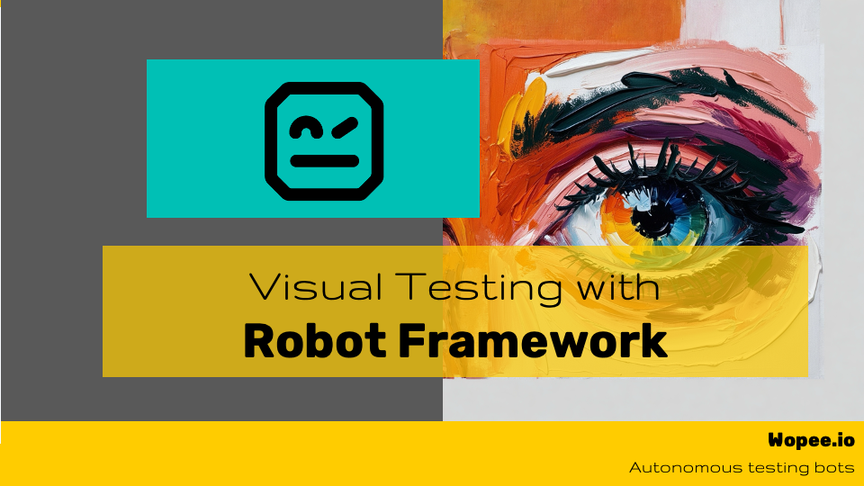

In the rapidly evolving world of software testing, visual testing has become an increasingly crucial component. This blog post delves into the details of our recent webinar that explores both traditional and autonomous visual testing methods, with a focus on integrating these techniques into automated testing frameworks like Robot Framework.

<!--truncate-->

_Source: Wopee.io_

### Understanding Visual Testing

Visual testing, though not a new concept, remains underutilized or improperly implemented in many testing environments. The essence of visual testing lies in its ability to validate the visual elements of an application, ensuring that the user interface (UI) appears as expected across different environments. This approach is particularly beneficial in catching UI discrepancies that traditional automated tests might overlook, such as misaligned elements or missing components.

### Traditional vs. Autonomous Visual Testing

The webinar begins by discussing traditional visual testing methods, highlighting the challenges and limitations of manually writing assertions for every UI element. This method, while effective, can be cumbersome and time-consuming, especially when dealing with complex applications.

The conversation then shifts to autonomous visual testing, a more advanced approach powered by AI. Autonomous visual testing leverages AI to reduce human involvement, automating the identification and verification of visual elements. This method is presented not as a replacement for human testers but as a tool that enhances their capabilities, allowing them to focus on more critical tasks.

### Implementing Visual Testing in Robot Framework

For those using Robot Framework, the webinar introduces two primary tools for integrating visual testing: **WatchUI** and **Wopee.io (an AI-driven tool)**.

1. **WatchUI**: An open-source library that allows users to compare screenshots taken during test execution with predefined baselines. WatchUI is simple to set up and supports multiple UI platforms, making it a great starting point for those new to visual testing.

2. **Wopee.io**: A more sophisticated tool that offers both traditional and AI-augmented visual testing capabilities. Wopee.io stands out with its ability to conduct visual tests without modifying existing test cases, using a listener approach to automatically capture and compare screenshots. This tool also includes advanced features like baseline management, soft assertions, and integration with various automation libraries.

### Beyond Visual Testing: AI and Autonomous Testing

The webinar also explores how AI can be used to enhance other aspects of test automation. One intriguing example is the use of AI to dynamically generate locators and test data, enabling the automation of form filling without predefined locators. This demonstrates the potential for AI to reduce the maintenance burden in test automation significantly.

Additionally, the discussion touches on the possibility of using AI to perform visual assertions by analyzing screenshots and extracting relevant information, such as the number of products in a shopping cart or the total order amount, directly from the image.

### Conclusion: The Future of Visual Testing

The webinar concludes by emphasizing the ongoing evolution of visual testing tools and methods. The combination of traditional testing frameworks with AI-powered tools like Wopee.io represents the future of test automation, where testers can achieve higher efficiency and coverage with less manual effort.

For those interested in further exploring these tools and techniques, the webinar offers a wealth of resources and practical demonstrations. Whether you're a seasoned automation engineer or just beginning your journey into visual testing, there's something here for everyone to learn and implement in their testing practices.

---

**Watch the full webinar on YouTube to see live demonstrations and dive deeper into the concepts discussed in this blog post.**

<iframe width="560" height="315" src="https://www.youtube.com/embed/cSyMuWnOWWw?si=8EeUJbqh-tDovtvF" title="YouTube video player" frameborder="0" allow="accelerometer; autoplay; clipboard-write; encrypted-media; gyroscope; picture-in-picture; web-share" referrerpolicy="strict-origin-when-cross-origin" allowfullscreen></iframe>

