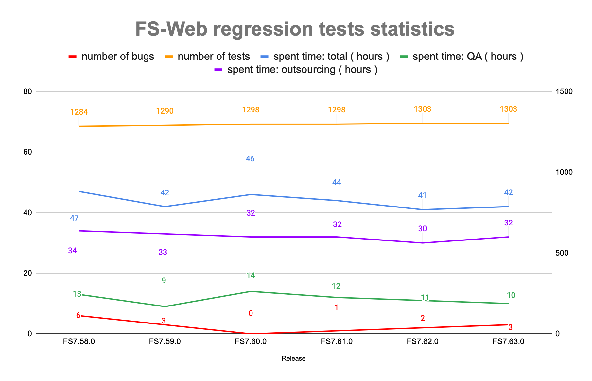

### Excellence isn’t just a goal at Livesport. It’s engineered into everything they do.

 

There’s a running joke that a goal is spotted first in the Livesport app before it even happens on the field. But what if it’s more than just a joke?

This is a story of partnership and progress. This is a story about Livesport's testing team, their journey, and how Wopee.io has helped them raise the bar in quality assurance.

<!--truncate-->

---

At Livesport, also known as Flashscore.com, every detail is thoughtfully designed, reflecting an unwavering commitment to quality.

Two years ago, Livesport turned to us to help them maintain this sharp edge. We’ve supported them in enhancing their software testing efficiency, enabling them to deliver not just good, but truly exceptional products. We're proud to be a part of their journey toward excellence.

## Meet the Team: David, Martin, and Livesport Testing

David and Martin are integral members of Livesport's testing team. Their expertise and dedication have helped transform the QA team into a well-oiled machine. From manual testing to automation and everything in between, they’ve been at the forefront of implementing cutting-edge testing strategies that keep Livesport’s products reliable and user-friendly.

  

## How Testing Works at Livesport

At Livesport, the testing team consists of 18 members, including one intern from CUT (Czech Technical University). The team is divided into various roles, each with a specific focus:

- **Interns** rotate between testing simpler tasks on the web, mobile, and automation teams.
- **Manual testers** handle web and mobile applications, API (REST, GQL), and database testing (SQL / no-SQL) based on their experience level.
- **Automation testers** focus on maintaining existing automated tests, while **automation developers** are responsible for the development and upkeep of testing frameworks for web and mobile platforms.

Livesport operates on an iterative development process with cross-team collaboration, ensuring projects are planned end-to-end. For new projects, the focus is on minimizing the number of manual and automated front-end (FE) tests while maximizing automated API tests. Legacy applications, on the other hand, require a heavier emphasis on FE tests due to historical architecture limitations.

The team employs a combination of manual and exploratory testing for new features, supported by automation to detect regressions early. Automated tests save significant time during regression testing, with manual regression testing outsourced to external vendors.

The Livesport testing team utilizes a range of tools to maintain their high standards, including: TestRail, Currents, BrowserStack, Wopee.io, Cypress, Playwright, Webdriver.io, Postman, Kibana/Grafana, GitLab, and YouTrack.

### Test Automation Evolution: From Cypress to Playwright, Webdriver.io for Mobile

Livesport's journey in test automation began with **Cypress**, which they initially adopted for web testing. Cypress allowed the team to efficiently manage a high volume of web tests and baseline screenshots, significantly improving their automation coverage. As a reliable tool for web applications, Cypress helped lay a solid foundation for automation at Livesport.

Now, as the team continues to expand and innovate, they have started incorporating **Playwright** into new web projects. Playwright offers advanced browser automation capabilities and greater flexibility for cross-browser testing, enabling Livesport to further streamline its automation processes and ensure superior product performance across platforms.

For mobile application testing, **Webdriver.io** has been the go-to solution. Its integration with Wopee.io has enabled Livesport to perform comprehensive visual and functional tests on their mobile apps, ensuring a seamless user experience on mobile devices.

By leveraging these powerful tools—Cypress for initial automation, Playwright for cutting-edge web testing, and Webdriver.io for mobile testing—Livesport continues to enhance its quality assurance processes, ensuring exceptional performance across all platforms.

## Proud Achievements in Livesport Testing

David highlights the evolution of the testing team as one of their most significant achievements. In just two and a half years, they have transformed from a chaotic, unmanaged group into a self-organized, integral part of the development process. This transformation was made possible by recruiting competent, communicative employees, introducing new or refining existing processes, and completely overhauling their testing tools. The team's success is a testament to the power of effective collaboration and continuous improvement.

  

### David Krist, Head of QA&Testing

> ### "Any company that doesn’t build its testing on strong, stable foundations often struggles with inefficient, chaotic processes led by a group of people who are completely disconnected from the development process.

> Over the past two and a half years, our testing team has become an equal partner in development and product management. The team has transformed from an unstructured, no-name group into a self-organized unit that no project can start without. This efficiency was achieved by recruiting competent and communicative employees, implementing new or refining existing processes, and completely overhauling our testing tools. All these significant and positive changes are primarily driven by people who are eager to push things forward, including themselves."

## Challenges and Areas for Improvement

Despite their successes, the team still faces challenges. Historically, Livesport focused mainly on FE testing due to the siloed development process. With the shift to cross-team end-to-end development, there's a need to change the mindset of testers to focus beyond front-end activities and integrate them more effectively into the development process.

Ongoing discussions about the scope of regression tests, setting test priorities, and selecting candidates for automation also pose challenges. Testers are used to testing the maximum safe variant, which, based on user data and recent releases, is often unnecessary and overly expensive. Regularly collecting and evaluating production data helps guide these decisions, but the team acknowledges that progress, while steady, could be faster.

## Future Plans for QA Improvement

Looking ahead, Livesport's QA team has several plans for further improvement:

- Reviewing testing activities within development teams to ensure software is delivered at the appropriate quality.
- Focusing on better slicing of user stories to enable continuous integration into the main branch, rather than waiting until just before code freeze.
- Increasing emphasis on grooming activities to detect bugs earlier, shifting from reactive to preventive measures.
- Integrating API tests into development pipelines (shift-left) and using FE auto tests as part of production business process monitoring (shift-right).
- Enhancing in-sprint test automation, automatic test data generation, and unifying the management of test environments.
- Promoting greater communication and assertiveness among team members to foster team growth and personal development.

### Commitment to Accessibility

Other area where Livesport is making strides is in accessibility. They’ve recently involved a visually impaired user to test parts of their mobile applications, with plans to extend this to web applications. The insights from this testing will feed into a broader project planned for next year, which aims to make Livesport’s products more accessible to all users.

## Livesport and Wopee.io: A Partnership for Success

### Why Wopee.io?

Livesport has been using Wopee.io for over a year, starting with Cypress in early 2023 and going live by Q2 of the same year. Wopee.io was also integrated into Webdriver.io projects for mobile application testing in Q1 of this year. The decision to choose Wopee.io was driven by Livesport's focus on the visual aspect of applications. They needed a solution that could handle visual baseline comparisons with zero tolerance for deviations, and Wopee.io proved to be the best option.

  

### Martin Šimon, Test Automation Team Leader

> "Testing at Livesport has always been heavily focused on the visual aspects of our applications because we aim to offer our users a product that excels in every area—functionality, visuals, and data. This required us to compare baseline images with the current state, with zero tolerance for deviations. A proof of concept with Wopee.io and other tools (like Applitools, Percy) that handle visual testing evaluation and management—or even a potential in-house solution—clearly showed that **Wopee.io was the only tool capable of delivering the required functionalities** at a reasonable cost. Given Wopee's startup nature, we also had the opportunity to contribute to the product's development with our suggestions and requests. These would have been much harder to negotiate with other solutions, or their implementation would have taken much longer."

### Team-wide Adoption of Wopee.io

All 18 members of the testing team actively use Wopee.io, making it an essential part of their daily workflow.

### Top 3 Benefits of Collaboration with Wopee.io

1. **Enhanced Maintenance Efficiency:** What once required technical expertise and considerable time has been simplified. Wopee.io's intuitive interface allows even manual testers to manage visual tests with a single 'Approve' button click.

2. **Impact on Product Direction:** As a startup, Wopee.io has remained flexible and receptive to Livesport’s input, ensuring the tool evolves to meet their unique needs.

3. **Exceptional Support:** Livesport highly values the fast and effective support from Wopee.io, enabling swift resolution of issues as they arise.

## How Wopee.io has improved Livesport's Testing?

> ### Entire maintenance process has been streamlined to a simple click of the button directly in Wopee.io

> "The most significant improvement has been the reduction in the complexity of maintaining visual tests. When we had baseline images stored directly in the repository, any change required technical knowledge of the project and code. The image had to be regenerated, pushed to GitLab, approved, and merged. Since visual changes—whether due to bugs, new features, or test data changes—occur daily, this was a very time-consuming task that could only be handled by members of the automation team. **Now, the entire maintenance process has been streamlined to a simple click of the ‘Approve’ button directly in Wopee.io**, and the entire image database **can be managed by manual testers**, who also run the tests and evaluate the results. Currently, we have around 1,000 baseline screenshots, a volume that would have been unsustainable for us in the past." -- Martin Šimon, Test Automation Team Leader

## Interesting Statistics from Testing Team

- **Frameworks in Use**: Livesport has over 400 web tests in Cypress (~700 screenshots) and over 100 mobile application tests in Webdriver.io (~200 screenshots). They are also starting new projects in Playwright, where Wopee.io is already in use.
- **Testing Frequency**: The team runs smoke tests frequently, with approximately 100 web and 160 mobile screenshots involved in nightly runs and standard feature tests.

- **Regression Testing**: The full regression suite is executed about three times per release cycle, which is bi-weekly for web and every six weeks for mobile.

- **Automation Coverage**: Livesport has achieved 54% coverage for web and 14% for mobile, relative to the full regression testing scope. The coverage relative to the planned automation scope is 78% for web and 14% for mobile.

| Metric                                           | WEB | Mobile |
| ------------------------------------------------ | --- | ------ |
| **Regression Testing (RT) Scope**                | 827 | 974    |
| - Automated                                      | 446 | 137    |
| - Planned for automation                         | 123 | 650    |
| - Manual execution time [h]                      | 30  | 24     |
| - Execution time using automation [h]            | 15  | 24     |
| - Coverage relative to full RT scope             | 54% | 14%    |
| - Coverage relative to RT planned for automation | 78% | 14%    |
| **Relative savings - automation [%]**            | 50% | 21%    |
| **Absolute savings - automation [h]**            | 15  | 3      |

Livesport conducts over 40,000 visual checks each month, averaging around 1,500 visual tests daily, all powered by Wopee.io.

_Some interesting stats from Livesport's regression automation testing from recent months, source Livesport:_

## Looking Ahead with Wopee.io: The Future of Testing Excellence

As Livesport continues to innovate and expand its offerings, maintaining high standards in testing is more critical than ever. With Wopee.io as a trusted partner, Livesport’s testing team is not just keeping up with the pace of development—they’re setting new benchmarks in efficiency, accuracy, and scalability.

**Join the Revolution in Testing:**
If Livesport’s story resonates with you, it’s time to take action. Wopee.io offers a unique opportunity to revolutionize your testing processes. Whether you’re looking to streamline your test automation, reduce maintenance burdens, or simply ensure that your applications perform flawlessly, Wopee.io is the tool that can make it happen.

**Start Your Journey with Wopee.io:**
Don’t wait to transform your testing. Join Livesport and countless other forward-thinking companies in experiencing the power of Wopee.io. With a quick setup, minimal maintenance, and results in minutes, Wopee.io is the solution you’ve been searching for. **Get started today and take your testing to the next level.**

**Experience Testing Excellence:**
Livesport has shown what’s possible with the right tools and a commitment to quality. Now, it’s your turn. Embrace the future of web app testing with Wopee.io—because excellence isn’t just a goal; it’s a journey. **Try Wopee.io now and achieve faster, more reliable testing with less effort.**
