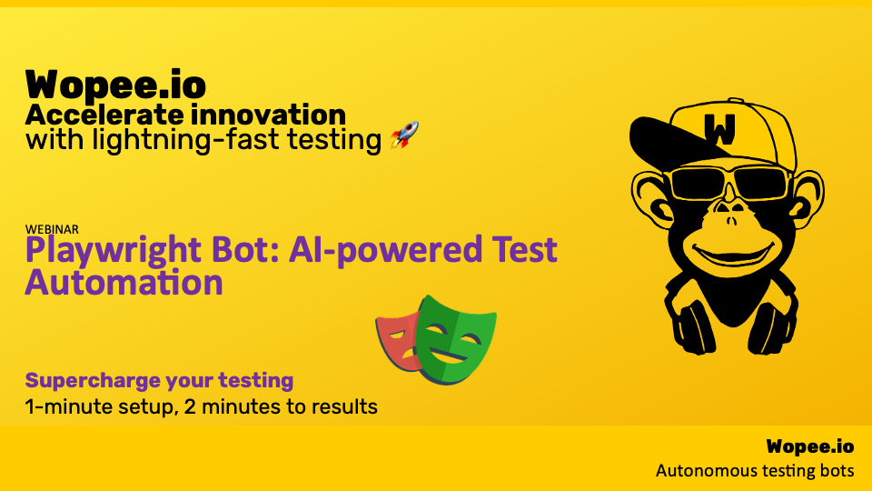

> ## Automating tests isn’t a luxury anymore. It’s a necessity.

But here’s the catch: manual test creation is frustratingly slow, error-prone, and simply doesn’t scale for modern, rapidly evolving web applications.

<!--truncate-->

Playwright Bot changes that. It doesn’t just run your tests—it _creates_ them for you. Automatically. Using AI (LLMs). Forget about writing endless scripts or hunting down bugs caused by unstable locators. Playwright Bot does the heavy lifting so you don’t have to.

In this blog post, we’ll get straight to the point and show you exactly how Playwright Bot simplifies test automation. Watch it:

- Generate complete test suites from just a URL
- Leverage AI to write adaptive tests that handle UI changes
- Automatically manage common pain points like cookie consent forms and dynamic interactions

Below, you’ll see how this tool can shift your testing from tedious to effortless in minutes.

## Why Automating Test Creation Matters

Scaling QA efforts is impossible without automation, but creating and maintaining tests is often a massive drain on time and resources. With Playwright Bot, you can automate test generation with minimal manual effort, cutting down the tedious work while boosting efficiency.

<iframe width="560" height="315" src="https://www.youtube.com/embed/6m-l5yM2Gno?si=Ab_qjojKoHjO_Uh_" title="Effortless Test Creation with Playwright Bot: AI-Powered Test Automation" frameborder="0" allow="accelerometer; autoplay; clipboard-write; encrypted-media; gyroscope; picture-in-picture; web-share" referrerpolicy="strict-origin-when-cross-origin" allowfullscreen></iframe>

## Step-by-Step: Test Creation with Playwright Bot

In the video above, you’ll see exactly how to use Playwright Bot to automatically generate tests based on a URL and collected data. Here’s a breakdown of the key steps:

- **Setting Up Playwright Bot:** Initialize the bot, configure the environment, and run it against your web application.
- **Data Collection and Test Generation:** Learn how the bot automatically gathers relevant data (HTML, screenshots, etc.) and analyzes user flows to create comprehensive test cases.
- **LLM Integration for Smart Test Generation:** Watch how large language models (LLMs) assist in building reliable, scalable test cases based on simple text instructions.
- **Challenges and Solutions in Autonomous Testing:** See how Playwright Bot handles tricky elements like cookies, dynamic content, and shifting UIs—and how it fine-tunes test scripts to match real-world scenarios.

## Advantages of Using Playwright Bot for Test Automation

- **Speed and Efficiency:** Playwright Bot drastically reduces the time spent manually writing and maintaining tests.
- **Scalability:** Effortlessly extend your test coverage for new features, without reinventing the wheel.
- **Error Reduction:** By leveraging AI, the generated tests adapt to changes in the UI or code, reducing the likelihood of errors.

## Upcoming Features

As discussed in the video, we are continuously enhancing Playwright Bot’s capabilities. Exciting features in development include:

- AI-driven test case optimization
- Self-healing test scripts
- Automatic test maintenance

_Want to be part of the action?_ Join the Playwright Bot testing group and help us shape the future of test automation.

## Conclusion

Playwright Bot is reshaping the landscape of automated testing, bringing AI-powered capabilities that streamline test creation and maintenance. Whether you need to save time, reduce errors, or scale your test suite, Playwright Bot offers a smart and practical solution for modern testing challenges.

Watch the demo, try our autonomous testing bot for free, or explore more at [Wopee.io](https://wopee.io).

:::tip

## Try the Playwright AI Bot Today

 

With Playwright Bot, testing becomes less of a chore and more of a seamless, adaptive process. By automating test creation with AI, you’re not just saving time. You’re setting your testing strategy up for long-term success.

 

Don’t take our word for it. Try Playwright AI Bot for free and experience the future of test automation today.

 

👉 Explore [Playwright AI Bot Demo](https://github.com/Wopee-io/playwright-ai-bot-demo) repository.

:::
