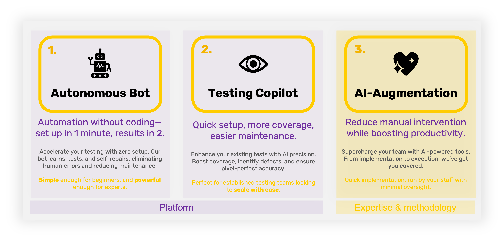

> ## Automate Web App Testing -- No Coding Required

From the beginning, we've been delivering webinars that explore trends and innovative testing ideas, focusing on modern test automation frameworks and tools for web app testing.

This time, it's different. We're excited to share something we’re passionate about. Our very own creation, Wopee.io.

Enter Wopee.io, an innovative solution designed to simplify testing through autonomous testing bots. In this post, I’ll walk you through how to get started with Wopee.io, highlight its key features, and guide you step-by-step on how to streamline your web app testing process with minimal effort and no coding required.

<!--truncate-->

## Understanding the Challenges in Test Automation

Over the past two decades, testing has evolved significantly. Manual testing can be slow, error-prone, and resource-heavy, while traditional automated testing often demands programming skills and ongoing maintenance. Many teams face challenges such as:

- Difficulty in locating and maintaining test elements
- Excessive time spent maintaining old tests rather than creating new ones
- Struggling to keep pace with frequent application updates
- High costs and complexity of traditional test automation tools

If any of these challenges resonate with you, Wopee.io’s autonomous testing bots are designed to tackle them—making testing faster, easier, and more accessible to teams with limited technical resources.

Watch the webinar below to get started:

<iframe width="560" height="315" src="https://www.youtube.com/embed/b7J0AEufAM0?si=FeWOQp3At9Y5YjCS" title="Getting Started with Wopee.io: Automate Web App Testing with No Coding Required" frameborder="0" allow="accelerometer; autoplay; clipboard-write; encrypted-media; gyroscope; picture-in-picture; web-share" referrerpolicy="strict-origin-when-cross-origin" allowfullscreen></iframe>

## Autonomous Testing Bots: A New Era of Test Automation

Our autonomous testing bot revolutionizes the testing lifecycle by automating the most repetitive tasks. With Wopee.io, all you need is your app's URL, and the bot will handle the rest. It will crawl your application, generate test cases, and deliver a comprehensive test report. All without the need for any programming knowledge.

## Key benefits include

- **Minimal setup:** Start testing in minutes by simply providing your app’s URL.
- **No coding required:** Ideal for manual testers or teams without extensive programming knowledge.
- **Automated repetitive tasks:** Spend less time maintaining tests and more time focusing on new features.
- **Built-in validations:** Wopee.io offers visual, network, and JavaScript validations to ensure comprehensive testing for common issues like broken functionality or visual bugs.

You can explore these features in detail by watching the video above.

## Step-by-Step: How to Get Started with Wopee.io

Here’s a quick guide (covered in more detail in the video) to setting up and running your first test using Wopee.io:

1. **Create an Account:** Head over to [CMD.wopee.io](https://cmd.wopee.io/) and create your free account.
2. **Set Up a Project:** Once logged in, provide the URL of your web app. The autonomous testing bot will crawl the app and gather all necessary data to generate test cases.
3. **Review Generated Test Scenarios:** Wopee.io will automatically generate test cases based on the app's structure and functionality.
4. **Run Your First Test:** With just a few clicks, you can run the generated tests and review a detailed report covering any issues identified during the analysis.
5. **Customizing Tests:** Need more control? Manually add or prioritize test cases, exclude elements from testing (e.g., cookie banners), or schedule tests to run regularly.

## Advanced Features: Beyond Basic Testing

Once you've mastered the basics, Wopee.io offers several advanced features to further enhance your testing experience:

- **Multi-step Scenarios:** Automate complex user flows by generating multi-step test cases.
- **Cross-browser and Mobile Testing:** Wopee.io’s bots can handle testing across different browsers and mobile platforms, making it a versatile tool for all your testing needs.
- **Prioritizing and Optimizing Test Cases:** Use Wopee.io’s test prioritization features to focus on the most critical parts of your app, saving time during regression testing.

## Take Your Testing to the Next Level with Wopee.io

Wopee.io is more than just a testing tool. It’s a fresh approach to automated testing that eliminates the complexity of programming. Whether you're a manual tester looking to automate repetitive tasks or a seasoned developer aiming to reduce test maintenance overhead, Wopee.io offers a scalable solution for your needs.

Want to learn more? Watch the full webinar above, or sign up for a free trial to experience Wopee.io firsthand.

:::tip Get Started Today 🔥

Interested in trying out Wopee.io?

Head over to [https://wopee.io](https://wopee.io) to sign up for a [free trial](https://cmd.wopee.io) or [book a demo](https://wopee.io/book-demo) with us.

:::

Stay tuned for more updates, tips, and best practices by subscribing to our newsletter or following us on social media!
