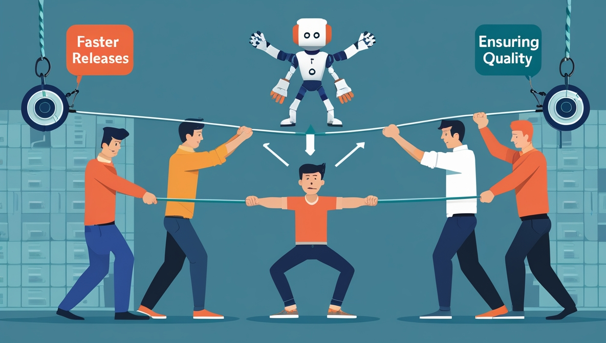

## The Race for Innovation

We don't have to convince anyone that in today's hyper-competitive digital landscape, delivering innovative projects faster than ever is not just an advantage—it's a necessity. If you're a CTO, head of engineering, or test lead, it's a safe bet you're under immense pressure to accelerate development cycles while maintaining software quality. Cutting-edge features, seamless user experiences, and robust security must be delivered at an unprecedented pace to stay ahead of the pack.

However, a major roadblock stands in your way: traditional software testing. As you push for faster releases, testing processes often become bottlenecks that slow down innovation.

> ### The paradox?

The faster you innovate, the harder it becomes to ensure your software remains reliable and bug-free.

<!--truncate-->

_source: leonardo.ai_

## Leading the Testing Transformation

As a technical leader in 2025, your success increasingly depends on your ability to drive organizational transformation. The evolution of testing practices represents a unique opportunity to establish yourself as an innovative leader who can deliver both technical excellence and business value.

The reality is that transforming testing isn't just about solving a technical problem—it's about:

- Positioning yourself at the forefront of industry innovation
- Demonstrating the ability to drive organizational change
- Delivering measurable business impact through technical transformation
- Building a reputation for innovative problem-solving

## The market for Test Automation Talent is Brutal

Hiring test automation engineers has never been more challenging. The talent market is brutal, with skilled professionals in high demand and short supply. Even when you do manage to hire specialists, retaining them is another uphill battle. Traditional test automation requires:

- Expensive specialists with deep programming knowledge
- Extensive maintenance to keep test scripts up to date
- Complex setups that require ongoing oversight and fine-tuning

Despite heavy investment in automation tools, these challenges often result in inefficiencies that drain your company's resources and delay releases. **Test automation, meant to accelerate software development, ironically becomes a source of friction.**

## From Cost Center to Value Driver

Forward-thinking leaders are transforming testing from a traditional cost center into a strategic value driver. This shift is characterized by:

- Reduced dependency on specialized resources
- Improved team-wide participation in quality assurance
- Accelerated project delivery timelines
- Enhanced ability to support innovative initiatives

## Rethinking Testing as an Enabler, Not a Blocker

What if you could transform testing bottlenecks into streamlined processes that enhance rather than hinder development speed.? Forward-thinking tech leaders, like you, are embracing a new approach — one that transforms software testing from a slow, resource-intensive process into an agile, autonomous solution.

### Enabling True Innovation

When testing becomes an enabler rather than a bottleneck, it unlocks new possibilities for innovation:

#### Faster Experimentation

- Try new approaches with confidence
- Validate ideas quickly
- Fail fast and learn faster
- Iterate on features without fear

#### Reduced Risk of Innovation

- Comprehensive testing coverage for new features
- Instant feedback on changes
- Protected core functionality during experiments
- Confident exploration of new technologies

Progressive companies and leaders are shifting their focus to AI Testing Agents, autonomous solutions that:

- Minimize the need for specialized talent
- Reduce test maintenance overhead
- Automate the entire test creation, execution, and validation process

This shift is not just about efficiency; it's about unlocking the potential of your development teams to focus on innovation rather than getting stuck in testing cycles.

## Empowering Your Entire Team

The most significant impact of modern testing solutions goes beyond technical capabilities—it fundamentally transforms how teams work together. With solutions like Wopee.io, technical leaders are:

- Enabling non-technical team members to contribute meaningfully to quality assurance
- Breaking down traditional silos between development and testing
- Creating a culture of shared responsibility for quality
- Improving team morale through broader participation and reduced bottlenecks

## Consider these real-world impacts

- Product managers can validate features without waiting for QA
- Developers get instant feedback on their changes
- Business analysts can verify requirements directly
- Team members feel more empowered and engaged in the quality process

## Meet Wopee, the Intelligent AI Testing Agent

Make Wopee.io your superpower. Wopee.io is at the forefront of this transformation, offering an AI-powered web app testing solution that eliminates the need for complex test preparation and manual intervention. Unlike traditional test automation tools, Wopee.io leverages AI Testing Agents to:

- **Boost efficiency:** Achieve 10x faster testing with 5x more test coverage and 30% less maintenance
- **Simplify automation:** No coding, no complex setups — just plug-and-play
- **Minimize human errors:** Ensure consistent and accurate test execution, reducing the risk of overlooked bugs
- **Enable low-skilled staff to automate tests:** Empower your whole team to contribute to quality, remove dependencies on expensive specialists
- **Turn tedious manual activities into fully automated processes:** Wopee.io transforms critical but time-consuming tasks such as test analysis and design, scripting, and maintenance into fully automated activities. What once took days is now completed in hours, and what took hours is now done in minutes.

## Measuring Success: Beyond Technical Metrics

The impact of transformed testing practices can be measured in multiple dimensions:

### Technical Outcomes

- 10x faster testing execution
- 5x increase in test coverage
- 30% reduction in maintenance overhead
- 90% decrease in false positives

### Business Impact

- 60% faster time-to-market for new features
- 40% reduction in quality-related incidents
- 50% decrease in testing-related costs
- 80% improvement in team productivity

Leadership Outcomes

- Enhanced reputation for driving innovation
- Improved team satisfaction and retention
- Recognition as a progressive technical leader
- Stronger positioning for career advancement

## How Wopee.io Works

Wopee.io takes a revolutionary approach to test automation by leveraging intelligent bots that learn and adapt to your web application. Here's how it works:

### AI Testing Agents in Action

1. **Bot Learning and Analysis:** Wopee.io explores your application, identifying all possible interactions and storing the data for test case generation.
2. **Test Execution:** The AI testing agent autonomously executes the generated tests, eliminating the need for manual scripting.
3. **Visual and Non-Visual Testing:** Automated validation of UI consistency, JavaScript behavior, and API responses.
4. **Minimal Maintenance:** When potential issues arise, users can update tests with a single click or report a bug instantly.

### Key Features

- **Exploratory Testing:** The bot executes randomly generated test cases based on learned application behavior.
- **Priority-Based Testing:** Define and execute the most valuable test cases as per user-defined priorities.
- **Visual Regression Testing:** Automatic comparison of baseline and actual screenshots for web apps, mobile apps, PDFs, and more.
- **Automated Integrations:** Seamlessly integrates with Playwright, Cypress, WebdriverIO, and Robot Framework for comprehensive test coverage.
- **Scheduled Runs & Multi-Config Testing:** Run tests across different browsers, resolutions, and environments with zero setup effort.

### Real-World Use Cases

Wopee.io is designed to fit seamlessly into your existing workflow. Here's how technical leaders like you are using it to revolutionize testing:

- **Automated Visual Regression Testing:** Quickly identify UI inconsistencies across releases.
- **Exploratory and Smoke Testing in Production:** Ensure critical workflows remain functional in live environments.
- **Regression Testing with No-Code Setup:** Reduce time-to-market without relying on dedicated automation engineers.
- **Multi-Version Testing:** Validate feature releases across different branches and environments.

## The Future of Testing Leadership

As we move through 2025, technical leaders face a clear choice: embrace the transformation of testing practices or risk falling behind. Those who successfully lead this transformation will undoubtedly drive their organizations' competitive advantage and create more empowered and efficient teams.

With Wopee.io, you're not just adopting a new testing tool—you're positioning yourself as a progressive leader who can transform technical challenges into strategic advantages.

Join the ranks of technical leaders who are revolutionizing how their organizations approach quality assurance.

> ## Testing's next evolution is here.

:::tip Testing's next evolution is here 🚀

 

## Ready to Transform Your Testing?

 

[Get started with Wopee.io](https://wopee.io) and revolutionize your testing practices today.

 
:::
