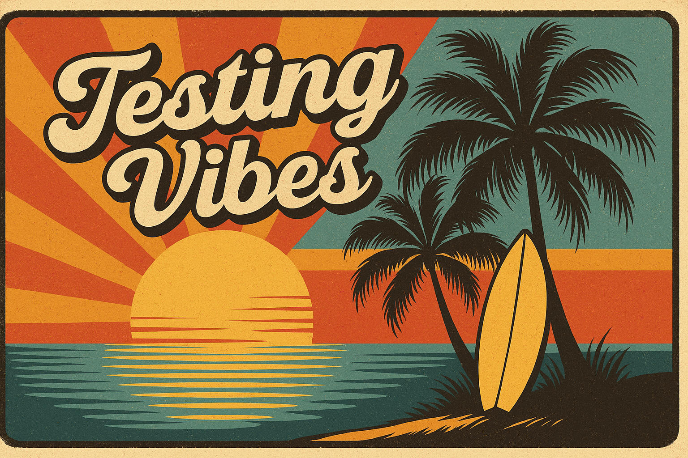

When we talk about the _vibe_ in software development, we’re talking about that almost-magical state where everything just _flows_: ideas turn into code effortlessly, tools feel like natural extensions of our creativity, teamwork clicks without friction, and we actually **enjoy** the process. This vibe-centric approach is giving rise to concepts like **Vibe Coding**, **Vibe Testing**, and **Vibe Engineering**. These aren’t just buzzwords; they represent a shift in how we build software—focusing on human creativity and happiness supported by powerful automation and AI. Before you dismiss it as hype, let’s explore what each of these concepts means and how together they can transform software development.

<!--truncate-->

## The “Vibe” in modern software development

At its core, the vibe movement is about changing the software development experience from a tedious grind into a creative and satisfying flow state. It’s a recognition that with modern AI-assisted tools and refined practices, we can **stay in the zone of creativity** while letting computers handle the dull bits. Think of writing code as less about wrestling with syntax or hunting bugs, and more about **shaping ideas**. In vibe-driven development, a developer might describe what they want in plain language and have AI translate that into working code. The result? Development feels more intuitive and fluid, almost like _jamming on an instrument_ rather than laboring over every note.

This emphasis on vibe means developers use **intuitive tooling** that minimizes friction: AI code assistants, low-code platforms, and collaborative IDEs that respond to natural language. It also means teams work together more seamlessly: when everyone is “in the vibe,” hand-offs between coding, testing, and deployment become smoother. Perhaps most importantly, the vibe philosophy acknowledges the **emotional aspect** of engineering. Developers and testers who feel happy and in tune with their work tend to be more productive and creative. By aligning tools and processes with human instinct and enjoyment, the vibe movement aims to unlock higher performance _and_ satisfaction.

Let’s break down the movement’s key facets: **Vibe Coding**, **Vibe Testing**, and **Vibe Engineering**.

## Vibe Coding: Code with creativity and joy

Vibe Coding is all about developer joy and rapid creation. It’s an approach to writing software where you **“fully give in to the vibes”**, as AI pioneer Andrej Karpathy famously quipped. In practical terms, [vibe coding](https://en.wikipedia.org/wiki/Vibe_coding) means using AI and modern frameworks to eliminate the tedious parts of coding so developers can focus on creative problem-solving. Instead of manually writing boilerplate code or fighting with configuration, you describe your intent and let AI helpers (like GitHub Copilot, Replit’s Ghostwriter, or Cursor) generate the baseline code. The developer’s role shifts from keystroke grunt work to guiding the AI, making high-level decisions, and fine-tuning the outcome.

**The hallmark of vibe coding is the flow state** it enables. By minimizing context switches and frustrations, developers can stay “in the zone” and iterate faster on ideas. The IBM AI advocacy team describes [vibe coding](https://www.ibm.com/think/topics/vibe-coding) as a way to **“help developers stay in the zone of creativity and automate tedious coding work”**. In other words, the tools handle the boring stuff, while you get to do the fun stuff. It’s a fresh, AI-powered take on development where you express what you want in natural language and the AI transforms that into executable code. This flips traditional coding on its head: start with working code generated quickly, then refine and improve it with human insight (a “code first, refine later” mindset aligned with agile fast-prototyping).

**Key characteristics of Vibe Coding include:**

- **Intention over Implementation:** You focus on _what_ the software should do, and let the tools figure out _how_ to do it. Code is generated to match your intent, so you’re less bogged down in syntax and more engaged in design and logic.
- **AI Assistance Everywhere:** From autocomplete to full code generation, AI acts as a pair-programmer. It can create functions or entire modules from a prompt, freeing you to concentrate on higher-level architecture and creative decisions.
- **Rapid Iteration:** Because you can get working prototypes in minutes, the cycle of _build → test → learn_ accelerates dramatically. Teams have reported compressing development that normally took weeks into days, allowing for fast validation of ideas.
- **Developer Empowerment and Joy:** Perhaps the most important aspect – it just _feels_ more fun. When you’re not stuck on rote tasks or waiting on resources, you regain a sense of play and exploration in coding. Vibe coding “democratizes” development, enabling even non-experts to create functional apps with minimal fuss, which is empowering and satisfying for any creator.

Of course, vibe coding doesn’t throw engineering rigor out the window. Think of it as speeding down the highway with an AI co-driver: you’ll get to your destination faster, but you still need to steer. Seasoned developers bring the “adult supervision” to guide AI-generated code (ensuring quality, security, and scalability) – a role sometimes nicknamed **vibe engineering** (more on that soon). For now, the takeaway is that vibe coding is about coding at the speed of thought, harnessing modern frameworks and AI to maximize developer happiness and output.

## Vibe Testing: QA that flows with development

Just because you’re coding at warp speed with AI help doesn’t mean quality can be an afterthought. Enter **Vibe Testing** – a creative, non-intrusive approach to quality assurance that keeps pace with vibe coding. The idea behind vibe testing is to make testing **as intuitive, fun, and fast** as the coding process itself, so it _matches the vibe_ rather than interrupting it. In other words, if you can use AI to write the code, why not use AI to test it too?

As one QA expert put it, _“Vibe Testing is about making testing just as accessible and AI-assisted as vibe coding. If you can use AI to write code, why not use AI to test it too?”_.

Traditional testing can feel like a chore or a roadblock when you’re iterating quickly. Vibe testing seeks to change that by infusing creativity and intelligence into QA. Instead of writing dozens of rigid test scripts that break whenever something changes, a vibe-driven tester might engage in **exploratory and collaborative testing** with the aid of AI. Some characteristics of vibe testing include:

- **Exploratory & Intuition-Driven:** Rather than pre-defining every test case up front, testers (or developers in a testing mindset) _play_ with the application like a real user would, guided by intuition and curiosity. The goal is to explore the app’s behavior in creative ways that an explicit script might miss. This free-form exploration often uncovers corner cases and usability issues that formal tests wouldn’t catch.
- **Prompt-Driven Testing with AI:** In vibe testing, you can literally ask an AI to help generate test scenarios. For example, you might prompt, _“Test the login feature, including edge cases”_, and let an AI tool suggest a variety of flows (valid logins, invalid password, SQL injection attempt, etc.). You can then execute these or even have an AI agent execute them. The AI assists in brainstorming and even automating tests, so you’re not manually writing every assertion.
- **Intent-Focused Validation:** Vibe testing isn’t just about verifying the app does what the code says; it’s about ensuring the app does what the **user or developer _meant_**. This means validating against the intended user experience or requirement, not just the literal implementation. The essence of vibe testing is asking _“Does this app do what I **meant**, not just what I **said**?”_. The testing process thus aligns with the higher-level intentions behind the software, catching misunderstandings and gaps in logic.

Crucially, vibe testing strives to **integrate seamlessly into the development flow**. It’s non-intrusive in that it doesn’t demand huge testing overhead or waiting on a separate QA phase. Much of the testing can be automated by intelligent agents in the background, or performed interactively by developers and testers in real-time. The result is a tighter feedback loop: you catch issues almost as quickly as you create new features, without killing the development momentum.

Modern AI-driven QA tools are key enablers here. We’re seeing the rise of self-healing tests (which automatically adjust to minor UI changes), AI-generated test cases (which scan your app or spec and suggest tests you wouldn’t have thought of), and anomaly detection that flags when “something feels off” in the app’s behavior. All this means you spend less time writing and fixing tests, and more time **improving the product**. Vibe testing lives up to its name by turning testing into a smarter, more _adaptive_ partner in development, rather than a cumbersome safety net. It keeps quality high **without killing the vibe** of rapid, joyful creation.

## Vibe Engineering: Holistic flow from build to deploy

Where does vibe coding and vibe testing lead us? They converge into a broader philosophy we might call **Vibe Engineering**. If vibe coding and testing are about specific activities, vibe engineering is about the **culture and workflow of the whole team**. It’s a holistic discipline that unifies how we **build, test, and deploy** software around a shared focus on team energy and productivity. In vibe engineering, the entire software delivery pipeline is optimized for flow, creativity, and sustainable pace.

Imagine an engineering process where every step: design, coding, testing, CI/CD, deployment, monitoring, feels integrated and frictionless. That’s what vibe engineering aims for. It extends the principles of DevOps (breaking silos, automating hand-offs) with the vibe principles of intuition and joy. In practical terms, vibe engineering means adopting tools and practices that keep the team’s **“vibe” consistent and positive** across the software lifecycle:

- **Unified, Energized Teamwork:** Developers, testers, ops, and product folks work in concert rather than throwing work over the wall. Because AI and automation handle a lot of drudgery, people can collaborate on the interesting problems. The team shares a sense of ownership and creative involvement from start to finish, which keeps morale high.
- **Continuous Everything (Integration, Testing, Delivery):** Vibe engineering embraces continuous integration and delivery, but without the usual pain points. Automated pipelines run in the background, powered by intelligent agents that ensure quality gates are passed without constant human intervention. Instead of dreaded “merge day” or “testing phase” bottlenecks, software flows from commit to production smoothly. This removes the bottlenecks that traditionally slowed projects down, allowing innovation to reach users faster.
- **AI-Augmented Engineering Practices:** Just as vibe coding and testing inject AI into those stages, vibe engineering looks to AI and smart automation for build, deployment, and operations as well. Think automated code reviews, AI-assisted troubleshooting in production, or release orchestration that optimizes timing based on user traffic patterns. The idea is to leverage AI wherever it can eliminate toil and amplify human expertise. The result is an engineering process that feels “lighter” and more intuitive, but is actually highly disciplined under the hood.
- **Focus on Energy and Well-Being:** This is an often-forgotten aspect of engineering management. Vibe engineering explicitly values the human factor: it tries to ensure people aren’t burning out on repetitive tasks or late-night deploy firefights. By unifying the process and automating the grind, teams can **sustain a high-energy, positive momentum**. Engineering becomes less about constantly putting out fires and more about building great products in a sustainable rhythm.

In essence, vibe engineering takes the empowerment of vibe coding and the intelligence of vibe testing, and scales them to the whole engineering organization. One proponent described vibe engineering as vibe coding _“but with adult supervision”_—meaning we still apply sound engineering principles (code review, architecture, robust testing) but in a way that feels natural and not stifling. Others describe it as transforming engineering organizations through strategic AI integration, not just improving coding practices. The outcome is an org that’s not only extremely productive (because it has removed traditional friction and bottlenecks) but is also a place where developers and testers _thrive_. A vibe-engineered team is a happy team, and happy teams build better software.

## Benefits of embracing the “Vibe” movement

Why should technical leaders and teams care about this vibe movement?

The benefits of adopting vibe coding, testing, and engineering practices are compelling, addressing many classic pain points in software development.

Here are some of the key advantages:

- **Faster Time to Market:** Teams practicing these vibe principles can deliver features and products faster than ever. When AI-assisted coding speeds up development and continuous testing catches issues early, you drastically shorten release cycles. Prototypes that once took months can be ready in days. AI-augmented tools effectively _cut down the time to release_ by automating slow steps. This speed can be a decisive competitive edge in today’s market.
- **Happier, More Productive Teams:** Developers and testers get to spend more time on creative, fulfilling work and less on tedious maintenance. By _“eliminating human drudgery”_ and letting autonomous bots handle the boring bits, the vibe approach makes engineering work more engaging. A happy team is not a trivial benefit—when people enjoy their workflow, they collaborate better and put more energy into the product. Reduced burnout and higher morale translate into sustained productivity.
- **Reduced Overhead & Fewer Bottlenecks:** Traditional development often accumulates overhead in the form of long debugging sessions, test maintenance, meetings to hand off work, and so on. Vibe practices cut through much of this. For instance, AI **self-healing tests** can adjust to app changes, greatly reducing the maintenance overhead of test scripts. Continuous integration with intelligent automation means you’re not waiting on lengthy manual processes (no more “testing is the bottleneck” scenarios). In short, there’s less waste and waiting, and more flow.
- **Higher Product Quality:** It might seem counterintuitive that moving faster and automating more leads to better quality—but that’s exactly what vibe-oriented teams are seeing. AI-powered testing tools can achieve broader and deeper test coverage than a small QA team ever could, catching edge-case bugs and visual regressions that might slip through otherwise. These tools **learn, adapt, and improve** with each run, meaning testing gets smarter over time. By continuously testing throughout development (instead of at the end), issues are found and fixed early, resulting in a more robust product by the time it reaches users. Quality isn’t an afterthought; it’s baked into the process.

Ultimately, embracing the vibe movement means you get to deliver **better software faster** while making the whole journey more enjoyable for your team. It’s no surprise that many forward-thinking organizations are looking for ways to infuse this “vibe” into their culture and tooling.

## Enabling vibe testing & engineering with Wopee.io

So, how can teams start riding this vibe wave, especially when it comes to testing and overall engineering flow?

A great example is **Wopee.io**, a platform designed as a natural enabler of Vibe Testing and Vibe Engineering practices. Wopee.io is an AI-driven testing tool that keeps regression risks low without burdening your team – in other words, it lets you **maintain quality and confidence without killing the vibe**.

Wopee embodies many of the vibe principles we discussed by making testing **fast, intelligent, and seamless**:

### Quick onboarding and minimal friction

You can get started with Wopee.io in minutes. In fact, one of its key benefits is _“minimal setup: start testing in minutes by simply providing your app’s URL”_. There’s no heavy framework or coding needed to write tests initially – the platform’s autonomous bots will crawl your web app, generate test cases, and even execute them automatically. This means even a small team or a lone developer can instantly add a safety net of tests without a big hassle.

### Easy-to-maintain test logic

Wopee.io is built to **reduce the maintenance overhead** that plagues traditional test automation. It uses intelligent mechanisms to keep tests stable. For example, if your UI changes slightly, Wopee’s self-healing capabilities adjust tests accordingly, instead of failing and requiring a human to fix selectors. As their team puts it, you _spend less time maintaining tests and more time focusing on new features_. Test logic is also expressed in a high-level way (and can be augmented by AI generation), making it easier to update when your app evolves. This aligns perfectly with the vibe approach of _automation handling the grind_.

### Visual and Intelligent Validations

One standout feature of Wopee is its built-in **visual testing**. It doesn’t just check functionality via the DOM; it actually compares what users see. Wopee can catch visual bugs by comparing screenshots, with an ability to ignore insignificant differences and highlight meaningful changes. According to their documentation, _“Wopee.io offers visual, network, and JavaScript validations to ensure comprehensive testing for common issues like broken functionality or visual bugs.”_. This kind of holistic checking means your app not only works right, but also _looks_ right after every change – all done automatically. It’s creative QA in the sense that it observes the app like a user would (with eyes, not just code assertions).

### Seamless CI/CD Integration

In a vibe-engineered pipeline, any testing tool must plug in effortlessly to continuous integration and delivery. Wopee is designed for that. It integrates with modern testing frameworks and can run in your CI pipeline so that every commit triggers those smart bots to validate the app. It supports popular tools like Cypress, Playwright, Selenium, and more, which means you don’t have to reinvent your toolchain to add it. By fitting neatly into existing workflows, Wopee ensures that automated vibe testing is just a natural part of your development rhythm. Teams get immediate feedback on each change without a separate, painful QA step.

In short, Wopee.io acts as an accelerator for vibe testing and engineering. It provides the safety net (catching regressions, visual issues, etc.) _without_ demanding the usual time and effort teams associate with testing. The result is confidence and quality assurance at high speed. With quick onboarding, low maintenance, smart validations, and CI/CD friendliness, tools like Wopee allow teams to crank up the development “vibe” knowing that quality is under control. It’s a great example of how automation and AI can serve human creativity, not stifle it.

## The future: Blending AI vibes with dependable automation

As we look forward, it’s clear that the future of software development lies in a harmonious blend of **AI-powered tools and trusted automation methods**.

The “vibe” movement we’ve discussed is really about finding that sweet spot between innovation and dependability. On one hand, we have AI and large language models (LLMs) unlocking new levels of productivity and allowing us to code and test with unprecedented speed and intuition. On the other hand, we have decades of software engineering wisdom—version control, test automation frameworks, CI/CD, design patterns—that ensure our products are robust and maintainable. **Vibe Engineering is about marrying these two**: letting the AI-driven creativity flow while anchoring it with solid engineering practices and automation.

In practical terms, we can expect our development environments to become increasingly _conversational and intelligent_ (thanks to AI assistants), while our pipelines become increasingly _autonomous and reliable_ (thanks to smart automation). The winners in this new era will be teams that can embrace AI/LLM tools for the flexibility and speed they offer, **without sacrificing the rigorous quality controls** that come from automation and testing. Vibe coding + vibe testing = vibe engineering – this could well define how software is built in the coming decade.

The excitement around these emerging concepts is palpable: developers are building entire applications by describing their vision, and AI is writing the code; testers are leveraging AI to generate and run tests at scale; and engineers are orchestrating complex releases with the push of a button.

It’s a future where creativity and dependability are not at odds but go hand in hand. And that is the essence of the _vibe_ movement – it represents that **sweet spot of innovation and reliability**, where we can move fast _and_ break nothing.

By embracing vibe coding, testing, and engineering today, and using enabling tools like Wopee.io to smooth the journey, teams can position themselves at the forefront of this new paradigm. They’ll deliver faster, work happier, and achieve a level of quality and performance that sets them apart. The vibe revolution is here – and it just might make software development feel as inspiring as it was always meant to be.

**Sources:** The concept of “vibe coding” was introduced by Andrej Karpathy in early 2025 and emphasizes using AI (LLMs) to generate code from high-level intent. _Vibe testing_ extends this idea to QA, making testing AI-assisted and exploratory so it keeps up with rapid development. _Vibe engineering_ refers to integrating these practices across the team for a holistic, AI-augmented workflow. Embracing “vibe” practices can accelerate development cycles and improve team satisfaction and product quality. Wopee.io is cited as an example platform enabling vibe-aligned testing through autonomous bots, quick setup, and intelligent validations.

## Ready to start your journey?

Partner with us to explore AI Testing Agents and redefine your testing processes. [Work with us](https://wopee.io/marcel) to begin your journey toward autonomous and intelligent testing today.
