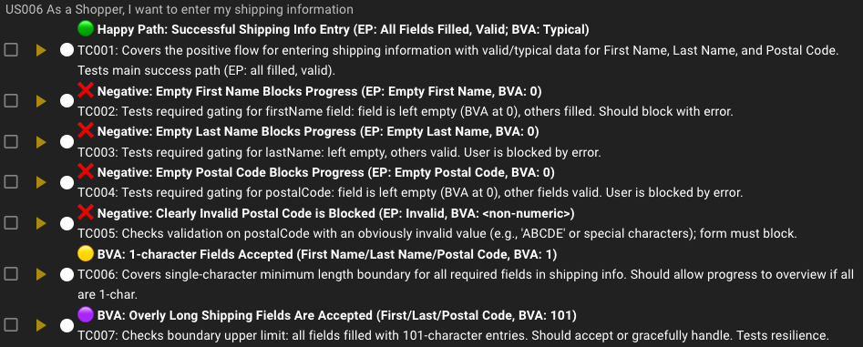
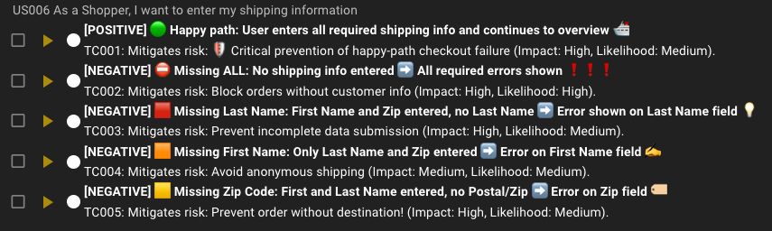
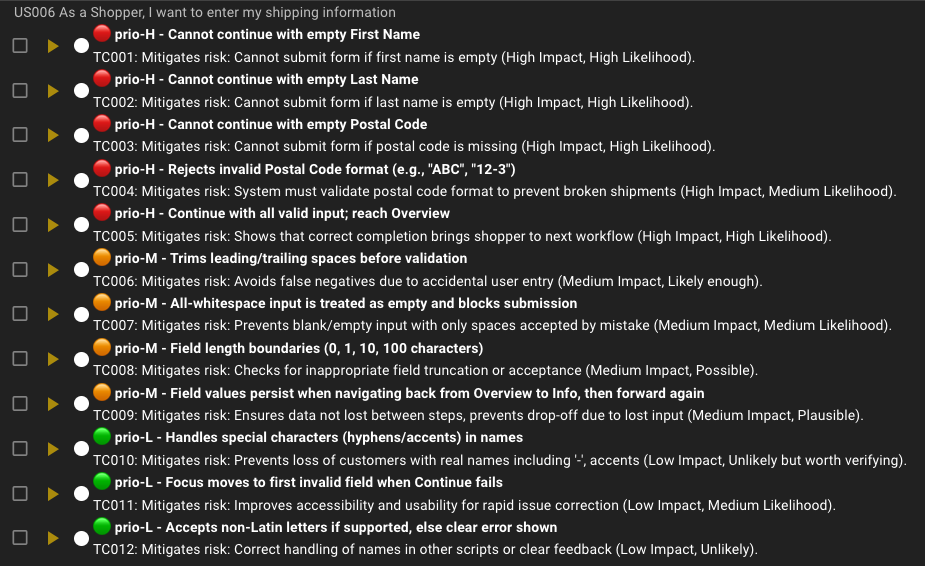
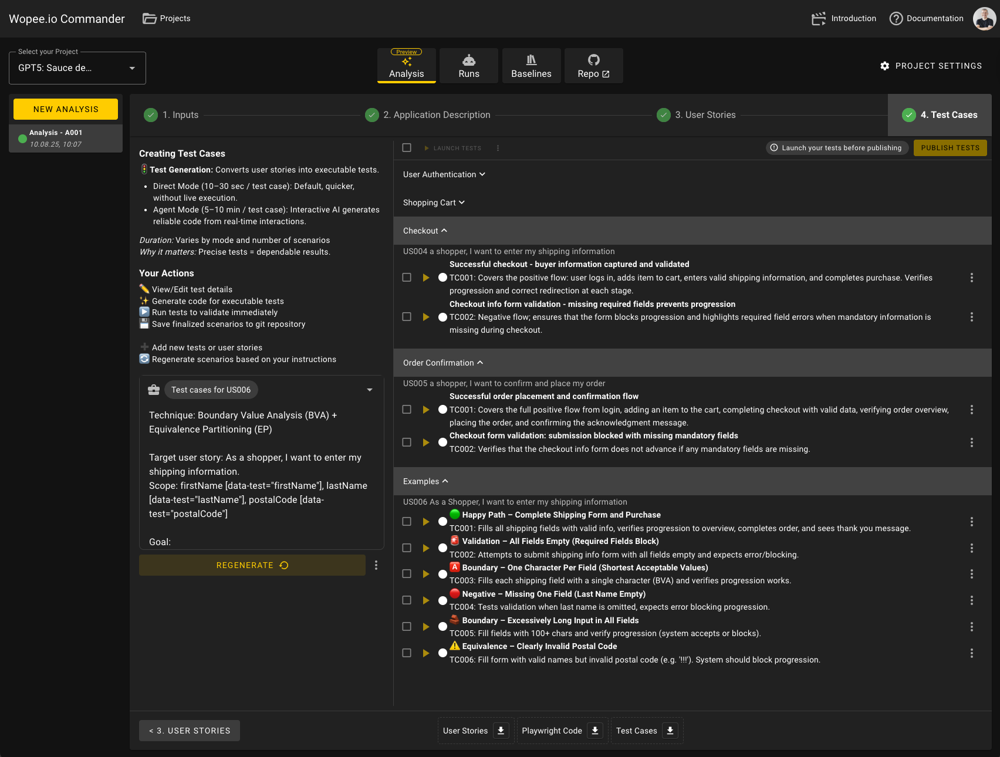
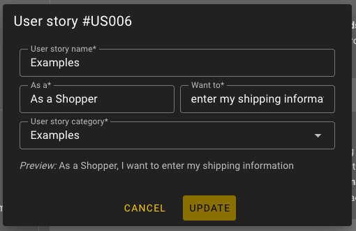
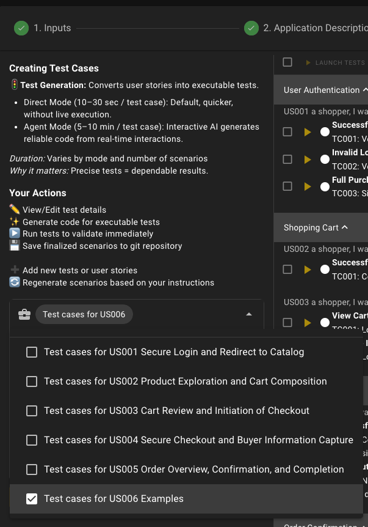

The era of manually writing tests is soo 2005. We can now generate tests automatically with LLMs.

However, still, it is good to drive the test design process by human. ... at least until the current tools are good enough.

Want to turn the theory into executable tests?

Here are a few examples with the Swag Labs demo project inside Wopee.io Commander: a **copy-paste prompts** tailored to the Swag Labs demo project so you can generate real scenarios.

<!--truncate-->

[Test design techniques](/blog/test-design-techniques) are important to achieve comprehensive test coverage and assure effective testing.

## Example prompts you can use

Feel free to use the prompts below as a starting point and adapt them to your needs.

All the examples below are for user story:

> _As a shopper, I want to enter my shipping information_.

In order to use the prompts below, go to **Analysis → 4. Test Cases**, pick the user story, and paste the prompt below. See below for the [detailed steps](#how-to-use-wopeeio-commander-quick-steps).

---

### A. BVA/EP for checkout info

Use Boundary Value Analysis (BVA) and Equivalence Partitioning (EP) to create a **minimal set** of positive/negative tests around the required buyer fields before moving to the overview page.

```
Use BVA/EP test design technique to create a minimal set of positive/negative tests around the required buyer fields before moving to the overview page.

Scope: First Name, Last Name, Postal Code

Goal: Generate the smallest test set that proves required-field gating works and handles edge inputs.

Design:
- EP: {filled vs empty} for each field; {valid vs clearly invalid} for postalCode.
- BVA around length: 0, 1, typical (5), long (100+) for each field.
- Combine minimally to avoid duplicates; show which partition/boundary each case covers.
- Each test should cover end-to-end flow: from login → cart → checkout → overview.

Generate:
- Positive path that advances to overview when all fields are valid.
- Negative cases that block progression with clear errors when one or more fields are empty/invalid.
- Use emojis to make the test design more fun.
```

Why this works here: User story explicitly requires first/last name and postal code and blocks progression on missing data; advancing shows the **order overview**.

### Generated tests for BVA/EP example



_Wopee.io Commander with test cases generated for the user story, BVA/EP_

---

### B. Decision table for “continue” gating

Model the **rules for advancing** from `checkout info` → `overview` using a compact decision table (presence/absence of required fields).

```
Use decision table test design technique to model the rules for advancing from checkout info → overview.

Rules:
- Continue is allowed only when firstName, lastName, and postalCode are all provided.
- Otherwise: progression is blocked; show clear error/highlight on missing fields.

Please:
1) Produce a decision table with the three conditions (FName?, LName?, Zip?) → Outcome (Advance/Blocked + which field errors).
2) Generate the minimal set of unique test cases from that table (no duplicates).
3) Include steps and expected results for each case.
4) Into test description field, add a short "Mitigates risk:" note to each test (Impact, Likelihood).
5) Use emojis extensively to make the final tests fun to read.
```

This aligns with Swag Labs behavior: missing any of the three required inputs prevents progression and highlights errors; with all present, the flow proceeds to the **overview** and later to **confirmation**.

### Generated tests for decision table example



_Wopee.io Commander with test cases generated for the user story, decision table_

---

### C. Risk-based testing: prioritize what matters first

This version bakes priority **into the test names** so your suite is immediately ordered. Use the prefixes:

- `prio-H` = high impact × high likelihood (test first)
- `prio-M` = medium
- `prio-L` = low

**Risk focus for user story**

- **High**: required-field gating (firstName, lastName, postalCode), invalid postal code formats, and the ability to continue only when all fields are valid.
- **Medium**: whitespace handling (trim vs. all-spaces), max/min lengths, state persistence when navigating back from Overview.
- **Low**: special characters, accessibility focus on first invalid field, non-Latin characters.

Copy-paste prompt (risk-based, with priority in names):

```
Use risk-based testing with explicit priority prefixes in test names.

Goal:
- Generate a prioritized suite for the user story.
- Prefix every test title with one of emojis: High 🔴, Medium 🟠, Low 🟢
- One deterministic automated test per risk; include preconditions, steps, and expected results.

Risk model (Impact × Likelihood)

High (prio-H) — must-have paths and hard blockers:
- prio-H - cannot continue with empty firstName
- prio-H - cannot continue with empty lastName
- prio-H - cannot continue with empty postalCode
- prio-H - rejects invalid postalCode format (e.g., "ABC", "12-3")
- prio-H - can continue when all fields are valid and reaches Overview page

Medium (prio-M) — common edge behaviors:
- prio-M - trims leading/trailing spaces before validation ("  John  " → "John")
- prio-M - all-whitespace is treated as empty and blocks progression
- prio-M - field length boundaries: 0, 1, typical (10), long (100+) with expected outcomes
- prio-M - values persist when navigating back from Overview to Info and then forward again

Low (prio-L) — nice-to-have quality checks:
- prio-L - handles special characters without crashing (names with hyphen/accents)
- prio-L - focus moves to the first invalid field when Continue fails
- prio-L - accepts non-Latin letters if supported; otherwise shows a clear validation error

Generation requirements
- For negatives, verify error text and that the page does NOT advance.
- For the positive case, assert navigation to Overview and presence of order summary.
- Add a short "Mitigates risk:" note to each test (Impact, Likelihood) into test description field.
```

Note: There are no validations or any other logic for the fields in the Swag Labs demo project. This is just an example.

### Generated tests for risk-based testing example



_Wopee.io Commander with test cases generated for the user story, risk-based testing_

---

## How to use Wopee.io Commander (quick steps)

### 1. Go to **Analysis → 4. Test Cases** (Commander).



_Wopee.io Commander with test cases generated for the user stories, step 1: Analysis → 4. Test Cases_

### 2. **Add a user story** you want to cover.



_Wopee.io Commander with test cases generated for the user stories, step 2: Add user story_

### 3. Select the user story, then paste a prompt (see below).



_Wopee.io Commander with test cases generated for the user stories, step 3: Paste a prompt_

### 4. Click **`GENERATE`** to create the test cases.

:::caution heads-up

If you pick an existing user story that already has scenarios, the generator will **rewrite** them.

:::

:::tip fast path

## Generate your tests automatically too

Wopee.io maps your app. Create tests. Automate instantly.

<br />

Paste a prompt and then let our AI Agent map your app, generate rest of the test cases. You will get automated tests right in [Wopee.io](https://wopee.io) Commander.

:::
