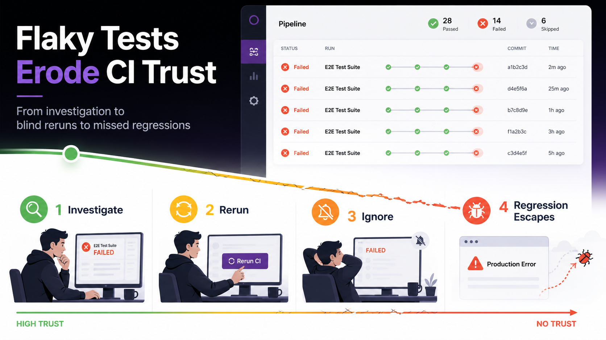
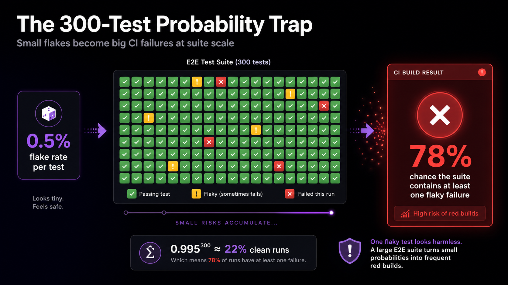

Flaky tests affect 16% of all tests at Google. 84% of pass-to-fail CI transitions involve one (Source: [Google Testing Blog](https://testing.googleblog.com/2017/04/where-do-our-flaky-tests-come-from.html), 2017). In E2E suites, async-wait issues alone drive about 45% of the failures. The wasted developer hours are bad. The trust damage is worse: once your team learns that red CI usually means "probably a flake," real regressions stop getting caught.
<!--truncate-->



If you've watched your team default to "click rerun" instead of investigating failures, that behavioral shift is the inflection point. Flaky tests stop being an annoyance and become a systemic threat. This guide synthesizes a decade of academic research and practitioner evidence from Google, Meta, Microsoft, Atlassian, Spotify, and Slack.

## What Are Flaky Tests?

A flaky test produces non-deterministic outcomes (sometimes passing, sometimes failing) when run against the same source code (Source: [Luo et al., FSE 2014](https://mir.cs.illinois.edu/lamyaa/publications/fse14.pdf), 2014). Nothing changes between runs. The result still varies.

It's not random noise. Some triggering condition (a timing window, a resource contention issue, a shared-state dependency) only manifests intermittently. The test is deterministic in theory and non-deterministic in practice, because something in the environment is uncontrolled.

How does this differ from a genuine failure? A real regression fails consistently after a specific commit. A flaky test fails sporadically across commits, correlating with CI load, time of day, or test execution order rather than code changes.

Martin Fowler framed the stakes in 2011: "Non-deterministic tests have two problems: firstly they are useless, secondly they are a virulent infection that can completely ruin your entire test suite" (Source: [Fowler, "Eradicating Non-Determinism in Tests"](https://martinfowler.com/articles/nonDeterminism.html), 2011). Fifteen years later, that assessment still holds.

Meta's engineering team adds a useful refinement: every real-world test is flaky to some degree. The question isn't *whether* a test is flaky but *how* flaky (Source: [Meta Engineering, "Probabilistic Flakiness"](https://engineering.fb.com/2020/12/10/developer-tools/probabilistic-flakiness/), 2020). That reframes flakiness as a measurement problem, not a binary classification one.

## How Prevalent Is E2E Test Flakiness?

Data from large engineering organizations converges. Flaky tests aren't rare exceptions; they're a structural feature of testing at scale.

| Organization | Metric | Source |
|---|---|---|
| Google | 16% of tests exhibit flaky behavior; 84% of pass-to-fail transitions involve a flake | Memon et al., 2017 |
| Meta | E2E flakiness rate ~10%; unit tests well below 1% | Machalica et al., 2020 |
| Microsoft | 26% of distinct builds affected by flaky tests | Lam & Godefroid, ISSTA 2019 |
| Atlassian | 15–21% of build failures from flaky tests | Atlassian Engineering, 2025 |
| GitHub Actions | 67.73% of rerun builds exhibited flaky behavior | Large-scale study, 2025 |

Why does this hit E2E suites hardest? Individual flake rates compound across suite size. For a suite of 300 tests each with a 0.5% per-test failure rate, the probability of a clean suite run is 0.995^300, roughly 22%. So 78% of your runs will contain at least one flaky failure, even with individually "well-behaved" tests.



The economic impact is measurable. A peer-reviewed industrial case study quantified the direct cost at 2.5% of total productive developer time: 1.1% investigating, 1.3% repairing (Source: [Kowalczyk et al., TUM](https://mediatum.ub.tum.de/doc/1730194/gbm0plj5hiwtahxthafyg16bl.cost-of-flaky-tests-in-ci.pdf), 2024). Atlassian reported over 150,000 developer hours per year consumed by flaky-test investigation in their Jira backend alone.

The biggest cost shows up later, in trust. Once developers learn that red CI usually means "probably a flake," investigation stops happening at all. [INTERNAL_LINK: What the Data Says About the Real Cost of Flaky Tests]

## What Causes E2E Test Flakiness?

The foundational taxonomy from Luo et al. (2014) analyzed 201 flaky-test fix commits across 51 Apache projects and identified 10 root-cause categories. This classification has been independently validated by multiple subsequent studies across a decade of research.

| Root Cause | Prevalence | Source |
|---|---|---|
| Async wait / timing | ~45% | Luo et al. (2014), confirmed by Parry et al. (2021) |
| Concurrency / race conditions | ~20% | Luo et al. (2014) |
| Test order dependency | ~12% | Luo et al. (2014); 59% in Python (Gruber et al., 2021) |
| Resource leaks | ~8% | Luo et al. (2014) |
| Network / external dependencies | ~5% | Luo et al. (2014) |
| Time, I/O, randomness, other | ~10% | Luo et al. (2014) |

For E2E browser tests the picture shifts. Romano et al.'s ICSE 2021 study of 235 flaky UI test samples identified four additional E2E-specific categories: animation timing, platform/browser inconsistencies, test-runner API misuse, and DOM selector fragility (Source: [Romano et al., ICSE 2021](https://dl.acm.org/doi/10.1109/ICSE43902.2021.00139), 2021).

What does that look like in practice? Your `click()` fires before the event listener attaches. Your assertion checks DOM state before a framework re-render completes. Your test passes locally and fails in CI because a third-party API responds 200ms slower under load.

For each mechanism and its fix, see [INTERNAL_LINK: 7 Root Causes of Flaky E2E Tests (And How to Fix Each One)].

### Systemic flakiness clusters

Parry et al. (2025) found that 75% of flaky tests belong to co-occurring failure clusters, mean size 13.5 tests (Source: [Parry et al., ICSE 2025](https://arxiv.org/abs/2504.16777), 2025). Intermittent networking and external-dependency instability were the dominant causes. The implication is concrete: fix one shared root cause and you resolve a dozen-plus flaky tests at once. Batch remediation works once you identify the cluster.

## How Do You Detect and Classify Flaky Tests?

Detection has matured from simple reruns to ML-based prediction. Each step buys accuracy at the cost of compute.

### Rerun-based detection

Run the test N times and flag inconsistent outcomes. Cheap and widely deployed. Bell et al. showed that Maven's built-in rerun caught only 23% of confirmed flakes (Source: [Bell et al., "DeFlaker," ICSE 2018](https://dl.acm.org/doi/10.1145/3180155.3180164), 2018). Even 10,000 reruns don't catch every flake. Gruber et al. found that getting to 95% confidence a test is *not* flaky takes an average of 170 reruns.

### Differential coverage (DeFlaker)

DeFlaker tracks which code lines changed since the last green build. If a newly failing test didn't execute any changed code, it's flagged as flaky. The approach achieved 95.5% recall with a 1.5% false-alarm rate across 96 Java projects. The trade-off: it needs coverage instrumentation on every CI run, which is impractical for many E2E suites where the system under test runs separately from the test runner.

### ML-based prediction

FlakeFlagger (ICSE 2021) predicts flakiness from test and code features (test smells, churn, runtime, assertion density) without needing reruns. Flakify (IEEE TSE 2022) fine-tunes CodeBERT on test source alone and outperforms FlakeFlagger by +10pp precision and +18pp recall (Source: [Fatima et al., IEEE TSE 2022](https://ieeexplore.ieee.org/document/9796326), 2022).

### The critical caveat

Can you trust automated flake classification to suppress failures? Lampel et al. (2023) applied a state-of-the-art flakiness predictor to Chromium's CI pipeline. Despite 99.2% precision in detecting flaky tests, the system misclassified 76.2% of genuine fault-triggering failures as flaky (Source: [Lampel et al., ESEC/FSE 2023](https://dl.acm.org/doi/10.1145/3611643.3616298), 2023). One-third of real faults were revealed by tests that were *also* sometimes flaky. Aggressive flake suppression masks real regressions. Don't ship the auto-suppress.

## How Do You Fix Flaky Tests?

Remediation has a clear order of operations. Framework-level fixes are cheapest and have the biggest payoff. Isolation patterns come next. Process changes last.

### Replace sleeps with state-based waits

Playwright's docs put it directly: "Never wait for timeout in production tests. Tests that wait for time are inherently flaky" (Source: [Playwright docs](https://playwright.dev/docs/best-practices), 2026). Replace every `page.waitForTimeout()` with a web-first assertion like `expect(locator).toBeVisible()` that auto-retries until the condition is met or the timeout expires.

```typescript
// Flaky: timing-dependent
await page.waitForTimeout(2000);
await page.click('#submit');

// Stable: state-dependent
await expect(page.locator('#submit')).toBeEnabled();
await page.locator('#submit').click();
```

### Isolate test state

Each test should run independently, in any order. Use fresh browser contexts per test (Playwright's default), per-test database transactions where feasible, and API-level test-data setup instead of UI-based workflows that drag in more flakiness vectors.

### Mock external dependencies

Real third-party API calls in CI are a category error. Use `page.route()` or an equivalent network-intercept layer to mock external services. Keep a small number of true end-to-end paths for critical journeys; stub everything else. [INTERNAL_LINK: Eliminating Flaky Tests in Playwright: Auto-Waiting, Isolation, and Network Mocking]

### Use resilient locators

Ban XPath structural queries from new tests. Prefer `getByRole()`, `getByLabel()`, and `getByTestId()`: locators tied to user-facing semantics rather than DOM structure. Romano et al. (2021) flagged selector brittleness as a first-class E2E flakiness category that barely exists in unit-test research.

## Does Framework Choice Materially Affect Flakiness?

Yes. This is one of the cleanest empirical patterns in the field. Framework architecture sets your flakiness baseline before you write a single test.

Playwright performs five actionability checks before executing any action: visible, stable, receives events, enabled, and editable (for input actions). The test author doesn't have to implement them. The framework eliminates the #1 root cause (async wait, 45% of all flakiness) by construction, not by discipline.

The Selenium-era approach relied on explicit waits written by test authors. Miss one `WebDriverWait` call and you have a flaky test. The difference is structural: Playwright makes stability the default. Selenium makes it opt-in.

Practitioner reports back this up. Slack's CI failure rate dropped from 56.76% to 3.85% after a dedicated initiative that included framework-level changes (Source: [Slack Engineering](https://slack.engineering/handling-flaky-tests-at-scale-auto-detection-suppression/), 2023). GitHub reported an 18x reduction in flaky builds (Source: [GitHub Engineering](https://github.blog/engineering/infrastructure/reducing-flaky-builds-by-18x/), 2020).

<!-- BENCHMARK_DISCLAIMER: Results depend on workload, environment, and version. Reproduce on your own workload before drawing conclusions. -->

Does that mean migrating frameworks eliminates all flakiness? No. Auto-waiting handles timing. It can't fix data pollution, external-dependency variance, or non-deterministic test logic. Think of it as removing the most common category from your flake budget, not zeroing the budget. [INTERNAL_LINK: Eliminating Flaky Tests in Playwright: Auto-Waiting, Isolation, and Network Mocking]

## How Should You Manage Flaky Tests at Scale?

Quarantine (isolating known flaky tests from the CI gate while still running them for monitoring) is the dominant industry pattern. Every major engineering organization studied uses some variant. Without lifecycle management, the quarantine becomes a permanent test graveyard.


### The quarantine trap

Martin Fowler recommended a hard cap in 2011: maximum 8 tests in quarantine, maximum one-week period. The failure mode is well-documented. Without enforced expiry and ownership, quarantine lists grow without bound and get ignored. The quarantine itself turns into unmanaged technical debt.

### What works at scale

Slack's "Project Cornflake" cut build failure rates from 56.76% to 3.85% by switching from result suppression (hiding failures in the UI) to execution suppression (actually disabling tests with tracking tickets assigned to owners). The lesson: visibility and ownership drive resolution. Not detection algorithms.

Atlassian's Flakinator processes 350 million+ test executions daily, detected 7,000 unique flaky tests, and recovered 22,000+ builds per quarter. Their stack: Bayesian inference for detection, code-ownership routing for accountability, Jira tickets with deadlines, and automated reintroduction after sustained health (Source: [Atlassian Engineering](https://www.atlassian.com/blog/atlassian-engineering/taming-test-flakiness-how-we-built-a-scalable-tool-to-detect-and-manage-flaky-tests), 2025).

### Five principles that hold up

The patterns that distinguish working quarantine programs from the failed ones share a small handful of traits.

1. Every quarantined test has a named owner. Not "the platform team," not "QA". A specific person whose name is on the ticket.
2. Quarantine has a hard expiry. 30 days is the working maximum we see in the literature. Past the deadline, the test gets auto-disabled.
3. Detection, ticketing, and notification are wired together. No manual steps. If a human has to file the ticket, they won't.
4. Quarantined tests keep running in non-blocking mode. You need the health signal to know when to reintroduce.
5. Past-SLA tests get deleted, not re-quarantined indefinitely. Kent Beck's instinct (delete the non-deterministic test) is right for the long tail.

For implementation details, see [INTERNAL_LINK: How to Build a Flaky Test Quarantine System That Doesn't Become Technical Debt].

## What's Next: AI, Systemic Flakiness, and the Research Frontier

### Pre-merge detection has the biggest payoff

Lam et al. (2020) found that 75% of flaky tests are flaky from the moment they're committed (Source: [Lam et al., ICSE 2020](https://dl.acm.org/doi/10.1145/3377811.3380437), 2020). Running detectors on newly added tests catches 75% of flakes before they enter the main suite. Extending to directly modified tests raises coverage to 85%. Run new tests N times before promotion. That's the highest-ROI intervention point in the entire pipeline.

### AI-assisted repair (with caveats)

FlakyGuard (ASE 2025) reportedly repaired 47.6% of reproducible flaky tests with a 51.8% developer acceptance rate. A peer-reviewed ICSE 2024 study showed LLMs repairing 79% of order-dependent flakes and 58% of implementation-dependent ones.

Our honest read: AI can defensibly heal locator drift and trivial async patterns today. It does not reliably distinguish a flake from a real bug, and it does not address the deep async/concurrency root causes that drive most E2E flakiness. Most vendor "self-healing" claims remain unbenchmarked in peer-reviewed literature. Treat them as marketing until you see the methodology.

### Systemic flakiness clusters

Parry et al.'s 2025 finding (75% of flaky tests cluster by shared root cause) opens a different remediation playbook. Fix one underlying infrastructure issue and resolve 13+ tests at once. ML models trained on static test-case distance measures can identify these clusters without 10,000-rerun setups.

## Other articles in this series

This guide is the pillar of a four-post series on flaky tests in E2E suites.

1. [INTERNAL_LINK: What the Data Says About the Real Cost of Flaky Tests]. Quantitative evidence for the business case behind flaky-test investment.
2. [INTERNAL_LINK: 7 Root Causes of Flaky E2E Tests (And How to Fix Each One)]. Each root-cause category covered with code-level fixes.
3. [INTERNAL_LINK: Eliminating Flaky Tests in Playwright: Auto-Waiting, Isolation, and Network Mocking]. Hands-on implementation guide for Playwright-based suites.
4. [INTERNAL_LINK: How to Build a Flaky Test Quarantine System That Doesn't Become Technical Debt]. Quarantine lifecycle management for growing teams.

<!-- AUTHOR_BIO_PLACEHOLDER
Author: [Name]
Role: [Title] — [X] years in test/QA/engineering
Notable work: [OSS contributions, conference talks, or named production deployments]
Website/Profile: [URL]
-->

<!-- AUTHOR_EXPERIENCE: Add 1–2 sentences from the author about hands-on experience applying this pattern on a real project before publication -->

## Key takeaways

- 16% of tests at Google show some flakiness. E2E suites run roughly 10x flakier than unit tests because their failure surface is larger.
- About 45% of all flakiness comes from async-wait issues. Playwright's auto-waiting eliminates that category by construction, before any test author writes a wait line.
- 75% of flaky tests are flaky on the day they land. Pre-merge detection (running new tests N times before promotion) is the highest-impact intervention you can deploy.
- The hidden cost is trust, not time. Once teams default to "click rerun," real regressions escape, and that habit is harder to reverse than any technical fix.
- Quarantine without lifecycle becomes a graveyard. Named owners, 30-day SLAs, and automated reintroduction are not optional.
- AI-assisted repair works for locator drift and trivial async patterns today. It does not yet handle the deep async and concurrency root causes that drive most E2E flakiness.

## FAQ

### What percentage of tests are typically flaky?

Google reports 16% of tests exhibit some flaky behavior, while Meta finds E2E tests reach approximately 10% flakiness compared to well below 1% for unit tests. For mid-market B2B SaaS teams running browser-based E2E suites, expect 5–15% depending on framework choice, suite maturity, and external dependency isolation (Source: [Memon et al., ICSE-SEIP 2017](https://research.google/pubs/taming-google-scale-continuous-testing/), 2017).

### What's the most common cause of flaky E2E tests?

Async-wait issues account for about 45% of all test flakiness in Luo et al.'s foundational taxonomy, confirmed by later studies. In E2E suites the share is higher because browser rendering, network responses, and JavaScript event handlers all introduce asynchronous behavior the test must synchronize against.

### Should you retry flaky tests?

Retries have a narrow legitimate role: surfacing which tests are flaky and keeping false-negative CI signals from blocking deployments. Set `retries: 1-2` in CI and treat every retried pass as flake telemetry to investigate, not as evidence the test is healthy. Retries become harmful the moment they substitute for root-cause investigation.

### How do you distinguish a flaky failure from a real bug?

No fully automated approach reliably solves this. DeFlaker's differential-coverage method (95.5% recall) is the strongest academic result, but Lampel et al. showed even high-precision predictors misclassify 76.2% of genuine faults in real CI. The safest operational pattern: retry once, investigate on second failure, and never auto-suppress a test that was previously stable.

### Is it better to fix or delete flaky tests?

Kent Beck advocates deleting non-deterministic tests immediately and rewriting if coverage is needed. Most practitioners prefer a time-bounded quarantine (30-day max) with a named owner. The right answer depends on coverage criticality. Tests covering payment flows or auth may warrant the fix investment. Tests covering non-critical UI styling can usually be deleted.

### Does migrating to Playwright eliminate flaky tests?

Playwright's auto-waiting removes the #1 root cause (async-wait, ~45%) by construction. It can't fix data pollution, external-dependency variance, or non-deterministic test logic. Teams migrating from Selenium-based frameworks report roughly 50% fewer flaky tests, but that's directional evidence from practitioner case studies, not controlled experiments.

## What to do on Monday

Don't try to solve flakiness as a project. It isn't a project. It's an operational property of your test suite that decays the moment you stop watching it.

Three concrete starting moves, in order of impact:

1. If you're still on Selenium and writing new E2E tests, stop. Move new work to Playwright. The 45% async-wait category disappears as a budget line.
2. Instrument flake telemetry before you try to fix anything. You can't manage what you can't see, and Spotify cut their flake rate 2 percentage points in two months through visibility alone, before deploying any enforcement.
3. If you have a quarantine list, look at it today. Every entry without a named owner gets one this week, or it gets deleted. There is no third option that actually works.

For implementation guidance, the [INTERNAL_LINK: Eliminating Flaky Tests in Playwright: Auto-Waiting, Isolation, and Network Mocking] guide is the next stop. If you need to build the business case first, [INTERNAL_LINK: What the Data Says About the Real Cost of Flaky Tests] has the quantitative framing.

<!-- BENCHMARK_DISCLAIMER: Results depend on workload, environment, and version. Reproduce on your own workload before drawing conclusions. -->
