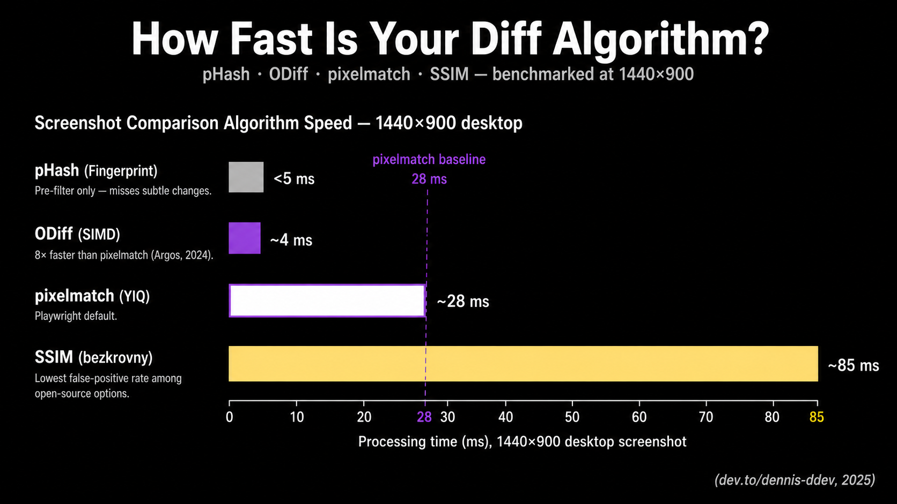

Pixelmatch, the diff engine behind Playwright's `toHaveScreenshot()`, processes a 1440×900 desktop screenshot in roughly 28 ms using YIQ NTSC color-distance math from [Kotsarenko & Ramos (2010)](https://github.com/mapbox/pixelmatch). SSIM costs about 85 ms on the same image. ODiff finishes the same job 8× faster than pixelmatch ([Argos engineering, 2024](https://argos-ci.com/blog/odiff)). Choosing between them is what separates a useful visual suite from a noise machine.

<!--truncate-->



This guide opens the black box. You'll learn how each major screenshot comparison algorithm works mathematically, what its false-positive and false-negative profile looks like, and when its trade-offs fit your stack. The piece covers pixelmatch, SSIM, perceptual hashing (pHash), ODiff, and AI-assisted approaches like Applitools Visual AI and Percy's Visual Review Agent. We'll also look at why current LLMs (Claude, Gemini, ChatGPT) are the wrong primitive for the comparison itself.

Most visual regression testing (VRT) advice stops at "use Playwright" or "buy Applitools." That's not enough. The diff engine is the part of your pipeline that decides whether a one-pixel shift fails the build or quietly gets ignored. If you can't reason about how it makes that call, you can't tune it.

## Why the diff algorithm matters more than the tool


A test suite's signal-to-noise ratio is set by the comparison algorithm, not the vendor. Pick the wrong one and you'll either drown in anti-aliasing noise or miss a regression that shipped a 2-pixel button offset to production.

The empirical evidence here is unflattering. A 2025 ICST study of 94 open-source developers found that flakiness and long execution times are the top obstacles to UI test adoption in CI, with most teams using ad-hoc trial-and-error instead of systematic mitigation ([Gan, Liang, Brown, ICST 2025](https://2025.icse-conferences.org/track/icst-2025-papers)). One credible practitioner survey reports that about 40% of teams abandon visual testing because of maintenance burden ([Yuri Kan, Senior QA Lead, 2024](https://yrkan.com/blog/visual-ai-testing/)). Most of that burden traces back to false positives that a different algorithm or threshold would have absorbed.

Here's the staked opinion. If you're paying $400+/month for a vendor's "99.9999% accuracy" claim while still running pixelmatch defaults in CI, you're buying review UX, not better diffing. The algorithm market is commoditized. The dashboards aren't. That's a fine reason to buy a tool. It's not a reason to skip understanding what the diff engine does.

For broader framing on tool selection and baseline strategy, see [INTERNAL_LINK: Visual Regression Testing: The Complete Guide].

<!-- BENCHMARK_DISCLAIMER: All performance numbers in this guide are reported by the linked sources and depend on workload, environment, and version. Reproduce on your own image corpus before drawing firm conclusions. -->

## How pixelmatch works under the hood


Pixelmatch is the de facto standard for open-source pixel diffing. It's roughly 150 lines of dependency-free JavaScript, used internally by Playwright's `toHaveScreenshot()`, jest-image-snapshot, BackstopJS, Lost Pixel (until ODiff), and many Cypress plugins ([mapbox/pixelmatch GitHub](https://github.com/mapbox/pixelmatch)). Knowing what it actually does is the first knob you should be able to turn.

The algorithm has two ingredients you need to internalize.

**Per-pixel color distance in YIQ space.** Pixelmatch doesn't compare RGB values directly. It converts each pixel to the YIQ NTSC color space and measures perceived color difference using the formula from [Kotsarenko & Ramos (2010)](https://github.com/mapbox/pixelmatch). YIQ weights luminance (Y) much more heavily than chrominance (I, Q), which matches how human eyes resolve detail. Playwright's `threshold: 0.2` option is the **per-pixel YIQ tolerance**, not the proportion of changed pixels across the image (Playwright issue #10219 documents how often this is misread). The fraction of changed pixels is `maxDiffPixels` (absolute) or `maxDiffPixelRatio` (proportion), and those are different knobs.

**Anti-aliasing detection.** Pixelmatch ships with the AA detector from [Vyšniauskas (2009)](https://github.com/mapbox/pixelmatch). With `includeAA: false` (the default), edge pixels that look like anti-aliasing artifacts are recognized and excluded from the diff count. That's why a curved button or a piece of italic text doesn't immediately flag a regression on every commit. The algorithm knows those edge pixels are fragile.

A typical Playwright config looks like this:

```typescript
// playwright.config.ts
import { defineConfig } from '@playwright/test';

export default defineConfig({
  expect: {
    toHaveScreenshot: {
      threshold: 0.2,           // per-pixel YIQ tolerance, NOT image-level
      maxDiffPixels: 100,       // absolute cap on differing pixels
      animations: 'disabled',   // freeze CSS transitions before capture
    },
  },
});
```

**Benchmarked performance** (1440×900 desktop screenshot, reported by [dev.to/dennis-ddev (2025)](https://dev.to/dennis-ddev/screenshot-diffing-pixel-level-comparison-techniques-18k)): about 8 ms for a 375×812 mobile viewport, 28 ms for desktop, 140 ms for a 1440×5000 full-page capture. Fast enough that the algorithm is almost never the bottleneck. Screenshot capture and baseline I/O usually dominate.

What pixelmatch is bad at: it doesn't reason about structure. If a navbar shifts down 4 pixels because a banner appears above it, pixelmatch will flag every pixel below the shift. The diff is technically correct and operationally useless.

For configuration trade-offs in detail, see [INTERNAL_LINK: Visual Regression Testing with Playwright and Docker: A Practical Setup Guide].

## SSIM: structural similarity across patches


The Structural Similarity Index Measure (SSIM) is a perceptual quality metric from [Wang, Bovik, Sheikh, and Simoncelli (2004)](https://www.cns.nyu.edu/~lcv/ssim/). Instead of comparing pixel-by-pixel, SSIM slides a small window (typically 8×8 or 11×11) across both images and evaluates three things in each patch: luminance, contrast, and structure. The output is a similarity score between 0 and 1, where 1 is identical.

Why this matters for VRT: SSIM is much more forgiving of the rendering-noise category (sub-pixel hinting, slightly different font smoothing, minor anti-aliasing) that produces false positives in raw pixel comparison. It looks at whether two patches share the same structure, not whether their bytes match.

The cost is computational. SSIM runs about 3× slower than pixelmatch, around 85 ms for a 1440×900 image on the same dev.to benchmark. Vitest supports SSIM natively via the `bezkrovny` comparator, a fast variant that uses block windows instead of Gaussian ones ([Vitest visual regression docs](https://vitest.dev/guide/browser/visual-regression-testing)):

```typescript
// vitest.config.ts
import { defineConfig } from 'vitest/config';

export default defineConfig({
  test: {
    browser: {
      enabled: true,
      visualRegression: {
        comparatorName: 'bezkrovny',  // SSIM variant
        threshold: 0.01,
        allowedMismatchedPixelRatio: 0.001,
      },
    },
  },
});
```

The American Express team's [jest-image-snapshot](https://github.com/americanexpress/jest-image-snapshot) also exposes SSIM via `comparisonMethod: 'ssim'`. BlazeDiff is a newer Rust implementation that claims about 4× faster SSIM by precomputing integral images for O(1) window summation ([BlazeDiff docs](https://www.blazediff.dev/docs/ssim)).

**When SSIM is the right call.** Use SSIM as a secondary check on the small set of pages where pixelmatch produces persistent false positives despite environment hardening. It's a poor blanket default. SSIM's window size is a hyperparameter that needs tuning per content type, and its scores aren't as intuitive as "pixels differ by X%" for review workflows. The Vitest team's choice to default to pixelmatch reflects that broader fit.

**What SSIM misses.** Subtle localized changes inside a window (a single-character text edit in a paragraph, a 1-pixel border becoming 2-pixel) can be averaged out across the patch and missed at default settings. SSIM tolerates more noise; it also occasionally tolerates more signal. Practitioners using it report needing tighter threshold values than the algorithm's literal "looks-the-same" interpretation would suggest ([Medium, Linda Liu, 2024](https://medium.com/@lindaliuAus/combine-playwright-and-ssim-js-to-scale-the-ui-regression-testing-ed12e3aa276b)).

## Perceptual hashing (pHash) as a pre-filter


Perceptual hashing converts an image to a compact 64-bit fingerprint via a 2D Discrete Cosine Transform on a heavily downsampled (typically 32×32) grayscale version. Two images are compared by computing the Hamming distance between their hashes. Hash generation costs about 4 ms, and the comparison itself is well under 0.01 ms ([dev.to benchmarks, 2025](https://dev.to/dennis-ddev/screenshot-diffing-pixel-level-comparison-techniques-18k)).

That speed is its only real advantage and its honest use case. As a primary diff comparator, pHash is unusable: it'll miss a button color change, a typo in a heading, or a layout shift smaller than a major grid cell. Hamming distance over a 64-bit DCT fingerprint is a similarity hint, not a regression detector.

As a **pre-filter**, it earns its place. Run pHash first across your screenshot corpus. Any pair with a Hamming distance below a small threshold (say, 3 out of 64) is almost certainly unchanged. Skip the expensive pixelmatch or SSIM step for those pairs entirely. On suites where most pages don't change run-to-run (a common case in component-library VRT and dashboards), this can cut total diff time by 60–80%.

```typescript
// Conceptual pre-filter pattern (sharp + a pHash implementation)
// ...
async function probablyUnchanged(baseline: Buffer, candidate: Buffer): Promise<boolean> {
  const [a, b] = await Promise.all([phash(baseline), phash(candidate)]);
  return hammingDistance(a, b) < 3; // tune for your corpus
}

if (await probablyUnchanged(base, current)) {
  return { passed: true, skipped: true };
}
// fall through to pixelmatch or SSIM
```

I haven't seen a major OSS VRT tool ship pHash pre-filtering by default. That gap is a credible build-it-yourself optimization if you're running thousands of screenshots per CI run and care about wall-clock time.

## ODiff: SIMD-accelerated pixel diffing


ODiff is what you reach for when pixelmatch becomes the bottleneck. Originally written in OCaml and now in Zig, it exposes SSE2, AVX2, AVX512, and NEON SIMD code paths to vectorize the per-pixel comparison loop. Argos, the open-source visual review platform, switched to ODiff from pixelmatch and reported an **8× speedup** on the same workload ([Argos engineering, 2024](https://argos-ci.com/blog/odiff)). Lost Pixel uses ODiff internally as well.

The algorithm is conceptually the same as pixelmatch (YIQ color distance, anti-aliasing-aware comparison). The difference is the implementation. SIMD instructions let one CPU instruction operate on 4, 8, or 16 pixels at once, which dramatically reduces the constant factor on the inner loop. Modern CPUs also have wider AVX-512 registers that the Zig codebase explicitly targets.

ODiff also ships a `--server` mode that keeps the process resident between comparisons:

```bash
# Start ODiff in server mode for high-volume CI
odiff --server --port 8080 &

# Each diff is now an HTTP call avoiding process startup cost
curl -X POST http://localhost:8080/diff \
  -F "baseline=@baseline.png" \
  -F "candidate=@current.png"
```

Process startup cost is non-trivial when you're diffing 5,000+ screenshots per CI run. Server mode amortizes it. On Argos's internal benchmarks, this matters more than the raw SIMD speedup at high snapshot counts.

**When ODiff is the right call.** Large screenshot corpora (1,000+ snapshots per run), aggressive CI parallelism, or any pipeline where the diff step is measurably slowing PR turnaround. For a 50-screenshot Playwright suite, pixelmatch is fine and the simpler dependency story usually wins.

**What it isn't.** ODiff is still a pixel diff. It doesn't help with structural noise, anti-aliasing across OSes, or dynamic content. The mitigations for those (Docker, font determinism, masking) apply identically. See [INTERNAL_LINK: Why Your Visual Regression Tests Keep Failing: 8 False Positive Causes and How to Fix Each] for the full list.

## AI-assisted diffing: Applitools, Percy, and the LLM trap


The "AI in VRT" pitch needs careful disambiguation, because two genuinely different things sit under the same marketing language.

**Applitools Visual AI** is the most established. Per Applitools' own materials, it's an ensemble of hundreds of algorithms ranging from hand-coded rule-based heuristics to deep-learning classifiers, trained on more than a billion images ([Applitools Visual AI docs](https://applitools.com/blog/visual-ai-vs-pixel-matching-dom-based-comparisons/)). It exposes four match levels (Strict, Layout, Content, Exact) that let you say "ignore content but verify layout" or vice versa. The technique is real and predates the LLM era by years.

The headline accuracy claim of "99.9999%" is marketing-grade. It appears in Applitools blogs and FAQs but I could not locate independent third-party verification, a methodology disclosure, or a reproducible benchmark. Treat it as directional. The Peloton case study (78% maintenance reduction, ~130 hours/month saved) is a named-company data point but still vendor-published ([Applitools, 2024](https://applitools.com/blog/test-maintenance-at-scale-visual-ai/)).

**Percy's Visual Review Agent** (October 2025) takes a different architectural path. Pixel diffing remains the detection layer. An AI model (most credibly a vision-language model) then **classifies and triages** the diffs: bounding boxes around meaningful changes, human-readable summaries of what shifted, automatic filtering of about 40% of pixel-level differences that look like rendering noise. The vendor claim is a 3× faster human review ([Percy product announcement, 2025](https://www.browserstack.com/percy)). This is AI as a review layer on top of a deterministic diff, not as the diff itself.

The architecture matters because it's reproducible: cheap, deterministic pixel/perceptual diff produces candidate diffs, then a vision model classifies each as semantic vs cosmetic. This is also what Wopee.io's "AI-Augmented Querying" and several emerging tools do under the hood.

Now the contrarian part. **Current large language models, including Claude, Gemini, and ChatGPT, should not be your visual diff engine.** Stefan Dirnstorfer published a [2025 InfoQ experiment](https://www.infoq.com/articles/spotting-image-differences-visual-software-testing-ai/) in which he asked all three to identify a missing street in a map comparison test. All three failed. Dirnstorfer's CNN trained on small 9×9 pixel patches (~48,000 parameters, trainable on stock hardware in minutes) detected the missing street with low false positives.

This isn't a casual finding. It generalizes a known pattern: generative AI models "can only identify differences in aspects they have been explicitly trained on." Visual regression detection at the pixel-and-layout level is not a task LLMs are aligned on. They hallucinate plausible-looking analyses. The vendors who ship genuine "AI-powered" VRT aren't using LLMs as the comparator. They're using vision models as triage on top of pixel diffs, or running specialized CV ensembles trained for years on image-pair datasets.

If a tool's pitch is "we use GPT-4V to compare your screenshots," that should raise the same eyebrow as "we use GPT-4 to validate your JSON schema." Possible, expensive, and not the right primitive.

## Choosing an algorithm for your stack


There isn't one right answer. The decision lives at the intersection of corpus size, environmental stability, and how much human review time you can absorb. Here's the working matrix:

| Algorithm | Speed (1440×900) | False positive rate | False negative rate | Best for |
|---|---|---|---|---|
| **pixelmatch** | ~28 ms | High without env controls | Very low | Default Playwright / Cypress / BackstopJS; small-to-medium corpora |
| **SSIM (`bezkrovny`)** | ~85 ms | Moderate-low | Moderate (needs tuning) | Pages with persistent AA noise despite Docker |
| **pHash** | `<5 ms` | Very low | High (unfit as primary) | Pre-filter to skip clearly unchanged pages |
| **ODiff** | ~3-4 ms (SIMD) | Same as pixelmatch | Same as pixelmatch | High-volume CI (1,000+ snapshots/run) |
| **Applitools Visual AI** | Cloud-dependent | Low (claimed); independent benchmarks absent | Low | Large dynamic apps, vendor-priced |
| **Percy + Visual Review Agent** | Pixel diff + AI triage | Lower after triage layer | Same as pixel diff | Teams that want review-time speedup without changing the detector |

**Working rules of thumb.** Start with pixelmatch via your framework's built-in (`toHaveScreenshot()` for Playwright, `toMatchScreenshot()` for Vitest). Lock the environment in Docker before tuning anything. If specific pages still produce false positives, switch those pages (not the suite) to SSIM. If diff time becomes the bottleneck in CI wall-clock terms, swap pixelmatch for ODiff at the engine layer without changing your assertions. If your team is spending more time triaging diffs than fixing real regressions, the upgrade is the **review UX**, not the algorithm: Argos, Chromatic, Percy, or Applitools' Test Manager all earn their keep there.

Don't pay for "AI accuracy" claims without a methodology disclosure. Pay for review UX, cloud rendering, or compliance features that you actually need.

## Production considerations: environment beats algorithm


Here's the part the algorithm comparison tends to obscure. **The single highest-leverage intervention is environmental determinism, not algorithm choice.**

Playwright's own docs are explicit: "Browser rendering can vary based on the host OS, version, settings, hardware, power source, headless mode, and other factors. For consistent screenshots, run tests in the same environment where the baseline screenshots were generated" ([Playwright visual comparisons](https://playwright.dev/docs/test-snapshots)). Macros translate to:

1. **Generate and run baselines in Docker.** The Microsoft `mcr.microsoft.com/playwright:v1.51.1-noble` image ships with pinned browsers and system fonts. Locally and in CI, both should run inside the same container.
2. **Wait for font readiness.** Inject `await page.evaluate(() => document.fonts.ready)` before capture. This is the fix for the Google Fonts `@import` flakiness pattern documented in Playwright issue #16927.
3. **Disable animations globally.** `animations: 'disabled'` in Playwright config, or inject `* { animation-duration: 0s !important; transition-duration: 0s !important; }` via `stylePath`.
4. **Freeze dynamic content.** Mock timestamps with `page.clock.setFixedTime()`, mask user avatars and ads with the `mask` option, intercept API responses for personalized data.
5. **Pin browser versions.** Disable browser auto-updates in CI. Bundled Playwright browsers are pinned per Playwright release; that's the cheap way.

Threshold tuning is the most common false-positive mitigation and the least effective one. The ShakaCode analysis is blunt: "increasing pixel-difference detection thresholds either masks genuine regressions or perpetuates false positives from minor rendering variations" ([ShakaCode, 2024](https://www.shakacode.com/blog/flaky-visual-regression-tests-and-what-to-do-about-them/)). Most teams turn the threshold up because it's easier than fixing Docker. That's a $50K-per-year mistake at scale, paid in undetected regressions.

For the full taxonomy of false-positive causes and their mitigations, see [INTERNAL_LINK: Why Your Visual Regression Tests Keep Failing: 8 False Positive Causes and How to Fix Each].

<!-- AUTHOR_BIO_PLACEHOLDER
Author: [Name]
Role: [Title], [X] years in test/QA/engineering
Notable work: [OSS contributions, conference talks, or named production deployments]
Website/Profile: [URL]
-->

<!-- AUTHOR_EXPERIENCE: Add 1-2 sentences from the author about hands-on experience tuning one of these algorithms on a real project (e.g., switching a CI suite from pixelmatch to ODiff, or layering SSIM on top of Playwright defaults) before publication. -->

## Key Takeaways

- Pixelmatch's `threshold` parameter is **per-pixel YIQ tolerance**, not the proportion of changed pixels in the image. The image-level threshold is `maxDiffPixelRatio` or `maxDiffPixels`. Most CI failures attributed to "weird thresholds" trace back to this confusion.
- SSIM is a targeted upgrade, not a default replacement. Apply it to specific pages that produce persistent AA noise despite Docker, not to the whole suite.
- pHash is a pre-filter, not a comparator. Use it to skip clearly unchanged pages before invoking pixelmatch or SSIM.
- ODiff is a drop-in pixelmatch replacement that's about 8× faster at the engine layer. Argos's switch is the most concrete reference deployment.
- Applitools Visual AI is technically real but its "99.9999% accuracy" headline is unverified by independent benchmarks. Buy the review UX honestly; don't believe the accuracy figure.
- Current LLMs are not the right primitive for visual diffing. Vendors using vision-language models do so as a triage layer on top of pixel diffs, not as the comparator itself.

## FAQ

**Is Playwright's `threshold: 0.2` the proportion of changed pixels?**
No. It's the per-pixel YIQ color-distance tolerance used inside pixelmatch. A pixel is considered changed if its YIQ difference exceeds 0.2 of the maximum. The image-level threshold (how many such pixels are allowed before the test fails) is set with `maxDiffPixels` or `maxDiffPixelRatio`. Misreading this is the most common cause of "my threshold doesn't do what I think" issues on Playwright's tracker.

**When should I switch from pixelmatch to SSIM?**
When specific pages produce persistent false positives after you've already containerized rendering, disabled animations, and masked dynamic content. SSIM is a per-page targeted fix, not a suite-wide default. Vitest's `bezkrovny` comparator and jest-image-snapshot's `comparisonMethod: 'ssim'` make it a small config change rather than a rewrite.

**Does ODiff change my baselines?**
No. ODiff is a drop-in replacement at the diff-engine layer that uses the same YIQ color distance and anti-aliasing detection as pixelmatch. Your existing PNG baselines work unchanged. The benefit is wall-clock time on large screenshot corpora, not algorithmic accuracy.

**Can I use GPT-4V or Claude to compare two screenshots?**
You can call those APIs, but you shouldn't rely on them as the primary diff engine. Stefan Dirnstorfer's 2025 InfoQ experiment showed all three major LLMs failing to identify a missing street in a map comparison test, while a small CNN trained on 9×9 pixel patches detected the change. Vendors who ship "AI VRT" use vision models as a triage layer above deterministic diffs, not as the comparator.

**Why is Applitools' "99.9999% accuracy" claim disputed?**
It's a vendor figure that appears in Applitools' own materials without published methodology, a public benchmark corpus, or independent replication. Applitools' Visual AI ensemble is a real technical achievement (hundreds of algorithms trained on more than a billion images), but the specific accuracy number is directional, not factual. Treat it the same way you'd treat any unverifiable headline claim.

**Do I need a vendor tool at all?**
Probably not at first. Playwright's built-in `toHaveScreenshot()`, locked to a Docker rendering environment, covers the algorithm side for most teams under a few hundred screenshots. Buy a vendor when reviewer fatigue becomes the bottleneck. The dedicated diff UI, branch-aware baselines, and bulk-accept workflows are where Chromatic, Argos, Percy, and Applitools earn their multiples.

## What to do next

Start by inspecting your current setup. Run `grep` for `threshold:` and `maxDiffPixels` in your Playwright or Vitest config and confirm you know which dimension each one controls. Capture a single page in Docker, then capture it again on macOS and diff the two. That delta is the magnitude of environment noise you're tolerating. If it's larger than the changes you'd be embarrassed to ship, your problem isn't the algorithm.

If you're already containerized and still seeing noise, evaluate ODiff for raw speed before paying for a vendor. If you're past the point where reviewers can absorb the diff volume, look at Argos, Chromatic, or Percy, and treat the algorithm question as resolved.

For the broader picture of how this fits into VRT strategy, return to [INTERNAL_LINK: Visual Regression Testing: The Complete Guide].
